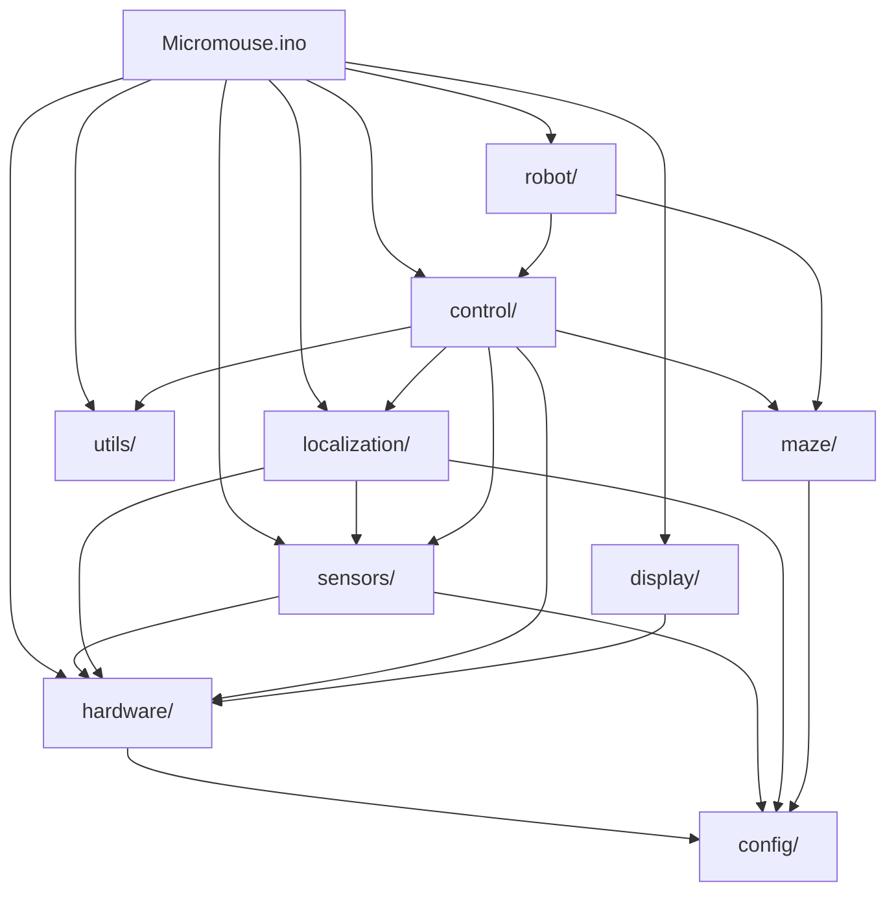

# 🧠 Micromouse Full_Code — Complete Codebase Analysis Report

> **Project**: Maze-Runner Micromouse  
> **Platform**: STM32F401CCU6 (Black Pill) @ 84 MHz, Arduino STM32 Core  
> **Language**: C/C++ (Arduino Framework)  
> **Maze**: 16×16 standard micromouse competition maze  

---

## Table of Contents

1. [The Big Picture](#1-the-big-picture)
2. [Recommended Reading Order](#2-recommended-reading-order)
3. [File-by-File Deep Dive](#3-file-by-file-deep-dive)
4. [Empty/Stub Files — Why They Exist](#4-emptystub-files--why-they-exist)
5. [How Files Interconnect](#5-how-files-interconnect)
6. [Data Flow Through the System](#6-data-flow-through-the-system)
7. [Development Phases (How the Code Was Tested)](#7-development-phases)
8. [Implementation Status Summary](#8-implementation-status-summary)

---

## 1. The Big Picture

This is the firmware for a **micromouse** — a small autonomous robot that:

1. **Explores** an unknown 16×16 maze (180mm cells) using wall sensors  
2. **Maps** the maze by recording wall positions  
3. **Solves** the shortest path from start (0,0) to the center goal (7,7)/(7,8)/(8,7)/(8,8)  
4. **Speed runs** the known path as fast as possible  

The code is organized into a **layered architecture** with 10 modules across 4 layers:

```
┌─────────────────────────────────────────────────┐
│              ROBOT LAYER (robot/)               │
│  State Machine • Mission Manager • Modes        │
├─────────────────────────────────────────────────┤
│           ALGORITHM LAYER (maze/)               │
│  Flood Fill • Dijkstra • Path Smoother • Solver │
├─────────────────────────────────────────────────┤
│         CONTROL LAYER (control/)                │
│  Motion • Heading • Speed • Velocity • PID      │
│         LOCALIZATION (localization/)             │
│  Odometry • Heading Est. • Position Est. • Pose │
├─────────────────────────────────────────────────┤
│          HARDWARE LAYER (hardware/ + sensors/)  │
│  GPIO • PWM • Motor • Encoder • Timer           │
│  MPU6050 • VL53L0X • Distance Mgr • Fusion     │
│  Battery • Button • LED                         │
├─────────────────────────────────────────────────┤
│         SUPPORT (config/ + display/ + utils/)   │
│  Pin Map • Robot Config • Algo Config           │
│  OLED • Menu • Logger • Filters • Math          │
└─────────────────────────────────────────────────┘
```

---

## 2. Recommended Reading Order

Read bottom-up: hardware first, then software that uses it.

### Phase 1: Configuration (Read These First)
| # | File | Why Read First |
|---|------|----------------|
| 1 | [`config.h`](file:///c:/Users/ADMIN/Desktop/Projects/Maze-Runner/Full_Code/Micromouse/src/config/config.h) | All algorithm tuning constants — maze size, costs, speeds |
| 2 | [`pin_config.h`](file:///c:/Users/ADMIN/Desktop/Projects/Maze-Runner/Full_Code/Micromouse/src/config/pin_config.h) | Every hardware pin assignment — the physical wiring map |
| 3 | [`robot_config.h`](file:///c:/Users/ADMIN/Desktop/Projects/Maze-Runner/Full_Code/Micromouse/src/config/robot_config.h) | Physical robot dimensions — wheel size, gear ratio, PWM |

### Phase 2: Hardware Abstraction Layer
| # | File | What It Teaches |
|---|------|-----------------|
| 4 | [`gpio.h`](file:///c:/Users/ADMIN/Desktop/Projects/Maze-Runner/Full_Code/Micromouse/src/hardware/gpio.h) / [`.cpp`](file:///c:/Users/ADMIN/Desktop/Projects/Maze-Runner/Full_Code/Micromouse/src/hardware/gpio.cpp) | How motor direction pins are controlled |
| 5 | [`pwm.h`](file:///c:/Users/ADMIN/Desktop/Projects/Maze-Runner/Full_Code/Micromouse/src/hardware/pwm.h) / [`.cpp`](file:///c:/Users/ADMIN/Desktop/Projects/Maze-Runner/Full_Code/Micromouse/src/hardware/pwm.cpp) | Register-level TIM1 PWM for motor speed |
| 6 | [`motor.h`](file:///c:/Users/ADMIN/Desktop/Projects/Maze-Runner/Full_Code/Micromouse/src/hardware/motor.h) / [`.cpp`](file:///c:/Users/ADMIN/Desktop/Projects/Maze-Runner/Full_Code/Micromouse/src/hardware/motor.cpp) | High-level motor control (uses GPIO + PWM) |
| 7 | [`encoder.h`](file:///c:/Users/ADMIN/Desktop/Projects/Maze-Runner/Full_Code/Micromouse/src/hardware/encoder.h) / [`.cpp`](file:///c:/Users/ADMIN/Desktop/Projects/Maze-Runner/Full_Code/Micromouse/src/hardware/encoder.cpp) | Hardware timer encoder mode (TIM2/TIM3) |
| 8 | [`timer.h`](file:///c:/Users/ADMIN/Desktop/Projects/Maze-Runner/Full_Code/Micromouse/src/hardware/timer.h) / [`.cpp`](file:///c:/Users/ADMIN/Desktop/Projects/Maze-Runner/Full_Code/Micromouse/src/hardware/timer.cpp) | 1kHz control loop timer interrupt (TIM4) |
| 9 | [`battery.h`](file:///c:/Users/ADMIN/Desktop/Projects/Maze-Runner/Full_Code/Micromouse/src/hardware/battery.h) / [`.cpp`](file:///c:/Users/ADMIN/Desktop/Projects/Maze-Runner/Full_Code/Micromouse/src/hardware/battery.cpp) | ADC voltage monitoring with EMA filter |
| 10 | [`button.h`](file:///c:/Users/ADMIN/Desktop/Projects/Maze-Runner/Full_Code/Micromouse/src/hardware/button.h) / [`.cpp`](file:///c:/Users/ADMIN/Desktop/Projects/Maze-Runner/Full_Code/Micromouse/src/hardware/button.cpp) | Debounced button input with edge detection |
| 11 | [`led.h`](file:///c:/Users/ADMIN/Desktop/Projects/Maze-Runner/Full_Code/Micromouse/src/hardware/led.h) / [`.cpp`](file:///c:/Users/ADMIN/Desktop/Projects/Maze-Runner/Full_Code/Micromouse/src/hardware/led.cpp) | Status/debug LED with non-blocking blink |

### Phase 3: Sensors
| # | File | What It Teaches |
|---|------|-----------------|
| 12 | [`mpu6050.h`](file:///c:/Users/ADMIN/Desktop/Projects/Maze-Runner/Full_Code/Micromouse/src/sensors/mpu6050.h) / [`.cpp`](file:///c:/Users/ADMIN/Desktop/Projects/Maze-Runner/Full_Code/Micromouse/src/sensors/mpu6050.cpp) | IMU gyro/accel I2C driver + calibration |
| 13 | [`vl53l0x.h`](file:///c:/Users/ADMIN/Desktop/Projects/Maze-Runner/Full_Code/Micromouse/src/sensors/vl53l0x.h) / [`.cpp`](file:///c:/Users/ADMIN/Desktop/Projects/Maze-Runner/Full_Code/Micromouse/src/sensors/vl53l0x.cpp) | ToF laser sensor driver (5 sensors, I2C mux) |
| 14 | [`distance_manager.h`](file:///c:/Users/ADMIN/Desktop/Projects/Maze-Runner/Full_Code/Micromouse/src/sensors/distance_manager.h) / [`.cpp`](file:///c:/Users/ADMIN/Desktop/Projects/Maze-Runner/Full_Code/Micromouse/src/sensors/distance_manager.cpp) | Wall detection logic, centering error |
| 15 | [`calibration.h`](file:///c:/Users/ADMIN/Desktop/Projects/Maze-Runner/Full_Code/Micromouse/src/sensors/calibration.h) / [`.cpp`](file:///c:/Users/ADMIN/Desktop/Projects/Maze-Runner/Full_Code/Micromouse/src/sensors/calibration.cpp) | Gyro calibration sequence at boot |
| 16 | [`sensor_manager.h`](file:///c:/Users/ADMIN/Desktop/Projects/Maze-Runner/Full_Code/Micromouse/src/sensors/sensor_manager.h) / [`.cpp`](file:///c:/Users/ADMIN/Desktop/Projects/Maze-Runner/Full_Code/Micromouse/src/sensors/sensor_manager.cpp) | Master init/update for ALL sensors |
| 17 | [`sensor_fusion.h`](file:///c:/Users/ADMIN/Desktop/Projects/Maze-Runner/Full_Code/Micromouse/src/sensors/sensor_fusion.h) / [`.cpp`](file:///c:/Users/ADMIN/Desktop/Projects/Maze-Runner/Full_Code/Micromouse/src/sensors/sensor_fusion.cpp) | Combines IMU + encoders + ToF |

### Phase 4: Localization
| # | File | What It Teaches |
|---|------|-----------------|
| 18 | [`pose.h`](file:///c:/Users/ADMIN/Desktop/Projects/Maze-Runner/Full_Code/Micromouse/src/localization/pose.h) / [`.cpp`](file:///c:/Users/ADMIN/Desktop/Projects/Maze-Runner/Full_Code/Micromouse/src/localization/pose.cpp) | Pose struct (x, y, theta) + angle normalization |
| 19 | [`odometry.h`](file:///c:/Users/ADMIN/Desktop/Projects/Maze-Runner/Full_Code/Micromouse/src/localization/odometry.h) / [`.cpp`](file:///c:/Users/ADMIN/Desktop/Projects/Maze-Runner/Full_Code/Micromouse/src/localization/odometry.cpp) | Dead reckoning from encoder deltas |
| 20 | [`heading_estimator.h`](file:///c:/Users/ADMIN/Desktop/Projects/Maze-Runner/Full_Code/Micromouse/src/localization/heading_estimator.h) / [`.cpp`](file:///c:/Users/ADMIN/Desktop/Projects/Maze-Runner/Full_Code/Micromouse/src/localization/heading_estimator.cpp) | Complementary filter (98% gyro + 2% encoder) |
| 21 | [`position_estimator.h`](file:///c:/Users/ADMIN/Desktop/Projects/Maze-Runner/Full_Code/Micromouse/src/localization/position_estimator.h) / [`.cpp`](file:///c:/Users/ADMIN/Desktop/Projects/Maze-Runner/Full_Code/Micromouse/src/localization/position_estimator.cpp) | Fuses odometry + heading + wall corrections |
| 22 | [`coordinate_transform.h`](file:///c:/Users/ADMIN/Desktop/Projects/Maze-Runner/Full_Code/Micromouse/src/localization/coordinate_transform.h) / [`.cpp`](file:///c:/Users/ADMIN/Desktop/Projects/Maze-Runner/Full_Code/Micromouse/src/localization/coordinate_transform.cpp) | mm ↔ cell index conversion |

### Phase 5: Control System
| # | File | What It Teaches |
|---|------|-----------------|
| 23 | [`pid.h`](file:///c:/Users/ADMIN/Desktop/Projects/Maze-Runner/Full_Code/Micromouse/src/control/pid.h) / [`.cpp`](file:///c:/Users/ADMIN/Desktop/Projects/Maze-Runner/Full_Code/Micromouse/src/control/pid.cpp) | Generic PID controller class |
| 24 | [`heading_controller.h`](file:///c:/Users/ADMIN/Desktop/Projects/Maze-Runner/Full_Code/Micromouse/src/control/heading_controller.h) / [`.cpp`](file:///c:/Users/ADMIN/Desktop/Projects/Maze-Runner/Full_Code/Micromouse/src/control/heading_controller.cpp) | PID to maintain target heading |
| 25 | [`speed_controller.h`](file:///c:/Users/ADMIN/Desktop/Projects/Maze-Runner/Full_Code/Micromouse/src/control/speed_controller.h) / [`.cpp`](file:///c:/Users/ADMIN/Desktop/Projects/Maze-Runner/Full_Code/Micromouse/src/control/speed_controller.cpp) | Per-wheel speed PID + feedforward → PWM |
| 26 | [`velocity_controller.h`](file:///c:/Users/ADMIN/Desktop/Projects/Maze-Runner/Full_Code/Micromouse/src/control/velocity_controller.h) / [`.cpp`](file:///c:/Users/ADMIN/Desktop/Projects/Maze-Runner/Full_Code/Micromouse/src/control/velocity_controller.cpp) | Unicycle (v, ω) → differential wheel speeds |
| 27 | [`motion_controller.h`](file:///c:/Users/ADMIN/Desktop/Projects/Maze-Runner/Full_Code/Micromouse/src/control/motion_controller.h) / [`.cpp`](file:///c:/Users/ADMIN/Desktop/Projects/Maze-Runner/Full_Code/Micromouse/src/control/motion_controller.cpp) | Top-level 1kHz control loop orchestrator |
| 28 | [`cell_controller.h`](file:///c:/Users/ADMIN/Desktop/Projects/Maze-Runner/Full_Code/Micromouse/src/control/cell_controller.h) / [`.cpp`](file:///c:/Users/ADMIN/Desktop/Projects/Maze-Runner/Full_Code/Micromouse/src/control/cell_controller.cpp) | Drive exactly N cells forward |
| 29 | [`turn_controller.h`](file:///c:/Users/ADMIN/Desktop/Projects/Maze-Runner/Full_Code/Micromouse/src/control/turn_controller.h) / [`.cpp`](file:///c:/Users/ADMIN/Desktop/Projects/Maze-Runner/Full_Code/Micromouse/src/control/turn_controller.cpp) | In-place and rolling (smooth) turns |
| 30 | [`wall_follower.h`](file:///c:/Users/ADMIN/Desktop/Projects/Maze-Runner/Full_Code/Micromouse/src/control/wall_follower.h) / [`.cpp`](file:///c:/Users/ADMIN/Desktop/Projects/Maze-Runner/Full_Code/Micromouse/src/control/wall_follower.cpp) | PID centering using wall sensors |
| 31 | [`trajectory_controller.h`](file:///c:/Users/ADMIN/Desktop/Projects/Maze-Runner/Full_Code/Micromouse/src/control/trajectory_controller.h) / [`.cpp`](file:///c:/Users/ADMIN/Desktop/Projects/Maze-Runner/Full_Code/Micromouse/src/control/trajectory_controller.cpp) | Motion profile tracking |

### Phase 6: Maze Algorithms
| # | File | What It Teaches |
|---|------|-----------------|
| 32 | [`maze.h`](file:///c:/Users/ADMIN/Desktop/Projects/Maze-Runner/Full_Code/Micromouse/src/maze/maze.h) | Core data structures: Cell, MazeMap, Direction, MotionCommand |
| 33 | [`flood_fill.h`](file:///c:/Users/ADMIN/Desktop/Projects/Maze-Runner/Full_Code/Micromouse/src/maze/flood_fill.h) / [`.c`](file:///c:/Users/ADMIN/Desktop/Projects/Maze-Runner/Full_Code/Micromouse/src/maze/flood_fill.c) | BFS flood fill for search-run navigation |
| 34 | [`dijkstra_weighted.h`](file:///c:/Users/ADMIN/Desktop/Projects/Maze-Runner/Full_Code/Micromouse/src/maze/dijkstra_weighted.h) / [`.c`](file:///c:/Users/ADMIN/Desktop/Projects/Maze-Runner/Full_Code/Micromouse/src/maze/dijkstra_weighted.c) | Turn-penalized optimal path finder |
| 35 | [`path_smoother.h`](file:///c:/Users/ADMIN/Desktop/Projects/Maze-Runner/Full_Code/Micromouse/src/maze/path_smoother.h) / [`.c`](file:///c:/Users/ADMIN/Desktop/Projects/Maze-Runner/Full_Code/Micromouse/src/maze/path_smoother.c) | Waypoints → motion commands (merge straights) |
| 36 | [`solver.h`](file:///c:/Users/ADMIN/Desktop/Projects/Maze-Runner/Full_Code/Micromouse/src/maze/solver.h) / [`.c`](file:///c:/Users/ADMIN/Desktop/Projects/Maze-Runner/Full_Code/Micromouse/src/maze/solver.c) | Orchestrates flood fill + Dijkstra + smoother |
| 37 | [`maze_explorer.h`](file:///c:/Users/ADMIN/Desktop/Projects/Maze-Runner/Full_Code/Micromouse/src/maze/maze_explorer.h) / [`.cpp`](file:///c:/Users/ADMIN/Desktop/Projects/Maze-Runner/Full_Code/Micromouse/src/maze/maze_explorer.cpp) | Exploration strategy (when to return) |

### Phase 7: Robot Brain & Display
| # | File | What It Teaches |
|---|------|-----------------|
| 38 | [`robot_state_machine.h`](file:///c:/Users/ADMIN/Desktop/Projects/Maze-Runner/Full_Code/Micromouse/src/robot/robot_state_machine.h) / [`.cpp`](file:///c:/Users/ADMIN/Desktop/Projects/Maze-Runner/Full_Code/Micromouse/src/robot/robot_state_machine.cpp) | Top-level FSM (Boot→Idle→Search→Fast) |
| 39 | [`mission_manager.h`](file:///c:/Users/ADMIN/Desktop/Projects/Maze-Runner/Full_Code/Micromouse/src/robot/mission_manager.h) / [`.cpp`](file:///c:/Users/ADMIN/Desktop/Projects/Maze-Runner/Full_Code/Micromouse/src/robot/mission_manager.cpp) | Coordinates search/optimize/fast-run |
| 40 | [`search_mode.h`](file:///c:/Users/ADMIN/Desktop/Projects/Maze-Runner/Full_Code/Micromouse/src/robot/search_mode.h) / [`.cpp`](file:///c:/Users/ADMIN/Desktop/Projects/Maze-Runner/Full_Code/Micromouse/src/robot/search_mode.cpp) | Search run behavior |
| 41 | [`fast_run_mode.h`](file:///c:/Users/ADMIN/Desktop/Projects/Maze-Runner/Full_Code/Micromouse/src/robot/fast_run_mode.h) / [`.cpp`](file:///c:/Users/ADMIN/Desktop/Projects/Maze-Runner/Full_Code/Micromouse/src/robot/fast_run_mode.cpp) | Fast speed run behavior |
| 42 | [`command_executor.h`](file:///c:/Users/ADMIN/Desktop/Projects/Maze-Runner/Full_Code/Micromouse/src/robot/command_executor.h) / [`.cpp`](file:///c:/Users/ADMIN/Desktop/Projects/Maze-Runner/Full_Code/Micromouse/src/robot/command_executor.cpp) | Executes MotionCommand sequences |
| 43 | [`competition_state.h`](file:///c:/Users/ADMIN/Desktop/Projects/Maze-Runner/Full_Code/Micromouse/src/robot/competition_state.h) / [`.cpp`](file:///c:/Users/ADMIN/Desktop/Projects/Maze-Runner/Full_Code/Micromouse/src/robot/competition_state.cpp) | Tracks runs, best time |
| 44 | [`oled_driver.h`](file:///c:/Users/ADMIN/Desktop/Projects/Maze-Runner/Full_Code/Micromouse/src/display/oled_driver.h) / [`.cpp`](file:///c:/Users/ADMIN/Desktop/Projects/Maze-Runner/Full_Code/Micromouse/src/display/oled_driver.cpp) | SSD1306 OLED display driver |
| 45 | [`menu.h`](file:///c:/Users/ADMIN/Desktop/Projects/Maze-Runner/Full_Code/Micromouse/src/display/menu.h) / [`.cpp`](file:///c:/Users/ADMIN/Desktop/Projects/Maze-Runner/Full_Code/Micromouse/src/display/menu.cpp) | Button-navigated menu |
| 46 | [`status_screen.h`](file:///c:/Users/ADMIN/Desktop/Projects/Maze-Runner/Full_Code/Micromouse/src/display/status_screen.h) / [`.cpp`](file:///c:/Users/ADMIN/Desktop/Projects/Maze-Runner/Full_Code/Micromouse/src/display/status_screen.cpp) | Standby status display |
| 47 | [`debug_screen.h`](file:///c:/Users/ADMIN/Desktop/Projects/Maze-Runner/Full_Code/Micromouse/src/display/debug_screen.h) / [`.cpp`](file:///c:/Users/ADMIN/Desktop/Projects/Maze-Runner/Full_Code/Micromouse/src/display/debug_screen.cpp) | Real-time debug screens |

### Phase 8: Main Sketch
| # | File | What It Teaches |
|---|------|-----------------|
| 48 | [`Micromouse.ino`](file:///c:/Users/ADMIN/Desktop/Projects/Maze-Runner/Full_Code/Micromouse/Micromouse.ino) | `setup()` + `loop()` — ties everything together |

### Phase 9: Utilities
| # | File | What It Teaches |
|---|------|-----------------|
| 49 | [`filters.h`](file:///c:/Users/ADMIN/Desktop/Projects/Maze-Runner/Full_Code/Micromouse/src/utils/filters.h) / [`.cpp`](file:///c:/Users/ADMIN/Desktop/Projects/Maze-Runner/Full_Code/Micromouse/src/utils/filters.cpp) | Low-pass EMA filter class |
| 50 | [`math_utils.h`](file:///c:/Users/ADMIN/Desktop/Projects/Maze-Runner/Full_Code/Micromouse/src/utils/math_utils.h) / [`.cpp`](file:///c:/Users/ADMIN/Desktop/Projects/Maze-Runner/Full_Code/Micromouse/src/utils/math_utils.cpp) | Constrain and map functions |
| 51 | [`logger.h`](file:///c:/Users/ADMIN/Desktop/Projects/Maze-Runner/Full_Code/Micromouse/src/utils/logger.h) / [`.cpp`](file:///c:/Users/ADMIN/Desktop/Projects/Maze-Runner/Full_Code/Micromouse/src/utils/logger.cpp) | Serial logging macros with levels |
| 52 | [`ring_buffer.h`](file:///c:/Users/ADMIN/Desktop/Projects/Maze-Runner/Full_Code/Micromouse/src/utils/ring_buffer.h) | Generic template ring buffer |
| 53 | [`serial_debug.h`](file:///c:/Users/ADMIN/Desktop/Projects/Maze-Runner/Full_Code/Micromouse/src/utils/serial_debug.h) / [`.cpp`](file:///c:/Users/ADMIN/Desktop/Projects/Maze-Runner/Full_Code/Micromouse/src/utils/serial_debug.cpp) | Serial command parser |
| 54 | [`timing.h`](file:///c:/Users/ADMIN/Desktop/Projects/Maze-Runner/Full_Code/Micromouse/src/utils/timing.h) / [`.cpp`](file:///c:/Users/ADMIN/Desktop/Projects/Maze-Runner/Full_Code/Micromouse/src/utils/timing.cpp) | Non-blocking timeout check |

---

## 3. File-by-File Deep Dive

### 3.1 Configuration Module (`src/config/`)

#### [`config.h`](file:///c:/Users/ADMIN/Desktop/Projects/Maze-Runner/Full_Code/Micromouse/src/config/config.h) — Algorithm Tuning Constants

This is the **tuneable brain** of the robot. Every competition-critical number lives here.

| Constant Group | Key Constants | Purpose |
|---|---|---|
| **Maze Geometry** | `MAZE_SIZE=16`, `CELL_SIZE_MM=180` | Standard 16×16 maze, 180mm cells |
| **Goal Cells** | `GOAL_CELLS={{7,7},{7,8},{8,7},{8,8}}` | Center 2×2 block (standard competition goal) |
| **Flood Fill** | `FLOOD_INFINITY=0xFFFF` | Sentinel for unreachable cells |
| **Dijkstra Costs** | `COST_STRAIGHT=10`, `COST_TURN_90=12`, `COST_TURN_180=30` | Turn penalties — ratio matters more than absolutes |
| **Search Speeds** | `SEARCH_MAX_SPEED=300mm/s`, `SEARCH_ACCEL=800mm/s²` | Conservative for accurate sensing |
| **Fast Speeds** | `FAST_MAX_SPEED=800mm/s`, `FAST_ACCEL=2000mm/s²` | Aggressive for competition time |
| **Turn Geometry** | `TURN_RADIUS_90=45mm`, `TURN_RADIUS_180=40mm` | Arc radii for smooth rolling turns |
| **S-Curve** | `JERK_LIMIT=8000mm/s³`, `ENABLE_S_CURVE=1` | Smooths acceleration transitions |
| **Look-Ahead** | `LOOK_AHEAD_COMMANDS=3` | Pre-plan deceleration 3 commands ahead |

#### [`pin_config.h`](file:///c:/Users/ADMIN/Desktop/Projects/Maze-Runner/Full_Code/Micromouse/src/config/pin_config.h) — Physical Wiring Map

Every pin assignment on the STM32F401CCU6. **No other file should hard-code pin numbers.**

| Hardware | Pins | Notes |
|---|---|---|
| **Left Motor** | PWM=PA9, IN1=PB15, IN2=PA10 | TIM1_CH2 |
| **Right Motor** | PWM=PA8, IN1=PB13, IN2=PB12 | TIM1_CH1 |
| **Motor STBY** | PB14 | Enable/disable motor driver |
| **Left Encoder** | PA0, PA1 | TIM2 (32-bit) |
| **Right Encoder** | PA6, PA7 | TIM3 (16-bit) |
| **I2C** | SCL=PB8, SDA=PB9 | 400kHz Fast Mode |
| **MPU6050** | I2C addr 0x68 | Shared I2C bus |
| **OLED** | I2C addr 0x3C | 128×64 SSD1306 |
| **5× ToF** | XSHUT: PA4, PB1, PC14, PA15, PB3 | Addresses: 0x30-0x34 |
| **Battery** | PB0 (ADC) | Voltage divider sense |
| **Buttons** | PB5 (Start), PB4 (Mode) | Active-LOW with pull-up |
| **LEDs** | PA5 (Status, active-HIGH), PC13 (Debug, active-LOW) | |

#### [`robot_config.h`](file:///c:/Users/ADMIN/Desktop/Projects/Maze-Runner/Full_Code/Micromouse/src/config/robot_config.h) — Physical Robot Parameters

| Parameter | Value | Derived From |
|---|---|---|
| `GEAR_RATIO` | 18.85 | Calibrated empirically (not datasheet) |
| `ENCODER_PPR` | 7 | Raw pulses per revolution |
| `ENCODER_CPR` | 7 × 18.85 × 4 = ~527.8 | Total counts per revolution |
| `WHEEL_DIAMETER` | 43mm | Measured |
| `WHEEL_CIRCUMFERENCE` | π × 43 ≈ 135.09mm | Calculated |
| `MM_PER_COUNT` | 135.09 / 527.8 ≈ 0.256mm | Distance resolution |
| `WHEEL_BASE` | 127.1mm | Calibrated from turn tests |
| `PWM_MAX` | 4199 | 84MHz / 4200 = 20kHz PWM |
| `CONTROL_LOOP_FREQ` | 1000 Hz | 1ms control period |
| **Battery** | Full=8.4V, Low=6.6V, Critical=6.0V | 2S LiPo thresholds |

---

### 3.2 Hardware Module (`src/hardware/`)

#### [`gpio.h`](file:///c:/Users/ADMIN/Desktop/Projects/Maze-Runner/Full_Code/Micromouse/src/hardware/gpio.h) / [`.cpp`](file:///c:/Users/ADMIN/Desktop/Projects/Maze-Runner/Full_Code/Micromouse/src/hardware/gpio.cpp) — Motor Direction Pin Control

**Purpose**: Isolates the TB6612FNG direction pin logic from motor.cpp.

| Function | What It Does |
|---|---|
| `gpio_init_motor_pins()` | Sets IN1/IN2/STBY as OUTPUT, enables STBY HIGH, coast mode |
| `gpio_set_standby(enable)` | HIGH = motors active, LOW = standby (power saving) |
| `gpio_set_left_direction(in1, in2)` | Writes digital values to left motor direction pins |
| `gpio_set_right_direction(in1, in2)` | Writes digital values to right motor direction pins |

#### [`pwm.h`](file:///c:/Users/ADMIN/Desktop/Projects/Maze-Runner/Full_Code/Micromouse/src/hardware/pwm.h) / [`.cpp`](file:///c:/Users/ADMIN/Desktop/Projects/Maze-Runner/Full_Code/Micromouse/src/hardware/pwm.cpp) — Register-Level TIM1 PWM

**Purpose**: 20kHz PWM on PA8 (right) and PA9 (left) using direct STM32 register access.

| Function | What It Does |
|---|---|
| `pwm_init()` | Enables GPIOA+TIM1 clocks, AF1 mode, PSC=0, ARR=4199, PWM Mode 1, MOE (mandatory for TIM1), starts counter |
| `pwm_set_left(duty)` | Writes clamped duty to TIM1→CCR1 |
| `pwm_set_right(duty)` | Writes clamped duty to TIM1→CCR2 |
| `pwm_set_both(l, r)` | Sets both simultaneously |

> [!IMPORTANT]
> TIM1 is an "advanced timer" — the `MOE` (Main Output Enable) bit in BDTR must be set, or NO PWM signal is output. This is the #1 beginner mistake with TIM1.

#### [`motor.h`](file:///c:/Users/ADMIN/Desktop/Projects/Maze-Runner/Full_Code/Micromouse/src/hardware/motor.h) / [`.cpp`](file:///c:/Users/ADMIN/Desktop/Projects/Maze-Runner/Full_Code/Micromouse/src/hardware/motor.cpp) — High-Level Motor Control

**Purpose**: Combines GPIO direction + PWM duty into a single signed-speed API.

| Function | What It Does |
|---|---|
| `motor_init()` | Calls gpio_init + standby on + motor_stop |
| `motor_set_speed(motor, pwm)` | Positive=forward, negative=reverse, 0=brake. Sets direction pins AND PWM duty |
| `motor_set_direction(motor, dir)` | TB6612 truth table: FWD=10, REV=01, BRAKE=11, COAST=00 |
| `motor_set_both(left, right)` | Convenience for differential drive |
| `motor_stop()` | Active brake (IN1=IN2=HIGH, PWM=0) |
| `motor_forward(pwm)` | Both wheels forward |
| `motor_reverse(pwm)` | Both wheels backward |
| `motor_turn_left(pwm)` | Left reverse, right forward (in-place spin) |
| `motor_turn_right(pwm)` | Left forward, right reverse |

#### [`encoder.h`](file:///c:/Users/ADMIN/Desktop/Projects/Maze-Runner/Full_Code/Micromouse/src/hardware/encoder.h) / [`.cpp`](file:///c:/Users/ADMIN/Desktop/Projects/Maze-Runner/Full_Code/Micromouse/src/hardware/encoder.cpp) — Hardware Quadrature Encoder

**Purpose**: Uses STM32 timer encoder mode — the hardware counts automatically, no ISR needed.

| Function | What It Does |
|---|---|
| `encoder_init()` | Configures TIM2 (PA0/PA1, 32-bit, AF1) and TIM3 (PA6/PA7, 16-bit, AF2) in Encoder Mode 3 (4× counting). Adds digital input filter |
| `encoder_get_count(enc)` | Reads TIMx→CNT. **Negation applied** to correct for physical wiring reversal |
| `encoder_get_delta(enc)` | Delta since last call — handles 16-bit wrap for TIM3 correctly |
| `encoder_reset(enc)` / `encoder_reset_all()` | Zeroes TIMx→CNT and internal tracking |
| `encoder_counts_to_mm(counts)` | `counts × MM_PER_COUNT` |
| `encoder_counts_to_speed(cps)` | `cps × MM_PER_COUNT` (mm/s) |
| `encoder_counts_to_rpm(cps)` | `(cps × 60) / CPR` |

> [!NOTE]
> The physical wiring is **swapped** — left encoder physically uses TIM3 and right uses TIM2. The code handles this with negation logic inside `encoder_get_count()`.

#### [`timer.h`](file:///c:/Users/ADMIN/Desktop/Projects/Maze-Runner/Full_Code/Micromouse/src/hardware/timer.h) / [`.cpp`](file:///c:/Users/ADMIN/Desktop/Projects/Maze-Runner/Full_Code/Micromouse/src/hardware/timer.cpp) — 1kHz Control Loop Timer

**Purpose**: Uses TIM4 HardwareTimer to fire a 1kHz ISR callback — the heartbeat of the control system.

| Function | What It Does |
|---|---|
| `timer_init(callback)` | Creates HardwareTimer on TIM4, sets 1000Hz, attaches ISR |
| `timer_start()` | `HardwareTimer::resume()` — starts interrupts |
| `timer_stop()` | `HardwareTimer::pause()` — stops during calibration/menu |
| `timer_tick_pending()` | Polled alternative to callback |
| `timer_tick_clear()` | Resets tick flag |
| `timer_micros()` | Wraps Arduino `micros()` (DWT cycle counter) |

> [!IMPORTANT]
> Timer allocation: TIM1 = PWM, TIM2 = Left Encoder, TIM3 = Right Encoder, **TIM4 = Control loop**. All 4 main timers are used.

#### [`battery.h`](file:///c:/Users/ADMIN/Desktop/Projects/Maze-Runner/Full_Code/Micromouse/src/hardware/battery.h) / [`.cpp`](file:///c:/Users/ADMIN/Desktop/Projects/Maze-Runner/Full_Code/Micromouse/src/hardware/battery.cpp)

| Function | What It Does |
|---|---|
| `battery_init()` | Configures ADC pin, 12-bit resolution, seeds EMA filter |
| `battery_get_voltage_mv()` | Reads ADC → pin mV → × divider ratio → EMA smooth (80/20) |
| `battery_get_percentage()` | Linear map [6000mV, 8400mV] → [0%, 100%] |
| `battery_is_low()` | < 6600mV |
| `battery_is_critical()` | < 6000mV → must stop robot |

#### [`button.h`](file:///c:/Users/ADMIN/Desktop/Projects/Maze-Runner/Full_Code/Micromouse/src/hardware/button.h) / [`.cpp`](file:///c:/Users/ADMIN/Desktop/Projects/Maze-Runner/Full_Code/Micromouse/src/hardware/button.cpp)

| Function | What It Does |
|---|---|
| `button_init()` | INPUT_PULLUP on both pins |
| `button_update()` | 20ms debounce, active-LOW detection, edge flag setting |
| `button_is_pressed(btn)` | Current debounced state |
| `button_just_pressed(btn)` | Rising edge (returns true ONCE per press, then auto-clears) |
| `button_wait_press(btn)` | Blocking wait for full press+release cycle |

#### [`led.h`](file:///c:/Users/ADMIN/Desktop/Projects/Maze-Runner/Full_Code/Micromouse/src/hardware/led.h) / [`.cpp`](file:///c:/Users/ADMIN/Desktop/Projects/Maze-Runner/Full_Code/Micromouse/src/hardware/led.cpp)

| Function | What It Does |
|---|---|
| `led_init()` | Both LEDs OUTPUT, OFF |
| `led_set(led, on)` | Direct on/off, **disables blink mode** |
| `led_toggle(led)` | Flip state |
| `led_blink(led, interval_ms)` | Non-blocking blink (0 = disable) |
| `led_update()` | Must be called in loop() — toggles based on millis() |

> [!NOTE]
> Status LED (PA5) is active-HIGH, Debug LED (PC13 onboard) is **active-LOW** — the code handles this polarity difference.

---

### 3.3 Sensors Module (`src/sensors/`)

#### [`mpu6050.h`](file:///c:/Users/ADMIN/Desktop/Projects/Maze-Runner/Full_Code/Micromouse/src/sensors/mpu6050.h) / [`.cpp`](file:///c:/Users/ADMIN/Desktop/Projects/Maze-Runner/Full_Code/Micromouse/src/sensors/mpu6050.cpp) — IMU Driver

| Function | What It Does |
|---|---|
| `mpu6050_init()` | WHO_AM_I check, wake from sleep, 1000Hz sample rate, DLPF=44Hz, gyro ±500°/s, accel ±2g |
| `mpu6050_read_raw(data)` | Burst reads 14 bytes (accel XYZ + temp + gyro XYZ) starting at register 0x3B |
| `mpu6050_read_scaled(data)` | Applies bias subtraction, scaling (16384 LSB/g, 65.5 LSB/°/s), **+2.1°/s hardware noise correction**, **0.5217× turn scaling**, and 0.85 EMA filter on Z gyro |
| `mpu6050_calibrate_gyro(samples)` | Averages N samples (default 1000) while stationary to compute zero-rate offsets |
| `mpu6050_get_gyro_bias_z()` | Returns calibrated Z bias |

> [!WARNING]
> **Hardware-specific calibration baked into code**: The `+2.1°/s` correction compensates for ToF laser current pulling the 3.3V rail. The `0.5217×` scaling corrects a 90°→172.5° over-reading. These values are specific to YOUR hardware and must be recalibrated if anything changes.

#### [`vl53l0x.h`](file:///c:/Users/ADMIN/Desktop/Projects/Maze-Runner/Full_Code/Micromouse/src/sensors/vl53l0x.h) / [`.cpp`](file:///c:/Users/ADMIN/Desktop/Projects/Maze-Runner/Full_Code/Micromouse/src/sensors/vl53l0x.cpp) — ToF Laser Sensor Driver

| Function | What It Does |
|---|---|
| `vl53l0x_init_all(sensors, count)` | **XSHUT address reassignment sequence**: all XSHUT LOW → bring up one at a time → change I2C address → start continuous mode. Uses Pololu VL53L0X library |
| `vl53l0x_start_measurement(sensor)` | No-op (continuous mode is always running) |
| `vl53l0x_read_distance_mm(sensor)` | Reads from the Pololu library. Returns 8190 on timeout/error |

#### [`distance_manager.h`](file:///c:/Users/ADMIN/Desktop/Projects/Maze-Runner/Full_Code/Micromouse/src/sensors/distance_manager.h) / [`.cpp`](file:///c:/Users/ADMIN/Desktop/Projects/Maze-Runner/Full_Code/Micromouse/src/sensors/distance_manager.cpp) — Wall Detection Logic

| Function | What It Does |
|---|---|
| `distance_manager_init()` | Populates sensor array with XSHUT/address pairs, calls `vl53l0x_init_all()` |
| `distance_manager_update()` | Reads all 5 sensors, applies EMA (70/30 blend), 8190 = invalid |
| `distance_get_mm(id)` | Raw filtered distance for any of the 5 sensors |
| `distance_has_wall_left/right/front()` | Threshold comparison (side < 120mm, front < 150mm) |
| `distance_get_centering_error()` | Both walls: R−L. One wall: compare to 50mm target. No walls: 0 |
| `distance_get_front_alignment_error()` | Front-right minus front-left (squaring up to a wall) |

#### [`calibration.h`](file:///c:/Users/ADMIN/Desktop/Projects/Maze-Runner/Full_Code/Micromouse/src/sensors/calibration.h) / [`.cpp`](file:///c:/Users/ADMIN/Desktop/Projects/Maze-Runner/Full_Code/Micromouse/src/sensors/calibration.cpp) — Boot-Time Calibration

| Function | What It Does |
|---|---|
| `calibrate_all()` | Shows "Calibrating IMU" on OLED, waits 10 seconds (hands off!), calibrates gyro, shows "Complete!" |
| `calibrate_gyro()` | Calls `mpu6050_calibrate_gyro(1000)` — ~2 seconds of sampling |
| `calibrate_distance_sensors()` | **Stub** — future implementation |
| `calibrate_encoders()` | **Stub** — future implementation |

#### [`sensor_manager.h`](file:///c:/Users/ADMIN/Desktop/Projects/Maze-Runner/Full_Code/Micromouse/src/sensors/sensor_manager.h) / [`.cpp`](file:///c:/Users/ADMIN/Desktop/Projects/Maze-Runner/Full_Code/Micromouse/src/sensors/sensor_manager.cpp) — Master Sensor Coordinator

| Function | What It Does |
|---|---|
| `sensor_manager_init()` | Calls `battery_init()`, `encoder_init()`, `mpu6050_init()`, `distance_manager_init()` |
| `sensor_manager_update()` | Calls `distance_manager_update()` (MPU6050 is read in fusion loop instead) |
| `sensor_manager_debug_print()` | Prints all 5 ToF distances + GyroZ + battery mV to Serial |

#### [`sensor_fusion.h`](file:///c:/Users/ADMIN/Desktop/Projects/Maze-Runner/Full_Code/Micromouse/src/sensors/sensor_fusion.h) / [`.cpp`](file:///c:/Users/ADMIN/Desktop/Projects/Maze-Runner/Full_Code/Micromouse/src/sensors/sensor_fusion.cpp) — Multi-Sensor Fusion

| Function | What It Does |
|---|---|
| `fusion_init()` | Initializes odometry, heading estimator, position estimator |
| `fusion_update(dt)` | (1) Update odometry from encoders, (2) Read IMU, (3) Complementary filter on heading, (4) Wall corrections on position |
| `fusion_get_heading()` | Returns fused heading in degrees |
| `fusion_reset_heading(deg)` | Forces heading — resets odometry theta and heading estimator |
| `fusion_get_velocity()` | **Returns 0.0** — not yet implemented |

---

### 3.4 Localization Module (`src/localization/`)

#### [`pose.h`](file:///c:/Users/ADMIN/Desktop/Projects/Maze-Runner/Full_Code/Micromouse/src/localization/pose.h) / [`.cpp`](file:///c:/Users/ADMIN/Desktop/Projects/Maze-Runner/Full_Code/Micromouse/src/localization/pose.cpp) — Pose Data Type

- `Pose` struct: `{x_mm, y_mm, theta_rad}`
- `pose_normalize_angle_rad(angle)` → wraps to [−π, π]
- `pose_normalize_angle_deg(angle)` → wraps to [−180, 180]

#### [`odometry.h`](file:///c:/Users/ADMIN/Desktop/Projects/Maze-Runner/Full_Code/Micromouse/src/localization/odometry.h) / [`.cpp`](file:///c:/Users/ADMIN/Desktop/Projects/Maze-Runner/Full_Code/Micromouse/src/localization/odometry.cpp) — Dead Reckoning

| Function | What It Does |
|---|---|
| `odometry_init()` | Zero pose, snapshot encoder counts |
| `odometry_update()` | Reads encoder deltas → `d_center = (L+R)/2`, `dθ = (R−L)/WHEEL_BASE` → updates x, y, θ using trigonometry |
| `odometry_get_pose()` | Current {x, y, θ} |
| `odometry_get_dtheta()` | Last computed heading change (used by heading_estimator) |
| `odometry_set_pose(new_pose)` | Force override (used by position_estimator corrections) |

#### [`heading_estimator.h`](file:///c:/Users/ADMIN/Desktop/Projects/Maze-Runner/Full_Code/Micromouse/src/localization/heading_estimator.h) / [`.cpp`](file:///c:/Users/ADMIN/Desktop/Projects/Maze-Runner/Full_Code/Micromouse/src/localization/heading_estimator.cpp) — Complementary Filter

**The key algorithm**: Fuses high-frequency gyro (accurate short-term, drifts long-term) with low-frequency encoder heading (no drift, but wheel slip causes error).

```
fused = 0.98 × (fused + gyro_dθ) + 0.02 × encoder_heading
```

**Deadband**: If encoders show no motion AND gyro rate < 1°/s → ignore gyro noise (sets dθ = 0).

#### [`position_estimator.h`](file:///c:/Users/ADMIN/Desktop/Projects/Maze-Runner/Full_Code/Micromouse/src/localization/position_estimator.h) / [`.cpp`](file:///c:/Users/ADMIN/Desktop/Projects/Maze-Runner/Full_Code/Micromouse/src/localization/position_estimator.cpp) — Full Pose Estimation

Takes odometry X/Y + fused heading, applies wall-based corrections (currently **disabled** for floor testing), and writes the corrected pose back to odometry to prevent cumulative drift.

#### [`coordinate_transform.h`](file:///c:/Users/ADMIN/Desktop/Projects/Maze-Runner/Full_Code/Micromouse/src/localization/coordinate_transform.h) / [`.cpp`](file:///c:/Users/ADMIN/Desktop/Projects/Maze-Runner/Full_Code/Micromouse/src/localization/coordinate_transform.cpp)

- `mm_to_cell(mm)` → cell index (integer division by 180)
- `cell_to_mm(cell)` → center coordinate (cell × 180 + 90)
- `get_cell_offset_mm(mm)` → distance from cell center

---

### 3.5 Control Module (`src/control/`)

#### [`pid.h`](file:///c:/Users/ADMIN/Desktop/Projects/Maze-Runner/Full_Code/Micromouse/src/control/pid.h) / [`.cpp`](file:///c:/Users/ADMIN/Desktop/Projects/Maze-Runner/Full_Code/Micromouse/src/control/pid.cpp) — Generic PID Controller

A reusable PID class used by heading, speed, and wall follower controllers.

| Method | Details |
|---|---|
| `PID(kp, ki, kd, out_min, out_max)` | Constructor with output clamping limits |
| `compute(setpoint, measurement, dt)` | P = kp × error, I = integral (anti-windup clamped), **D on measurement** (not error — prevents derivative kick), output clamped |
| `reset()` | Zeroes integral and previous values |
| `set_gains(kp, ki, kd)` | Runtime gain adjustment |

> [!TIP]
> **Derivative on measurement** instead of derivative on error is a best practice. It prevents the massive D-term spike that occurs when the setpoint suddenly changes (e.g., a step command).

#### [`heading_controller.h`](file:///c:/Users/ADMIN/Desktop/Projects/Maze-Runner/Full_Code/Micromouse/src/control/heading_controller.h) / [`.cpp`](file:///c:/Users/ADMIN/Desktop/Projects/Maze-Runner/Full_Code/Micromouse/src/control/heading_controller.cpp)

PID controller for steering. Kp=5.0, Ki=0.0, Kd=0.1. Wraps heading error to [−180, 180] before computing. Outputs angular velocity ω (clamped to ±5 rad/s).

#### [`speed_controller.h`](file:///c:/Users/ADMIN/Desktop/Projects/Maze-Runner/Full_Code/Micromouse/src/control/speed_controller.h) / [`.cpp`](file:///c:/Users/ADMIN/Desktop/Projects/Maze-Runner/Full_Code/Micromouse/src/control/speed_controller.cpp)

Two independent PID controllers (Kp=2.0, Ki=1.0, Kd=0.0) — one per wheel. Adds **feedforward** (`target_speed × 5.0`) to get close to the right PWM immediately, then PID corrects the residual error. Final output goes directly to `motor_set_both()`.

#### [`velocity_controller.h`](file:///c:/Users/ADMIN/Desktop/Projects/Maze-Runner/Full_Code/Micromouse/src/control/velocity_controller.h) / [`.cpp`](file:///c:/Users/ADMIN/Desktop/Projects/Maze-Runner/Full_Code/Micromouse/src/control/velocity_controller.cpp)

**Unicycle model conversion**: Takes (v_linear, ω_angular) and converts to differential wheel speeds:
```
v_left  = v_linear - ω × (wheel_base / 2)
v_right = v_linear + ω × (wheel_base / 2)
```
Also measures current wheel speeds from encoder deltas (× 1000 to get counts/sec from counts/ms), applies low-pass filter (α=0.05), and passes everything to speed_controller.

#### [`motion_controller.h`](file:///c:/Users/ADMIN/Desktop/Projects/Maze-Runner/Full_Code/Micromouse/src/control/motion_controller.h) / [`.cpp`](file:///c:/Users/ADMIN/Desktop/Projects/Maze-Runner/Full_Code/Micromouse/src/control/motion_controller.cpp) — **STUB**

The intended 1kHz top-level control loop. Currently all TODO — the pipeline would be:
1. `fusion_update()` → 2. `trajectory_controller_update()` → 3. `heading_controller_update()` → 4. `wall_follower_update()` → 5. `velocity_controller_update()` → 6. `speed_controller_update()`.

Phase 5 test mode in Micromouse.ino does this pipeline manually instead.

#### Remaining Control Stubs

| File | Purpose | Status |
|---|---|---|
| `cell_controller` | Drive exactly N cells | **Stub** — all TODOs |
| `turn_controller` | In-place and rolling turns | **Stub** — all TODOs |
| `wall_follower` | PID centering from wall sensors | **Stub** — all TODOs |
| `trajectory_controller` | Motion profile tracking | **Stub** — all TODOs |

---

### 3.6 Maze Algorithm Module (`src/maze/`)

#### [`maze.h`](file:///c:/Users/ADMIN/Desktop/Projects/Maze-Runner/Full_Code/Micromouse/src/maze/maze.h) — Core Data Structures

This is the **most important header** for understanding the maze logic. Everything is statically allocated.

**Direction System**:
- `Direction`: N=0, E=1, S=2, W=3 (clockwise from North)
- `WallBit`: N=0x01, E=0x02, S=0x04, W=0x08 (bitmask per cell)
- `DX[]/DY[]`: Movement deltas per direction
- `TurnType`: NONE=0, RIGHT_90=1, 180=2, LEFT_90=3
- `turn_cost_steps()`: 0 for straight, 1 for 90°, 2 for 180°

**Cell Structure** (5 bytes per cell, 1280 bytes total for 16×16):
```c
typedef struct {
    uint8_t  walls;        // Bitmask of known walls
    uint8_t  visited;      // Has robot been here?
    uint16_t flood_value;  // BFS distance to goal
} Cell;
```

**MazeMap** = 16×16 array of Cells.

**Key inline functions**:
- `maze_init_unknown()`: All cells unknown + border walls set
- `maze_set_wall()`: Sets wall on BOTH sides (cell + neighbor)
- `maze_has_wall()`: Check wall bitmask
- `maze_in_bounds()`: Bounds check

**Motion Commands** (output of path smoother):
- `CMD_STRAIGHT`, `CMD_TURN_LEFT_90`, `CMD_TURN_RIGHT_90`, `CMD_TURN_180`
- `CMD_SMOOTH_LEFT_90`, `CMD_SMOOTH_RIGHT_90` (rolling turns)
- `CMD_SS_LEFT_90`, `CMD_SS_RIGHT_90` (compound: straight + smooth turn)

#### [`flood_fill.h`](file:///c:/Users/ADMIN/Desktop/Projects/Maze-Runner/Full_Code/Micromouse/src/maze/flood_fill.h) / [`.c`](file:///c:/Users/ADMIN/Desktop/Projects/Maze-Runner/Full_Code/Micromouse/src/maze/flood_fill.c) — BFS Search Algorithm

**Tier 1** algorithm for the search run (exploring unknown maze).

- `flood_fill_compute()`: Multi-source BFS from goal cells. Seeds goals with distance 0, expands outward. O(256) cells, < 10µs on Cortex-M4.
- `flood_fill_choose_direction()`: Picks neighbor with lowest flood value. **Preference order**: straight → left → right → reverse (reduces unnecessary turns).

#### [`dijkstra_weighted.h`](file:///c:/Users/ADMIN/Desktop/Projects/Maze-Runner/Full_Code/Micromouse/src/maze/dijkstra_weighted.h) / [`.c`](file:///c:/Users/ADMIN/Desktop/Projects/Maze-Runner/Full_Code/Micromouse/src/maze/dijkstra_weighted.c) — Optimal Path Finder

**Tier 2** algorithm for the fast run. State = (x, y, heading), 1024 total states. Uses a **fixed-size binary min-heap** as priority queue. Penalizes turns: a longer path with fewer turns can be faster.

#### [`path_smoother.h`](file:///c:/Users/ADMIN/Desktop/Projects/Maze-Runner/Full_Code/Micromouse/src/maze/path_smoother.h) / [`.c`](file:///c:/Users/ADMIN/Desktop/Projects/Maze-Runner/Full_Code/Micromouse/src/maze/path_smoother.c) — Command Optimizer

**Tier 3**: Converts raw waypoints into compact motion commands. Merges consecutive same-direction moves into `CMD_STRAIGHT(n)`, classifies turns, detects diagonals.

#### [`solver.h`](file:///c:/Users/ADMIN/Desktop/Projects/Maze-Runner/Full_Code/Micromouse/src/maze/solver.h) / [`.c`](file:///c:/Users/ADMIN/Desktop/Projects/Maze-Runner/Full_Code/Micromouse/src/maze/solver.c) — Top-Level Orchestrator

| Function | What It Does |
|---|---|
| `solver_init(s)` | Unknown maze, position (0,0), heading North, search mode |
| `solver_record_walls(s, front, left, right)` | Converts relative sensor readings (front/left/right) to absolute wall directions and records in maze |
| `solver_search_step(s)` | Recomputes flood fill → returns best direction |
| `solver_advance(s, dir)` | Moves mouse position in maze + marks cell visited |
| `solver_at_goal(s)` / `solver_at_start(s)` | Position checks |
| `solver_compute_fast_path(s, x, y, heading)` | Runs Dijkstra → path_smooth → stores commands |
| `solver_get_next_command(s)` | Returns next MotionCommand (NULL when done) |

#### [`maze_explorer.h`](file:///c:/Users/ADMIN/Desktop/Projects/Maze-Runner/Full_Code/Micromouse/src/maze/maze_explorer.h) / [`.cpp`](file:///c:/Users/ADMIN/Desktop/Projects/Maze-Runner/Full_Code/Micromouse/src/maze/maze_explorer.cpp) — **Stub**

Decides when to stop exploring and return to start. All TODOs.

---

### 3.7 Robot Module (`src/robot/`)

#### [`robot_state_machine.h`](file:///c:/Users/ADMIN/Desktop/Projects/Maze-Runner/Full_Code/Micromouse/src/robot/robot_state_machine.h) / [`.cpp`](file:///c:/Users/ADMIN/Desktop/Projects/Maze-Runner/Full_Code/Micromouse/src/robot/robot_state_machine.cpp)

States: `BOOT → IDLE → CALIBRATING → SEARCH_RUN → RETURN_START → FAST_RUN → ERROR`

Currently a minimal skeleton — `fsm_update()` has empty `case` handlers.

#### Other Robot Files

| File | Purpose | Status |
|---|---|---|
| `mission_manager` | Coordinates search → optimize → fast run strategy | **Stub** |
| `search_mode` | Per-cell search behavior (calls solver) | **Stub** |
| `fast_run_mode` | Executes precomputed fast path | **Stub** |
| `command_executor` | Iterates through MotionCommand array | **Stub** |
| `competition_state` | Tracks run count, best time | **Stub** |

---

### 3.8 Display Module (`src/display/`)

#### [`oled_driver.h`](file:///c:/Users/ADMIN/Desktop/Projects/Maze-Runner/Full_Code/Micromouse/src/display/oled_driver.h) / [`.cpp`](file:///c:/Users/ADMIN/Desktop/Projects/Maze-Runner/Full_Code/Micromouse/src/display/oled_driver.cpp) — ✅ Fully Implemented

Uses Adafruit_SSD1306 library. `oled_init()`, `oled_clear()`, `oled_update()`, `oled_print(x, y, text)`. `oled_draw_maze()` is a stub.

#### Other Display Files — All Stubs

`menu`, `status_screen`, `debug_screen` — all have headers defined but implementation is TODO.

---

### 3.9 Utils Module (`src/utils/`)

| File | What It Provides | Status |
|---|---|---|
| `filters.h/.cpp` | `LowPassFilter` class (EMA: `new = α×input + (1-α)×prev`) | ✅ Implemented |
| `math_utils.h/.cpp` | `math_constrain()`, `math_map()` | ✅ Implemented |
| `logger.h/.cpp` | `LOG_INFO()`, `LOG_DEBUG()`, `LOG_WARN()`, `LOG_ERROR()` macros (level-filtered Serial.printf) | ✅ Implemented |
| `ring_buffer.h` | Template-based circular buffer with push/pop/full/empty | ✅ Implemented (header-only) |
| `serial_debug.h/.cpp` | Serial command parser | **Stub** |
| `timing.h/.cpp` | `time_is_expired(start, duration)` — non-blocking timeout | ✅ Implemented |

---

### 3.10 Motion Module (`src/motion/`) — All Stubs

These files define future motion primitives but have only headers or minimal stubs:

| File | Purpose | Status |
|---|---|---|
| `motion_profile.h/.c` | Trapezoidal/S-curve velocity profiles | Has header with types defined |
| `straight_motion.h/.cpp` | Drive a fixed distance with profile | **Stub** |
| `arc_motion.h/.cpp` | Constant-radius arc (rolling turns) | **Stub** |
| `rolling_turn.h/.cpp` | Smooth turn while moving | **Stub** |
| `s_curve.h/.cpp` | S-curve jerk-limited acceleration | **Stub** |
| `look_ahead.h/.cpp` | Pre-plan deceleration for upcoming turns | **Stub** |

---

## 4. Empty/Stub Files — Why They Exist

> [!IMPORTANT]
> **None of the files are truly "empty"** — they all have headers with function declarations and `.cpp` files with function bodies (even if just `{ /* TODO */ }`). This is intentional **software architecture scaffolding**.

### Why This Pattern Matters

1. **Compiles without errors**: Every `#include` resolves. Every function call has a definition (even if it does nothing). The project builds and runs the implemented phases.

2. **Module boundaries are locked**: The headers define the **API contract** between modules. When you implement `wall_follower_update()`, you know exactly what parameters it takes and what it returns — because the header was designed upfront.

3. **Incremental development**: The project uses a **phased testing approach** (Phase 1→5 test modes in Micromouse.ino). Each phase only needs a subset of modules. Stubs let unused modules exist without blocking.

4. **Dependency graph is complete**: Even `cell_controller.cpp` (a stub) correctly includes the headers it will need, so the full dependency tree is visible.

### Files That Are Stubs But Critical for the Final Product

| Stub File | Why It's Needed |
|---|---|
| `motion_controller.cpp` | Will be the 1kHz ISR callback that chains ALL controllers |
| `cell_controller.cpp` | Will track distance traveled and trigger deceleration at cell boundary |
| `turn_controller.cpp` | Will execute 90°/180° turns using heading_controller |
| `wall_follower.cpp` | Will add centering corrections during straight moves |
| `trajectory_controller.cpp` | Will follow motion profiles (trapezoidal/S-curve) |
| `search_mode.cpp` | Will call solver_search_step() + physical movements |
| `fast_run_mode.cpp` | Will iterate solver_get_next_command() |
| `mission_manager.cpp` | Will orchestrate: Search → Return → Fast Run → Repeat |
| `robot_state_machine.cpp` | Will transition states based on button presses and goal detection |
| `menu.cpp` | Will let the user select Search/Fast/Calibrate via buttons+OLED |

---

## 5. How Files Interconnect

### Dependency Diagram (Simplified)



### Key Interconnection Chains

**Chain 1: Sensor → Fusion → Localization → Control → Motor**
```
VL53L0X / MPU6050 → sensor_manager_update() → fusion_update() 
→ odometry_update() → heading_estimator_update() → position_estimator_update()
→ heading_controller_update() → velocity_controller_update() → speed_controller_update() 
→ motor_set_both()
```

**Chain 2: Sensor → Maze → Solver → Commands**
```
distance_has_wall_front/left/right() → solver_record_walls() → flood_fill_compute()
→ solver_search_step() → return Direction → physical move
```

**Chain 3: Solver → Fast Path → Executor → Motion**
```
solver_compute_fast_path() → dijkstra_compute() → path_smooth() → SmoothedPath
→ solver_get_next_command() → motion_execute_command() → cell_controller/turn_controller
```

---

## 6. Data Flow Through the System

### Every 1ms (Control Loop @ 1kHz)

```
┌─ Encoder Hardware (TIM2/TIM3) ──┐
│  Counts automatically at 4×     │
│  resolution — no CPU needed     │
└─────────────┬───────────────────┘
              │ encoder_get_delta()
              ▼
┌─ Odometry ──────────────────────┐
│  dL, dR → d_center, dθ         │
│  Update (x, y, θ)              │
└─────────────┬───────────────────┘
              │ odometry_get_dtheta()
              ▼
┌─ Heading Estimator ─────────────┐
│  98% × (fused + gyro_dθ)       │ ◄── MPU6050 gyro_z_dps
│  + 2% × encoder_heading        │
└─────────────┬───────────────────┘
              │ heading_estimator_get()
              ▼
┌─ Heading Controller (PID) ──────┐
│  error = target_heading - fused │
│  → angular velocity ω          │
└─────────────┬───────────────────┘
              │ ω (rad/s)
              ▼
┌─ Velocity Controller ──────────┐
│  v_left  = v - ω×(base/2)     │
│  v_right = v + ω×(base/2)     │
└─────────────┬───────────────────┘
              │ target wheel speeds
              ▼
┌─ Speed Controller (2× PID) ────┐
│  FF + PID per wheel → PWM      │
└─────────────┬───────────────────┘
              │ motor_set_both(L, R)
              ▼
┌─ Motor Driver (TB6612FNG) ─────┐
│  Direction pins + TIM1 PWM     │
└─────────────────────────────────┘
```

### Every ~10ms (Sensor Update)

```
┌─ VL53L0X (5 sensors) ──────────┐
│  Continuous mode I2C reads      │
│  EMA filtered (70/30)          │
└─────────────┬───────────────────┘
              │ distance_get_mm()
              ▼
┌─ Wall Detection ────────────────┐
│  Front < 150mm? Left < 120mm?  │
│  Centering error = R - L       │
└─────────────────────────────────┘
```

### Per Cell (Search Run)

```
Robot enters new cell
    │
    ▼
Read walls (front/left/right from sensors)
    │
    ▼
solver_record_walls() → updates MazeMap
    │
    ▼
flood_fill_compute() → recompute all distances
    │
    ▼
flood_fill_choose_direction() → next Direction
    │
    ▼
Turn if needed → drive one cell → solver_advance()
    │
    ▼
At goal? → solver_compute_fast_path()
```

---

## 7. Development Phases

The `Micromouse.ino` file has **5 test phase modes** controlled by `#define PHASE_X_TEST_MODE`:

| Phase | What It Tests | Modules Used |
|---|---|---|
| **Phase 1** | GPIO, buttons, LEDs, OLED, battery, timer heartbeat | gpio, button, led, battery, timer, oled_driver |
| **Phase 2** | Motors (forward/reverse/turn), encoders (count/speed/distance) | + motor, pwm, encoder |
| **Phase 3** | IMU (gyro Z), ToF sensors (5 distances), calibration | + mpu6050, vl53l0x, distance_manager, calibration, sensor_manager |
| **Phase 4** | Sensor fusion, odometry, heading estimation (X/Y/θ tracking) | + sensor_fusion, odometry, heading_estimator, position_estimator |
| **Phase 5** | PID control: drive straight, turn 90° | + heading_controller, velocity_controller, speed_controller, pid |

> [!NOTE]
> Currently **Phase 5** is active (`PHASE_5_TEST_MODE 1`). The robot can drive straight at 150mm/s while maintaining heading, and turn 90° on button press.

---

## 8. Implementation Status Summary

### ✅ Fully Implemented (Working)

| Module | Files | Tested In |
|---|---|---|
| **Config** | config.h, pin_config.h, robot_config.h | All phases |
| **GPIO** | gpio.h/.cpp | Phase 1+ |
| **PWM** | pwm.h/.cpp (register-level) | Phase 2+ |
| **Motor** | motor.h/.cpp | Phase 2+ |
| **Encoder** | encoder.h/.cpp (register-level) | Phase 2+ |
| **Timer** | timer.h/.cpp (TIM4 HardwareTimer) | Phase 1+ |
| **Battery** | battery.h/.cpp (ADC + EMA) | Phase 1+ |
| **Button** | button.h/.cpp (debounce + edge) | Phase 1+ |
| **LED** | led.h/.cpp (blink + active-low) | Phase 1+ |
| **MPU6050** | mpu6050.h/.cpp (I2C + calibration) | Phase 3+ |
| **VL53L0X** | vl53l0x.h/.cpp (Pololu library) | Phase 3+ |
| **Distance Manager** | distance_manager.h/.cpp | Phase 3+ |
| **Calibration** | calibration.h/.cpp | Phase 3+ |
| **Sensor Manager** | sensor_manager.h/.cpp | Phase 3+ |
| **Sensor Fusion** | sensor_fusion.h/.cpp | Phase 4+ |
| **Odometry** | odometry.h/.cpp | Phase 4+ |
| **Heading Estimator** | heading_estimator.h/.cpp | Phase 4+ |
| **Position Estimator** | position_estimator.h/.cpp | Phase 4+ |
| **Coordinate Transform** | coordinate_transform.h/.cpp | Phase 4+ |
| **Pose** | pose.h/.cpp | Phase 4+ |
| **PID** | pid.h/.cpp | Phase 5 |
| **Heading Controller** | heading_controller.h/.cpp | Phase 5 |
| **Speed Controller** | speed_controller.h/.cpp | Phase 5 |
| **Velocity Controller** | velocity_controller.h/.cpp | Phase 5 |
| **OLED Driver** | oled_driver.h/.cpp | Phase 1+ |
| **Utils** | filters, math_utils, logger, ring_buffer, timing | Various |

### ✅ Implemented (Algorithm — Not Yet Connected to Hardware)

| Module | Files | Notes |
|---|---|---|
| **Maze Data Structures** | maze.h | Complete — walls, cells, directions, commands |
| **Flood Fill** | flood_fill.h/.c | Complete — BFS with straight preference |
| **Dijkstra** | dijkstra_weighted.h/.c | Complete — turn-penalized pathfinding |
| **Path Smoother** | path_smoother.h/.c | Complete — command merging and classification |
| **Solver** | solver.h/.c | Complete — orchestrates all 3 tiers |

### ⬜ Stub (API Defined, Implementation TODO)

| Module | Files | What's Missing |
|---|---|---|
| **Motion Controller** | motion_controller.h/.cpp | The 1kHz pipeline orchestration |
| **Cell Controller** | cell_controller.h/.cpp | Distance tracking for cell traversal |
| **Turn Controller** | turn_controller.h/.cpp | Turn execution logic |
| **Wall Follower** | wall_follower.h/.cpp | Centering PID from wall sensors |
| **Trajectory Controller** | trajectory_controller.h/.cpp | Motion profile following |
| **Motion Profiles** | motion_profile.h/.c | Trapezoidal/S-curve generators |
| **Straight Motion** | straight_motion.h/.cpp | Fixed-distance drive |
| **Arc Motion** | arc_motion.h/.cpp | Constant-radius curves |
| **Rolling Turn** | rolling_turn.h/.cpp | Turn-while-moving |
| **S-Curve** | s_curve.h/.cpp | Jerk-limited profiles |
| **Look-Ahead** | look_ahead.h/.cpp | Pre-plan deceleration |
| **Robot FSM** | robot_state_machine.h/.cpp | State transition logic |
| **Mission Manager** | mission_manager.h/.cpp | Search/fast run coordination |
| **Search Mode** | search_mode.h/.cpp | Per-cell search behavior |
| **Fast Run Mode** | fast_run_mode.h/.cpp | Precomputed path execution |
| **Command Executor** | command_executor.h/.cpp | MotionCommand iteration |
| **Competition State** | competition_state.h/.cpp | Run tracking |
| **Maze Explorer** | maze_explorer.h/.cpp | Exploration strategy |
| **Menu** | menu.h/.cpp | Button UI |
| **Status Screen** | status_screen.h/.cpp | Standby display |
| **Debug Screen** | debug_screen.h/.cpp | Runtime debug screens |
| **Serial Debug** | serial_debug.h/.cpp | Command parser |

---

> [!TIP]
> **The next step** to complete this robot is to implement `motion_controller_update()` — wiring together the already-working PID controllers (Phase 5) with the already-working maze solver into an automated cell-by-cell exploration loop. The hardest part (hardware drivers, sensors, PID tuning, maze algorithms) is already done.
