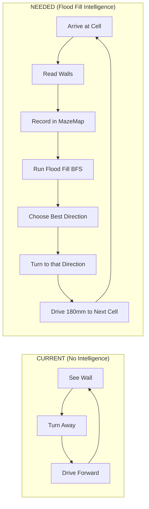
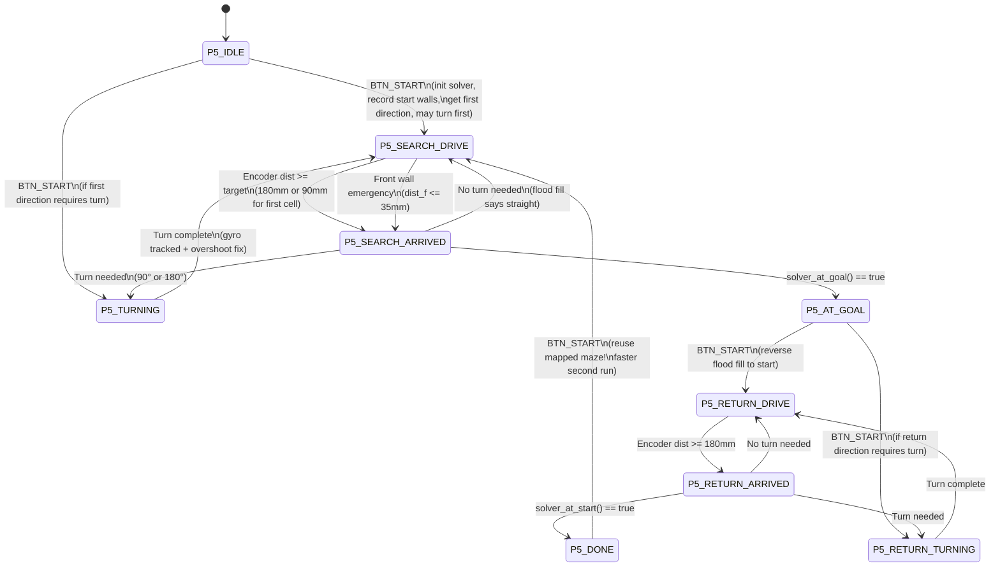
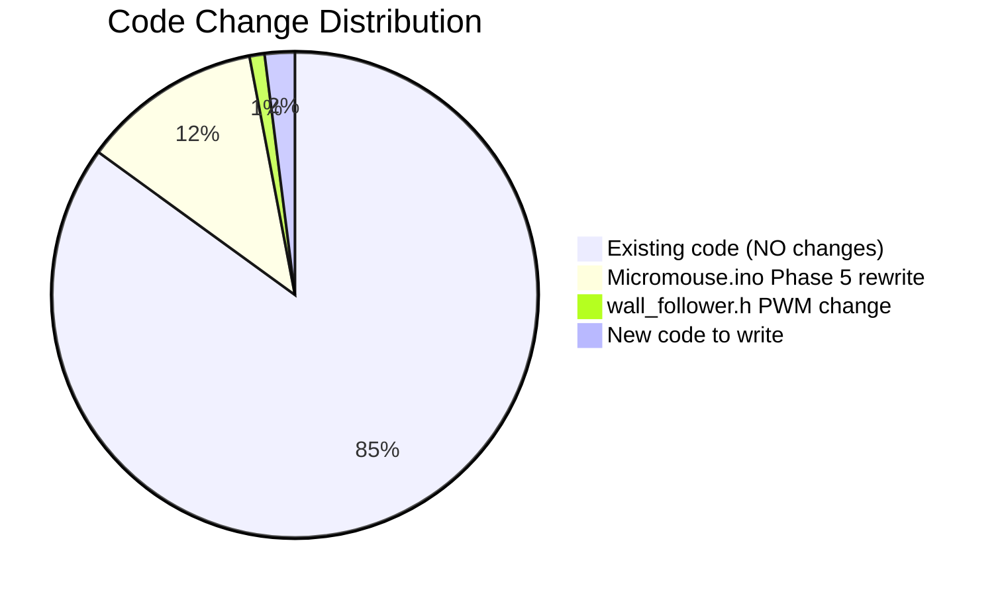

# 🏁 MazeX 1.0 Competition — Full Report & Implementation Plan

> **Competition:** MazeX 1.0 (Tomorrow, Aug 29, 2026)  
> **Team Status:** Phase 5 code exists but no algorithm — needs flood fill integration  
> **Strategy:** Wall-following PD + Flood Fill search, no speed controller, no sensor fusion  
> **Time Budget:** ~5-6 hours tonight to finish

---

## Table of Contents
1. [Competition Rules Digest](#1-competition-rules-digest)
2. [Full Codebase Analysis](#2-full-codebase-analysis)
3. [Current Phase 5 Code — What Works & What's Missing](#3-current-phase-5-gap-analysis)
4. [Modules We Have But Aren't Using](#4-unused-modules)
5. [Core Algorithm Design](#5-core-algorithm-design)
6. [State Machine Design](#6-state-machine-design)
7. [OLED Debug Screens](#7-oled-debug-screens)
8. [File-by-File Implementation Plan](#8-implementation-plan)
9. [Competition Day Checklist](#9-competition-day-checklist)
10. [Risk Assessment](#10-risk-assessment)
11. [Time Estimates](#11-time-estimates)

---

## 1. Competition Rules Digest

> [!IMPORTANT]
> ### Critical Competition Constraints
> From the [MazeX Delegate Handbook](file:///c:/Users/ADMIN/Desktop/Projects/Maze-Runner/MazeX%20Delegate%20Handbook.md):

| Rule | Detail |
|------|--------|
| **Registration** | 8:00 AM sharp at ENTC Hall 01 |
| **Robot Impoundment** | Robot collected immediately after registration — **NO modifications after** |
| **Running Order** | Randomized live raffle — **must be present all day** |
| **Calibration Time** | **5 minutes** — adjust sensors, change switches, replace batteries |
| **Competition Time** | **10 minutes** — timer starts when officials grant permission |
| **Max Runs** | **5 runs** — each can be Search Run or Fast Run (our choice) |
| **Lunch Break** | 1:00 PM – 2:00 PM |

### Maze Specifications

| Parameter | Value |
|-----------|-------|
| Grid Size | **16 × 16 cells** |
| Cell Size | **180mm × 180mm** |
| Wall Height | ~50mm |
| Wall Thickness | ~12mm |
| Start Cell | Corner of maze (3 walls: South, West, and one more) |
| Goal | Center 2×2 block: cells **(7,7), (7,8), (8,7), (8,8)** |
| Max Robot Size | 145mm × 145mm (no height limit) |

### Scoring & Penalties

| Event | Impact |
|-------|--------|
| **Run Time** | Measured from Start Line to Finish Line crossing |
| **Official Time** | The **minimum Run Time** across all 5 runs = final score |
| **Wall Contact** | **+3 seconds** penalty per collision (successive hits within 3s = 1 penalty) |
| **Manual Reset (goal→start)** | **+30 seconds** added to that Run Time |
| **Robot Stuck** | Can request restart — terminates run, **no time recorded** |
| **No completed run** | Score based on proximity to goal + cells explored |

### What We CAN Do Between Runs (While in Start Cell)
- ✅ Change switch settings (select algorithms/modes)
- ✅ Replace batteries
- ✅ Adjust sensors
- ✅ Change speed settings
- ✅ Make repairs (with judge approval)

### What We CANNOT Do
- ❌ Reprogram the robot after maze is revealed
- ❌ Enter maze information into the robot
- ❌ Use wireless communication
- ❌ Modify software during competition

---

## 2. Full Codebase Analysis

### 2.1 Project Structure

```
Full_Code/Micromouse/
├── Micromouse.ino              ← Main sketch (Phase 1-5 test modes)
├── src/
│   ├── config/
│   │   ├── config.h            ← Maze geometry, algorithm tuning, motion limits
│   │   ├── pin_config.h        ← STM32F401 pin assignments
│   │   └── robot_config.h      ← Physical robot constants (wheel, encoder, PWM)
│   ├── hardware/               (16 files)
│   │   ├── motor.h/.cpp        ← TB6612FNG driver, motor_set_both(), motor_stop()
│   │   ├── encoder.h/.cpp      ← TIM2/TIM3 quadrature, encoder_get_count()
│   │   ├── battery.h/.cpp      ← 2S LiPo ADC monitoring
│   │   ├── button.h/.cpp       ← Debounced BTN_START / BTN_MODE
│   │   ├── led.h/.cpp          ← Status + Debug LEDs with blink
│   │   ├── gpio.h/.cpp         ← Pin abstraction
│   │   ├── pwm.h/.cpp          ← TIM1 20kHz PWM
│   │   └── timer.h/.cpp        ← 1kHz control loop interrupt
│   ├── sensors/                (12 files)
│   │   ├── distance_manager.h/.cpp  ← 5× VL53L0X high-level API
│   │   ├── vl53l0x.h/.cpp      ← Low-level ToF driver (Pololu lib)
│   │   ├── mpu6050.h/.cpp      ← IMU driver (gyro_z_dps, bias calibration)
│   │   ├── sensor_fusion.h/.cpp ← Complementary filter (NOT USING)
│   │   ├── sensor_manager.h/.cpp ← Init + round-robin polling
│   │   └── calibration.h/.cpp  ← calibrate_all() for gyro bias
│   ├── control/                (18 files)
│   │   ├── wall_follower.h/.cpp ← PD controller (NOT TUNED YET)
│   │   ├── pid.h/.cpp          ← Generic PID class
│   │   ├── heading_controller  ← (available but not needed)
│   │   ├── motion_controller   ← (available but not needed)
│   │   ├── speed_controller    ← (SKIPPING - too complex for timeline)
│   │   ├── velocity_controller ← (SKIPPING)
│   │   ├── cell_controller     ← (stub)
│   │   ├── turn_controller     ← (stub)
│   │   └── trajectory_controller ← (stub)
│   ├── maze/                   (11 files)
│   │   ├── maze.h              ← MazeMap struct, wall ops, direction utils
│   │   ├── flood_fill.h/.c     ← BFS flood fill (READY, NOT CONNECTED)
│   │   ├── solver.h/.c         ← Orchestrator (READY, NOT CONNECTED)
│   │   ├── dijkstra_weighted   ← For fast run (SKIPPING)
│   │   ├── path_smoother       ← For fast run (SKIPPING)
│   │   └── maze_explorer       ← (stub)
│   ├── localization/           (10 files)
│   │   ├── odometry.h/.cpp     ← Encoder-based X/Y/θ tracking
│   │   ├── position_estimator  ← Wall correction (disabled currently)
│   │   ├── heading_estimator   ← Complementary filter
│   │   ├── pose.h/.cpp         ← Pose struct (x_mm, y_mm, theta_rad)
│   │   └── coordinate_transform ← Cell ↔ mm conversion
│   ├── display/                (8 files)
│   │   ├── oled_driver.h/.cpp  ← SSD1306 128×64 (oled_print, clear, update)
│   │   ├── menu               ← (stub)
│   │   ├── status_screen      ← (stub)
│   │   └── debug_screen       ← (stub)
│   ├── robot/                  (12 files)
│   │   ├── robot_state_machine ← FSM (stub)
│   │   ├── mission_manager    ← (stub)
│   │   ├── competition_state  ← (stub)
│   │   ├── search_mode        ← (stub)
│   │   ├── fast_run_mode      ← (stub)
│   │   └── command_executor   ← (stub)
│   └── utils/                  (13 files)
│       ├── logger.h/.cpp       ← LOG_INFO, LOG_ERROR macros
│       ├── serial_debug        ← Serial command parser
│       ├── debug_buffer        ← Ring buffer for debug
│       ├── filters             ← EMA filter
│       └── math_utils          ← Angle normalization
```

**Total: ~87 source files across 10 modules**

### 2.2 Component Status Matrix

| Component | Status | Phase | Notes |
|-----------|--------|-------|-------|
| Motors (TB6612FNG) | ✅ Working | Phase 2 | `motor_set_both(L, R)`, `motor_stop()`, PWM range 0-4199 |
| Encoders (TIM2/TIM3) | ✅ Working | Phase 2 | Quadrature 4×, calibrated GEAR_RATIO=18.85 |
| 5× VL53L0X ToF | ✅ Working | Phase 3 | Front, FL, FR, Left, Right — EMA filtered, offset calibrated |
| MPU6050 Gyro | ✅ Working | Phase 3 | `gyro_z_dps` calibrated, bias zeroed by `calibrate_all()` |
| OLED SSD1306 | ✅ Working | Phase 1 | 128×64, `oled_print(x, y, str)`, `oled_clear()`, `oled_update()` |
| Buttons | ✅ Working | Phase 1 | `button_just_pressed()`, `button_is_pressed()` with debounce |
| Battery Monitor | ⚠️ Not Using | Phase 1 | `battery_get_voltage_mv()` exists but **not integrated into P5** |
| Sensor Fusion | ⚠️ Not Using | Phase 4 | Complementary filter — **decided to skip, use gyro directly** |
| Wall Follower PD | ⚠️ Not Tuned | Ready | [wall_follower.cpp](file:///c:/Users/ADMIN/Desktop/Projects/Maze-Runner/Full_Code/Micromouse/src/control/wall_follower.cpp) — base PWM=1500 (too fast, needs 1100), KP=5, KD=1 |
| Maze Data Structures | ✅ Ready | — | [maze.h](file:///c:/Users/ADMIN/Desktop/Projects/Maze-Runner/Full_Code/Micromouse/src/maze/maze.h) — `MazeMap`, `Cell`, `Direction`, wall bitmasks |
| Flood Fill BFS | ✅ Ready | — | [flood_fill.c](file:///c:/Users/ADMIN/Desktop/Projects/Maze-Runner/Full_Code/Micromouse/src/maze/flood_fill.c) — BFS with straight preference |
| Solver Orchestrator | ✅ Ready | — | [solver.c](file:///c:/Users/ADMIN/Desktop/Projects/Maze-Runner/Full_Code/Micromouse/src/maze/solver.c) — `solver_record_walls()`, `solver_search_step()`, `solver_advance()` |
| Speed Controller | ❌ Skipping | — | Too complex for tonight — direct PWM instead |
| Dijkstra / Path Smoother | ❌ Skipping | — | Fast run optimization — not needed for search run |
| Robot FSM / Mission Manager | ❌ Stubs | — | Never implemented — we'll build our own in Phase 5 |

---

## 3. Current Phase 5 Gap Analysis

### What the Current Phase 5 Code Does

The current code in [Micromouse.ino lines 600-824](file:///c:/Users/ADMIN/Desktop/Projects/Maze-Runner/Full_Code/Micromouse/Micromouse.ino#L600-L824):

| Feature | Current Implementation | Quality |
|---------|----------------------|---------|
| Wall following | Inline P-only controller (`error = kp * (R-L)`) | ⚠️ No D term, no module reuse |
| Front wall detection | Stops when `dist_f <= 39mm` | ✅ Works |
| Turning | Gyro-tracked, `while(abs(angle) < target)` | ✅ Works but no overshoot correction |
| Turn direction decision | Compare `dist_l > dist_r` to pick left/right | ❌ **No algorithm — just follows openings** |
| Grid tracking | Encoder distance / 180mm = cell count | ⚠️ Basic, not connected to maze map |
| Button controls | Short press = toggle drive, long press = reboot | ✅ Works |
| OLED display | State, F/L/R distances, error, KP, motor PWMs | ⚠️ Basic — missing flood value, walls, cell |
| KP adjustment | MODE button cycles 1-15 | ✅ Works |

### What's MISSING (The Gap)



> [!CAUTION]
> ### The Critical Problem
> **The solver code (`solver.c`, `flood_fill.c`, `maze.h`) is fully written and ready — but it's NEVER called from Phase 5.** The robot currently just follows walls reactively with no maze-solving intelligence. It will wander randomly and likely never reach the center goal.

---

## 4. Modules We Have But Aren't Using

These are **already written, tested, and ready** — we just need to wire them into Phase 5:

### 4.1 Solver Orchestrator — [solver.c](file:///c:/Users/ADMIN/Desktop/Projects/Maze-Runner/Full_Code/Micromouse/src/maze/solver.c)

```cpp
// What it provides (already implemented):
void solver_init(Solver *s);                           // Init maze, set start (0,0), heading NORTH
void solver_record_walls(Solver *s, bool F, bool L, bool R);  // Record walls from sensor readings
Direction solver_search_step(Solver *s);               // Run flood fill, return best direction
void solver_advance(Solver *s, Direction dir);         // Move mouse position forward one cell
bool solver_at_goal(const Solver *s);                  // Check if at center (7,7)/(7,8)/(8,7)/(8,8)
bool solver_at_start(const Solver *s);                 // Check if at (0,0)
uint16_t solver_get_flood_value(const Solver *s, uint8_t x, uint8_t y);  // For OLED debug
```

### 4.2 Flood Fill — [flood_fill.c](file:///c:/Users/ADMIN/Desktop/Projects/Maze-Runner/Full_Code/Micromouse/src/maze/flood_fill.c)

```cpp
// Multi-source BFS from goal cells, with straight-preference tie-breaking
void flood_fill_compute(MazeMap *m, const uint8_t goal_cells[][2], uint8_t num_goals);
Direction flood_fill_choose_direction(const MazeMap *m, uint8_t x, uint8_t y, Direction heading);
```

### 4.3 Distance Manager — [distance_manager.cpp](file:///c:/Users/ADMIN/Desktop/Projects/Maze-Runner/Full_Code/Micromouse/src/sensors/distance_manager.cpp)

```cpp
// Already has clean API we should use instead of inline error calculation:
bool distance_has_wall_front();   // < 150mm threshold
bool distance_has_wall_left();    // < 120mm threshold  
bool distance_has_wall_right();   // < 120mm threshold
float distance_get_centering_error();  // Both-wall, left-only, right-only, no-wall logic
```

### 4.4 Wall Follower PD — [wall_follower.cpp](file:///c:/Users/ADMIN/Desktop/Projects/Maze-Runner/Full_Code/Micromouse/src/control/wall_follower.cpp)

```cpp
// PD controller with live tuning — should replace inline P-only:
void wall_follower_init();
void wall_follower_update(float lateral_error_mm, float dt);  // Drives motors directly
int16_t wall_follower_get_last_correction();  // For OLED display
float wall_follower_get_kp();
void wall_follower_set_kp(float new_kp);

// BUT: Base PWM is 1500 — needs to be lowered to ~1100 (user: "1500 very fast")
```

### 4.5 Maze Data Structures — [maze.h](file:///c:/Users/ADMIN/Desktop/Projects/Maze-Runner/Full_Code/Micromouse/src/maze/maze.h)

```cpp
// Direction system:
typedef enum { DIR_NORTH=0, DIR_EAST=1, DIR_SOUTH=2, DIR_WEST=3 } Direction;
typedef enum { TURN_NONE=0, TURN_RIGHT_90=1, TURN_180=2, TURN_LEFT_90=3 } TurnType;
TurnType get_turn_type(Direction from, Direction to);  // Tells us what turn to make

// Wall operations:
void maze_set_wall(MazeMap *m, uint8_t x, uint8_t y, Direction dir);  // Sets wall + mirror
bool maze_has_wall(const MazeMap *m, uint8_t x, uint8_t y, Direction dir);
```

---

## 5. Core Algorithm Design

### 5.1 Cell-by-Cell Flood Fill Search Algorithm

This is the **heart of the competition robot**. At each cell:

```
┌─────────────────────────────────────────────────────────┐
│                  CELL ARRIVAL PROCEDURE                  │
│                                                          │
│  1. STOP motors (brief pause for stable readings)        │
│  2. READ sensors: front, left, right                     │
│     → distance_has_wall_front/left/right()               │
│  3. RECORD walls in MazeMap:                             │
│     → solver_record_walls(&solver, F, L, R)              │
│     (This updates both current cell AND neighbor cells)  │
│  4. CHECK if at goal:                                    │
│     → solver_at_goal() checks (7,7)/(7,8)/(8,7)/(8,8)  │
│     → If YES: STOP! Goal reached! Flash LEDs!            │
│  5. COMPUTE next direction:                              │
│     → solver_search_step() runs flood fill BFS           │
│     → Returns the Direction with lowest flood value      │
│     → Prefers straight if tie (less turns = faster)      │
│  6. TURN if needed:                                      │
│     → get_turn_type(current_heading, next_direction)     │
│     → If TURN_NONE: no turn needed, keep driving         │
│     → If TURN_RIGHT_90/LEFT_90/180: execute gyro turn    │
│  7. ADVANCE solver position:                             │
│     → solver_advance(&solver, direction)                 │
│  8. DRIVE forward 180mm to next cell center              │
│     → Wall follower PD active during drive               │
│     → Encoder tracks distance                            │
│     → Front wall emergency stop if < 35mm                │
│  9. REPEAT from step 1                                   │
└─────────────────────────────────────────────────────────┘
```

### 5.2 First Cell Special Handling

```
Start position: Robot is at back wall of cell (0,0)
                Robot faces NORTH
                
Cell (0,0) has walls: SOUTH (border), WEST (border), 
                      + whatever the maze has on NORTH and EAST

FIRST MOVE: Drive only 90mm (half cell) to reach center of cell (0,0)
            → Then read walls, record, compute direction
            
SUBSEQUENT MOVES: Drive 180mm (full cell) between cell centers
```

### 5.3 Turn Handling — Fixing the "Sometimes Fast Sometimes Slow" Problem

The turn speed varies because:
- **Higher battery** → motors spin faster at same PWM
- **Lower battery** → motors spin slower at same PWM

**Solution:** We already use gyro tracking to stop at the right angle — the speed doesn't matter because we measure the actual angle turned, not timing.

**Additional improvements:**

```
BEFORE TURN:
  1. Stop motors completely
  2. Wait 100ms for stability
  3. Show turn info on OLED (direction, from→to heading)

DURING TURN:
  1. Set motors to pivot (±1100 PWM)
  2. Accumulate gyro angle: accumulated += gyro_z_dps × dt
  3. Safety timeout: 3 seconds max
  4. Stop when |accumulated| >= target_angle

AFTER TURN:
  1. Stop motors
  2. Wait 100ms for stability  
  3. CHECK OVERSHOOT: if (|accumulated| - target) > 3°
     → Reverse motors at half power
     → Accumulate correction angle
     → Stop when corrected
  4. Update solver heading
  5. Reset encoders for next cell drive
```

### 5.4 Return to Start (After Reaching Goal)

After reaching the center goal, we can return to start for another run:

```
1. Reverse the flood fill target: 
   → flood_fill_compute(&solver.maze, {{0,0}}, 1)  // Goal = start cell
2. Follow the flood fill back to (0,0)
3. The maze is already fully mapped — return is faster
4. Once at start: can do another search run with retained maze data
   → Second run uses known walls → faster path to goal
```

---

## 6. State Machine Design

### 6.1 State Diagram



### 6.2 State Descriptions

| State | What Happens | Motors | OLED Shows |
|-------|-------------|--------|------------|
| `P5_IDLE` | Wait for button, adjust KP via MODE | Stopped | Menu: KP, sensors, battery, "START=Go" |
| `P5_SEARCH_DRIVE` | Wall-follow forward, PD active, count distance | PD controlled | Sensors, error, correction, distance driven |
| `P5_SEARCH_ARRIVED` | Stop, read walls, record in maze, flood fill, decide turn | Stopped (50ms) | Cell position, walls detected, flood value, next direction |
| `P5_TURNING` | Gyro-tracked pivot turn with overshoot correction | Pivot ±1100 | Turn type, angle progress, from→to heading |
| `P5_AT_GOAL` | Celebrate! Show stats, wait for return command | Stopped, LED blink | "GOAL!", time, cells visited, "START=Return" |
| `P5_RETURN_DRIVE` | Same as SEARCH_DRIVE but heading back to start | PD controlled | Same but "RET" prefix |
| `P5_RETURN_ARRIVED` | Same as SEARCH_ARRIVED but checking for start cell | Stopped (50ms) | Same with return info |
| `P5_RETURN_TURNING` | Same as TURNING but during return | Pivot ±1100 | Same |
| `P5_DONE` | Back at start, maze retained for next run | Stopped | "BACK AT START", cells mapped, "START=Run again" |

---

## 7. OLED Debug Screens

Each screen uses all 6 lines (128×64 display, text size 1 = 8px per line):

### Screen: IDLE
```
┌────────────────────────┐  ← 128px wide
│MazeX v1.0  IDLE        │  Line 0 (y=0)
│KP: 5  MODE=+KP         │  Line 1 (y=12)
│F:245 L:31 R:28          │  Line 2 (y=24)
│Err:-3                   │  Line 3 (y=36)
│Bat:7840mV    START=Go   │  Line 4 (y=48)
└────────────────────────┘
```

### Screen: SEARCH DRIVE
```
┌────────────────────────┐
│SRC (3,5)N F:14          │  State, cell, heading, flood value
│F:142 L:31 R:28          │  Raw sensor distances
│WF:0 WL:1 WR:1           │  Wall booleans (debug: is threshold right?)
│Err:3 Cor:15              │  Centering error + PD correction
│D:94/180 C:12 T:45s      │  Distance driven/target, cells visited, time
└────────────────────────┘
```

### Screen: ARRIVED (at cell center)
```
┌────────────────────────┐
│ARRIVED (3,5) N          │  Cell position and heading
│F:142 L:31 R:28          │  Sensor distances
│Walls: .LR               │  Which walls detected (F/L/R or .)
│Flood: 11                │  Current flood value (lower = closer to goal)
│Next: E  C:12            │  Direction flood fill chose
└────────────────────────┘
```

### Screen: TURNING
```
┌────────────────────────┐
│TURN RIGHT 90            │  Turn type and angle
│(3,5) N->E               │  Cell, from heading → to heading
│                         │
│Cells: 12  T:45s         │  Progress stats
│                         │
└────────────────────────┘
```

### Screen: GOAL REACHED
```
┌────────────────────────┐
│   ** GOAL! **           │  Big celebration text
│Cell: (7,7)              │  Which goal cell we reached
│Time: 2:34               │  Elapsed time (mm:ss)
│Cells: 87/256            │  How many cells visited
│START=Return             │  Instructions for next action
└────────────────────────┘
```

### Screen: DONE (back at start)
```
┌────────────────────────┐
│** BACK AT START **      │
│Time: 4:12               │  Total time including return
│Cells: 102 mapped        │  Total cells explored
│Maze retained!           │  Maze data kept for fast second run
│START=Run again          │  Can start another run with known map
└────────────────────────┘
```

---

## 8. File-by-File Implementation Plan

### 8.1 Files to MODIFY

---

#### [MODIFY] [Micromouse.ino](file:///c:/Users/ADMIN/Desktop/Projects/Maze-Runner/Full_Code/Micromouse/Micromouse.ino)

**Changes needed:**

**A. Add includes (near line 42):**
```cpp
#include "src/control/wall_follower.h"
#include "src/maze/solver.h"
```

**B. Change phase flags (line 58-63):**
```cpp
#define PHASE_3_TEST_MODE 0   // was 1
#define PHASE_5_TEST_MODE 1   // was 0
```

**C. Rewrite Phase 5 setup (lines 225-251):**
- Add `wall_follower_init()` call
- Show "MazeX v1.0 Initializing..." on OLED
- Log "Phase 5 Competition Mode Ready!"

**D. Complete rewrite of Phase 5 loop (lines 600-824):**
Replace the entire Phase 5 loop section with the new state machine containing:

1. **Static variables:**
   - `Solver solver` — the maze solver instance
   - `P5State p5_state` — state machine state
   - `Direction target_direction` — where flood fill says to go
   - `float drive_target_mm` — how far to drive (90mm first, 180mm after)
   - `bool is_returning` — return mode flag
   - `uint32_t run_start_time` — for elapsed time display
   - `uint16_t cells_visited` — counter

2. **State machine switch/case** with all states from Section 6

3. **OLED debug display** updating at 10Hz with all screens from Section 7

4. **Serial debug output** printing state, cell, heading, sensors, flood value

---

#### [MODIFY] [wall_follower.h](file:///c:/Users/ADMIN/Desktop/Projects/Maze-Runner/Full_Code/Micromouse/src/control/wall_follower.h)

**Change base PWM from 1500 to 1100:**
```cpp
// BEFORE:
#define WALL_FOLLOW_BASE_PWM_LEFT  1500
#define WALL_FOLLOW_BASE_PWM_RIGHT 1500

// AFTER:
#define WALL_FOLLOW_BASE_PWM_LEFT  1100
#define WALL_FOLLOW_BASE_PWM_RIGHT 1100
```

**Reason:** User confirmed 1500 is too fast for reliable wall following. 1100 is the safe middle range.

---

### 8.2 Files that NEED NO CHANGES (used as-is)

| File | Why It's Ready |
|------|----------------|
| [solver.c](file:///c:/Users/ADMIN/Desktop/Projects/Maze-Runner/Full_Code/Micromouse/src/maze/solver.c) | Complete orchestrator with all needed functions |
| [solver.h](file:///c:/Users/ADMIN/Desktop/Projects/Maze-Runner/Full_Code/Micromouse/src/maze/solver.h) | Clean API header |
| [flood_fill.c](file:///c:/Users/ADMIN/Desktop/Projects/Maze-Runner/Full_Code/Micromouse/src/maze/flood_fill.c) | BFS with straight preference, O(256) |
| [flood_fill.h](file:///c:/Users/ADMIN/Desktop/Projects/Maze-Runner/Full_Code/Micromouse/src/maze/flood_fill.h) | Clean API header |
| [maze.h](file:///c:/Users/ADMIN/Desktop/Projects/Maze-Runner/Full_Code/Micromouse/src/maze/maze.h) | All data structures, direction utils, wall ops |
| [config.h](file:///c:/Users/ADMIN/Desktop/Projects/Maze-Runner/Full_Code/Micromouse/src/config/config.h) | Maze size=16, goal cells, PREFER_STRAIGHT=1 |
| [distance_manager.cpp](file:///c:/Users/ADMIN/Desktop/Projects/Maze-Runner/Full_Code/Micromouse/src/sensors/distance_manager.cpp) | Wall detection + centering error |
| [wall_follower.cpp](file:///c:/Users/ADMIN/Desktop/Projects/Maze-Runner/Full_Code/Micromouse/src/control/wall_follower.cpp) | PD controller logic (just change header PWM) |
| All hardware drivers | Tested in Phases 1-3 |

### 8.3 Files SKIPPED (not needed for competition)

- `speed_controller.cpp/h` — Too complex, direct PWM instead
- `velocity_controller.cpp/h` — Requires speed controller
- `dijkstra_weighted.c/h` — Only for fast run optimization
- `path_smoother.c/h` — Only for fast run optimization
- `sensor_fusion.cpp/h` — Using gyro directly for turns
- `position_estimator.cpp/h` — Wall corrections disabled
- All robot/ stubs — We build our own state machine inline

---

## 9. Competition Day Checklist

### Night Before (Tonight)
- [ ] Implement Phase 5 state machine with flood fill
- [ ] Lower wall_follower base PWM to 1100
- [ ] Test compilation (no syntax errors)
- [ ] If possible: test wall following on desk
- [ ] Charge batteries fully
- [ ] Pack: laptop, USB cable, spare batteries, charger, small screwdrivers

### Morning (8:00 AM)
- [ ] Arrive at ENTC Hall 01 **before 8:00 AM**
- [ ] Register team
- [ ] Hand over robot (impoundment)
- [ ] **Cannot modify robot after this!**

### When Called for Competition

#### Calibration Phase (5 minutes)
1. Place robot in start cell (corner)
2. Power on → "MazeX v1.0 Initializing..."
3. **Keep robot STILL** during gyro calibration (~2 seconds)
4. OLED shows IDLE screen → verify:
   - [ ] F, L, R sensor readings look reasonable
   - [ ] Centering error near 0 when centered
   - [ ] KP value displayed (adjust with MODE button if needed)
5. Optional: test centering error by shifting robot left/right in cell

#### Competition Phase (10 minutes, max 5 runs)

| Run | Strategy | What to Do |
|-----|----------|------------|
| **Run 1** | Search Run | Press START → robot explores maze with flood fill |
| **Run 2** | Search (if needed) | If Run 1 didn't reach goal, try again with retained maze data |
| **Run 3-5** | Repeat search | Each run benefits from previously mapped walls |

#### If Robot Gets Stuck
1. **Don't panic** — this burns a run but no time penalty
2. Request judge permission to restart
3. Place robot back in start cell
4. Press START for next run (maze data retained!)

#### If Robot Reaches Goal
- Run Time is recorded automatically
- **Option A:** Press START on robot → returns to start autonomously (recommended)
- **Option B:** Manually lift robot to start → **+30 second penalty!** Avoid this if possible

---

## 10. Risk Assessment

| Risk | Probability | Impact | Mitigation |
|------|-------------|--------|------------|
| **Wall follower PD not tuned** | 🔴 High | 🔴 High | Adjust KP via MODE button at venue. Start with KP=5, increase if not centering enough |
| **Turns overshoot/undershoot** | 🟡 Medium | 🟡 Medium | Gyro tracking handles variable speed. Post-turn correction fixes overshoot >3° |
| **Robot doesn't reach goal in 10 min** | 🟡 Medium | 🟡 Medium | Even partial exploration gets a score (Section 2.5.8). Flood fill ensures optimal path |
| **Compilation errors** | 🟡 Medium | 🔴 High | Test compile before sleep. The solver files are C (not C++) — ensure `extern "C"` is correct |
| **ToF gives wrong wall reading** | 🟢 Low | 🔴 High | EMA filter + calibrated offsets already in place. Thresholds adjustable |
| **Battery dies mid-run** | 🟢 Low | 🔴 High | Charge fully tonight. Bring spare. Check voltage on OLED before each run |
| **Robot crashes into wall** | 🟡 Medium | 🟡 Medium | Front wall emergency stop at 35mm. Each crash = +3s penalty but not fatal |
| **Code crash/freeze** | 🟡 Medium | 🔴 High | Long-press reboot available. 3-second turn timeout prevents infinite loops |
| **Encoder drift** | 🟢 Low | 🟡 Medium | Reset encoders at each cell center. 180mm per cell is forgiving |

---

## 11. Time Estimates

| Task | Time | Priority |
|------|------|----------|
| **Phase 5 state machine rewrite** (Micromouse.ino) | 2-3 hours | 🔴 Critical |
| **OLED debug screens** for all states | 30 min | 🔴 Critical (included in above) |
| **Lower wall_follower base PWM** | 5 min | 🔴 Critical |
| **Test compilation** | 15 min | 🔴 Critical |
| **Return-to-start logic** | 30 min | 🟡 Important (included in state machine) |
| **Desk testing** (drive straight, check OLED) | 30 min | 🟡 Important |
| **Post-turn overshoot correction** | 15 min | 🟡 Important (included in state machine) |
| **Total** | **~3.5-4.5 hours** | |

> [!TIP]
> ### The Key Insight
> **90% of the code we need already exists in the codebase.** The flood fill solver, maze data structures, wall detection, wall follower PD, gyro turns — all written and ready. We're not building from scratch. We're **wiring together existing tested modules** into a coherent state machine. That's why this is achievable tonight.

---

## Summary: What Changes and What Doesn't



**Files to modify: 2**  
**Files that work as-is: 85+**  
**New files to create: 0**

The competition robot is a **wiring job**, not a rewrite. Connect `solver_record_walls()` + `solver_search_step()` + `wall_follower_update()` + gyro turns into a state machine, add rich OLED debug, and we're competition-ready.
