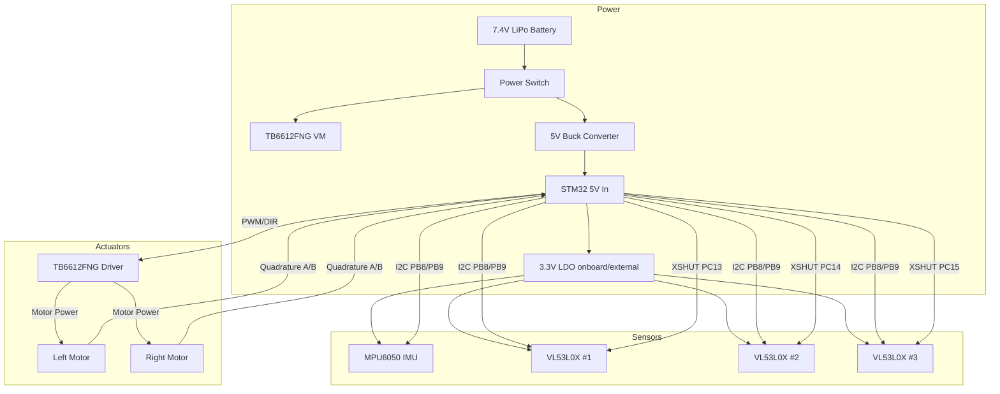

# 01 — Hardware Overview
## Every Component Explained for Micromouse

---

## 1. Microcontroller: STM32F411CEU6 (BlackPill)

### Specs:
- **MCU:** STM32F411CEU6
- **Flash:** 512KB
- **RAM:** 128KB
- **Clock Speed:** 100 MHz

**Why STM32F411CEU6?**
- 100 MHz clock speed → fast sensor reads, fast PID loops
- Hardware timers for precise encoder counting
- I2C hardware support for MPU6050 + multiple VL53L0X
- Ample PWM channels for motor control

**Arduino IDE Setup:**
```
Board Manager URL: https://github.com/stm32duino/BoardManagerFiles/raw/main/package_stmicroelectronics_index.json
Board: "STM32 boards groups" → Generic STM32F4 series (BlackPill)
Upload Method: STLink or Serial
```

---

## 2. N20 Motors with Encoders (300 RPM)

### Specs at 6V:
- **No-load speed:** 300 RPM
- **Stall torque:** ~1 kg·cm
- **Encoder resolution:** Typically 7 PPR (pulses per revolution) on motor shaft
- **Gear ratio:** Usually 1:30 to 1:50 (check your specific model)
- **Effective CPR after gearbox:** 7 × gear_ratio (e.g. 7 × 30 = 210 CPR)

### Role in micromouse:
- Drive the two rear wheels
- Encoders give you **odometry** — exactly how far each wheel has turned
- Differential drive: spin motors at different speeds to turn
- Encoder feedback enables **closed-loop PID speed control**

### Encoder signal type:
- Most N20 encoders give **quadrature output** (2 channels, A and B)
- Phase difference tells you direction
- Pulse count tells you distance traveled

---

## 3. MPU6050 (IMU — Gyroscope + Accelerometer)

### Specs:
- 3-axis gyroscope + 3-axis accelerometer
- I2C interface (address 0x68 or 0x69)
- DMP (Digital Motion Processor) onboard
- Supply: 3.3V (STM32 compatible)

### Role in micromouse:
- **Heading correction:** Gyro Z-axis measures yaw (rotation)
- Detect if robot is drifting/turning when it should go straight
- Correct accumulated encoder drift in turns
- **Critical for accurate 90° turns** in the maze
- Cross-check with encoder odometry

### Key usage:
- Use gyro integration for short-term heading
- Complementary filter: `heading = 0.98 × (heading + gyro_dt) + 0.02 × accel_angle`

---

## 4. VL53L0X — Time-of-Flight Distance Sensors (3 or 5)

### Specs:
- Ranging: 50mm – 2000mm (accurate up to ~1200mm)
- I2C interface (default address **0x29 — ALL same!**)
- Field of view: ~25°
- Update rate: up to 50 Hz (50ms per reading)
- Supply: 2.6V – 3.5V (3.3V ideal)

> [!CAUTION]
> **Address conflict!**
All VL53L0X start at 0x29. You MUST assign unique addresses at startup using **XSHUT pins**.

**Procedure:**
1. Pull ALL XSHUT pins LOW (disable all sensors)
2. Enable sensor 1 (XSHUT1 HIGH), assign address 0x30
3. Enable sensor 2 (XSHUT2 HIGH), assign address 0x31
4. Repeat for each sensor

### Placement (3-sensor config):
```
        [FRONT CENTER]  ← detects wall ahead
       /               \
[LEFT 45°]           [RIGHT 45°]  ← detects side walls
```

### Placement (5-sensor config — recommended):
```
     [FL 45°] [FRONT] [FR 45°]
     [LEFT 90°]       [RIGHT 90°]
```
- Front: detect wall, brake before hitting
- Side 90°: wall-following, centering in corridor
- Diagonal 45°: early detection of turns and openings

---

## 5. TB6612FNG — Dual Motor Driver

### Specs:
- Dual H-bridge motor driver
- Output: up to 1.2A continuous, 3.2A peak per channel
- Input voltage: 4.5V – 13.5V (VM pin)
- Logic voltage: 2.7V – 5.5V (VCC pin)
- PWM frequency: up to 100 kHz

### Role:
- Translates STM32 PWM + direction signals into motor power
- Drives both N20 motors independently
- Built-in protection: thermal shutdown, over-current

### Pins used:
```
PWMA  → PWM signal for Motor A (speed)
AIN1  → Direction bit 1 for Motor A
AIN2  → Direction bit 2 for Motor A
PWMB  → PWM signal for Motor B
BIN1  → Direction bit 1 for Motor B
BIN2  → Direction bit 2 for Motor B
STBY  → Standby (must be HIGH to enable)
VM    → Motor power (7.4V battery)
VCC   → Logic power (3.3V from STM32)
```

### Direction truth table:

| AIN1 | AIN2 | Motor |
|------|------|-------|
| HIGH | LOW  | Forward |
| LOW  | HIGH | Reverse |
| HIGH | HIGH | Brake |
| LOW  | LOW  | Coast |

---

## 6. Ball Caster / Third Contact Point

### Why needed:
- Differential drive uses only 2 wheels — robot tips forward/backward without a 3rd point
- Ball caster provides low-friction, omnidirectional ground contact

### Recommended options:

| Type | Diameter | Pros | Cons |
|------|----------|------|------|
| **Metal ball caster** | 10–15mm | Smooth, durable | Heavy, slippery on some floors |
| **Nylon ball caster** | 10mm | Lightweight | Can wear down |
| **PTFE skid pad** | N/A | Lightest option, no height | Less consistent friction |

### Placement:
- Mount at the **front center** of robot
- Height must match wheel contact plane — shim with washers if needed
- Keep it clean — dirt on ball caster causes erratic behavior

> [!TIP]
> For competition-grade robots, a PTFE (Teflon) skid is lighter than a ball caster and has more consistent friction.

---

## 7. Battery — 2× 3.7V LiPo

### Configuration:
- **Series connection** → 7.4V nominal (8.4V fully charged, 6.0V cutoff)
- Capacity: Recommend **500–800 mAh** for ~20–30 min runtime

### Power distribution:
```
7.4V Battery
├── VM (TB6612FNG motor power) ──→ direct
├── 5V Regulator (LM7805 or MP1584) ──→ STM32 5V pin
└── 3.3V LDO (AMS1117-3.3) ──→ VL53L0X, MPU6050
```

> [!WARNING]
> **Never connect 7.4V directly to STM32 or sensors!**

---

## 8. Weight Budget

**Target total weight: 80–150g** (lighter = faster acceleration + less wheel slip)

| Component | Approx Weight |
|-----------|---------------|
| STM32F411CEU6 (BlackPill) | 5g |
| 2× N20 motors + encoders | 20g |
| TB6612FNG breakout | 3g |
| MPU6050 breakout | 2g |
| 3× VL53L0X breakouts | 3g |
| 2× 3.7V LiPo (500mAh) | 25g |
| PCB + connectors | 15g |
| Wheels + ball caster | 10g |
| Chassis (acrylic/PCB) | 15g |
| Wiring + misc | 5g |
| **Total** | **~103g** |

> [!TIP]
> Competition micromice weigh 60–120g. If over 150g, consider lighter batteries (300mAh) or PCB-as-chassis design.

---

## 9. Sensor Comparison — VL53L0X vs Alternatives

| Sensor | Type | Range | Speed | I2C? | Cost | Recommendation |
|--------|------|-------|-------|------|------|----------------|
| **VL53L0X** | ToF laser | 50–1200mm | 50Hz | Yes | ~$3 | ✅ **Best overall for micromouse** |
| VL53L1X | ToF laser | 40–4000mm | 50Hz | Yes | ~$5 | Overkill range, same accuracy |
| GP2Y0A21 | IR analog | 100–800mm | ~25Hz | No (ADC) | ~$2 | Simpler wiring, less accurate |
| Sharp GP2Y0E03 | IR digital | 40–500mm | ~25Hz | Yes | ~$4 | Short range only |
| HC-SR04 | Ultrasonic | 20–4000mm | ~20Hz | No (GPIO) | ~$1 | Too slow, too wide beam for maze |

**Why VL53L0X wins:**
- Narrow 25° beam — doesn't hit adjacent walls
- Fast enough for 50Hz PID loops
- I2C = fewer pins used
- Accurate within ±3% at maze distances (50–300mm)

---

## 11. System Architecture Diagram


