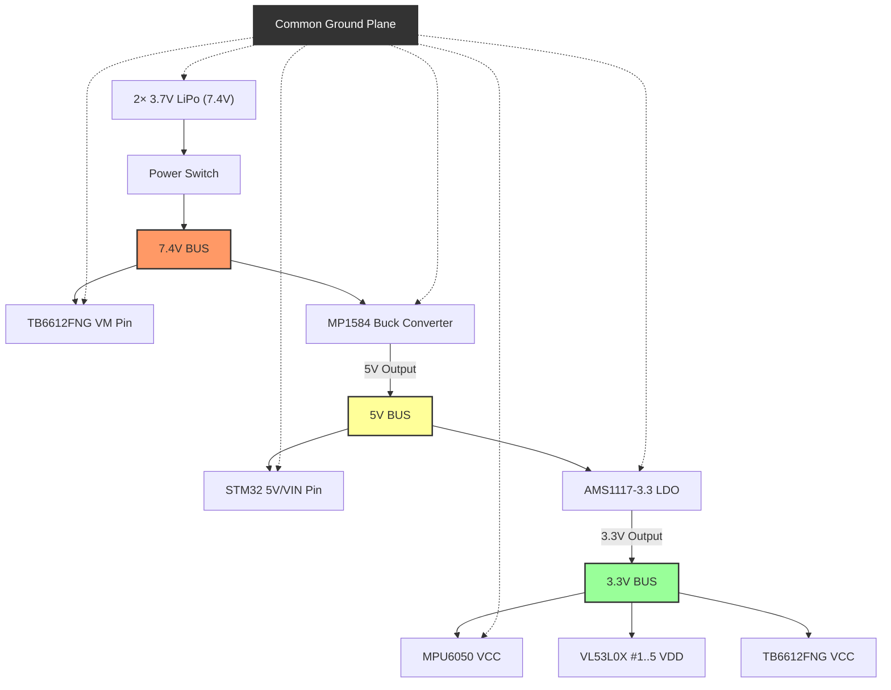
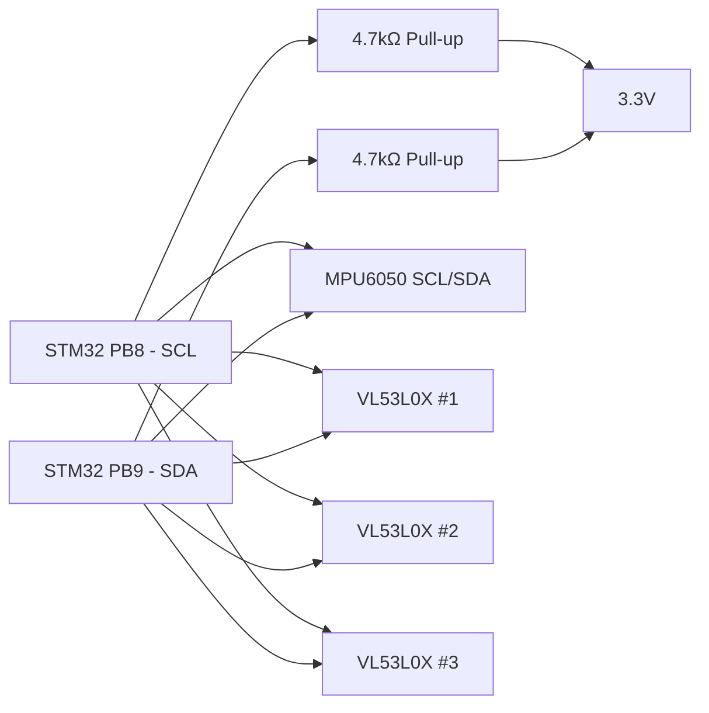

# 03 — Pin Diagram & Wiring Guide
## STM32F411CEU6 (BlackPill) — Complete Connection Map

---

## Pin Assignment Table (STM32F411CEU6)

> [!NOTE]
> **Updated to match actual tested hardware wiring** (confirmed by working Testing Codes).
> Motor PWM uses TIM1 (PA8/PA9) at 20kHz register-level PWM.
> Encoders use TIM2/TIM3 hardware encoder mode (not software EXTI interrupts).

| STM32 Pin | Function | Connected To | Notes |
|-----------|----------|--------------|-------|
| **PA0** | ENC_LA | Left Motor Encoder A | TIM2 CH1 — Hardware Encoder Mode 3 |
| **PA1** | ENC_LB | Left Motor Encoder B | TIM2 CH2 — Hardware Encoder Mode 3 |
| **PA6** | ENC_RA | Right Motor Encoder A | TIM3 CH1 — Hardware Encoder Mode 3 |
| **PA7** | ENC_RB | Right Motor Encoder B | TIM3 CH2 — Hardware Encoder Mode 3 |
| **PA8** | PWM_A | TB6612FNG PWMA | TIM1 CH1 — 20kHz PWM (register-level) |
| **PA9** | PWM_B | TB6612FNG PWMB | TIM1 CH2 — 20kHz PWM (register-level) |
| **PB12** | AIN1 | TB6612FNG AIN1 | Digital output — Motor A direction |
| **PB13** | AIN2 | TB6612FNG AIN2 | Digital output — Motor A direction |
| **PB15** | BIN1 | TB6612FNG BIN1 | Digital output — Motor B direction |
| **PA10** | BIN2 | TB6612FNG BIN2 | Digital output — Motor B direction |
| **PB14** | STBY | TB6612FNG STBY | HIGH = enabled |
| **PB8** | SCL | I2C1 Clock | MPU6050 + All VL53L0X (400kHz) |
| **PB9** | SDA | I2C1 Data | MPU6050 + All VL53L0X (400kHz) |
| **PA4** | XSHUT_1 | VL53L0X #1 XSHUT (Front) | Active LOW shutdown |
| **PA5** | XSHUT_2 | VL53L0X #2 XSHUT (Left) | Active LOW shutdown |
| **PB3** | XSHUT_3 | VL53L0X #3 XSHUT (Right) | Active LOW shutdown |
| **PB0** | VBAT_ADC | Battery voltage divider | ADC input — for low-voltage cutoff |
| **PB5** | BTN_START | Push Button 1 | INPUT_PULLUP |
| **PB4** | BTN_RESET | Push Button 2 | INPUT_PULLUP (optional) |
| **PB1** | BUZZER | Passive Buzzer | Optional |
| **PA15** | STATUS_LED | LED + 330Ω → GND | Optional |
| **PA11/PA12** | USB D-/D+ | USB (if using serial debug) | |

> [!NOTE]
> **Pin utilization:** 22 pins used / ~20 pins free on STM32F411CEU6. Plenty of room for expansion (OLED, Bluetooth, extra sensors).

---

## Wiring Diagrams

### Power Wiring


> [!CAUTION]
> All grounds must be connected together: Battery GND, STM32 GND, TB6612FNG GND, Sensor GND — one shared ground plane.

---

### I2C Bus Wiring (Shared)


> Note: Only 2 pull-up resistors needed per I2C bus (one on SCL, one on SDA). Don't add per-device.

---

### VL53L0X XSHUT Wiring (3-sensor example)
```
STM32 PC13 ──→ VL53L0X #1 XSHUT   (Front Center)
STM32 PC14 ──→ VL53L0X #2 XSHUT   (Left)
STM32 PC15 ──→ VL53L0X #3 XSHUT   (Right)

Each XSHUT also has 10kΩ pull-up to 3.3V
(keeps sensor active even if STM32 pin is floating during boot)
```

---

### TB6612FNG Wiring
```
STM32                   TB6612FNG           Motors
──────                  ─────────           ──────
PA8  (PWM_A)  ───────→  PWMA  (TIM1 CH1, 20kHz)
PB12 (AIN1)   ───────→  AIN1                      ┌─ AO1 ──→ Left Motor (+)
PB13 (AIN2)   ───────→  AIN2                      └─ AO2 ──→ Left Motor (-)
PA9  (PWM_B)  ───────→  PWMB  (TIM1 CH2, 20kHz)
PB15 (BIN1)   ───────→  BIN1                      ┌─ BO1 ──→ Right Motor (+)
PA10 (BIN2)   ───────→  BIN2                      └─ BO2 ──→ Right Motor (-)
PB14          ───────→  STBY (HIGH = active)
3.3V          ───────→  VCC  (logic power)
7.4V          ───────→  VM   (motor power)
GND           ───────→  GND
```

---

### Encoder Wiring (per motor)

> [!NOTE]
> Encoders use **hardware encoder mode** (TIM2/TIM3 in Encoder Mode 3), NOT software interrupts (EXTI).
> This gives 4× resolution (both edges of both channels) with zero CPU overhead.

```
N20 Motor Encoder       STM32              Timer
─────────────────       ─────              ─────
Left Encoder A   ─────→ PA0                TIM2 CH1 (32-bit counter)
Left Encoder B   ─────→ PA1                TIM2 CH2
Right Encoder A  ─────→ PA6                TIM3 CH1 (16-bit counter)
Right Encoder B  ─────→ PA7                TIM3 CH2
VCC (3.3V or 5V) ─────→ 3.3V
GND              ─────→ GND
```

> Some N20 encoders operate on 5V — check your datasheet. If 5V output signals, add voltage divider (10kΩ + 20kΩ) before STM32 pins to protect 3.3V GPIO.

---

### MPU6050 Wiring
```
MPU6050     STM32
───────     ─────
VCC   ────→ 3.3V
GND   ────→ GND
SCL   ────→ PB8
SDA   ────→ PB9
AD0   ────→ GND  (sets I2C address to 0x68)
INT   ────→ PA4  (optional — for DMP interrupt mode)
```

---

## Sensor Placement Angles

### 3-Sensor Config (Minimum):
```
         Front wall
    ─────────────────────
    │                   │
    │   ← Robot →      │
    │                   │
         [FRONT] ← 0°
     [L-45°]  [R-45°]

L-45° sensor mounted 45° left of forward axis
R-45° sensor mounted 45° right of forward axis
```

### 5-Sensor Config (Recommended):
```
    [L-90°] [L-45°] [FRONT] [R-45°] [R-90°]
      ←─────────── robot ──────────→

L-90°: Points directly left (wall-following)
R-90°: Points directly right (wall-following)
L-45°: Detects left-front corner/opening
R-45°: Detects right-front corner/opening
FRONT: Detects wall directly ahead
```

---

> [!WARNING]
> **Wiring Checklist**

Before powering on:
- [ ] All GNDs connected to common ground
- [ ] 7.4V not connected to STM32 or sensors directly
- [ ] 5V Buck converter output verified with multimeter before connecting
- [ ] 3.3V LDO output verified before connecting sensors
- [ ] I2C pull-ups (4.7kΩ) on SCL and SDA
- [ ] STBY pin of TB6612FNG HIGH (tied to 3.3V or STM32 pin)
- [ ] Motor polarity correct (wrong polarity just reverses direction, not harmful)
- [ ] Encoder power matches encoder spec (3.3V or 5V?)
- [ ] XSHUT lines have 10kΩ pull-ups to 3.3V
- [ ] No loose connections

---

## Color Code Convention (Recommended)

| Color | Use |
|-------|-----|
| Red | 3.3V |
| Orange | 5V |
| Black | GND |
| Blue | I2C SDA |
| Yellow | I2C SCL |
| Green | PWM signals |
| White | Encoder signals |
| Purple | Motor output wires |
| Gray | XSHUT signals |

---

## Timer & Peripheral Conflict Map (STM32F411)

> [!NOTE]
> All timer assignments verified against working testing code. No conflicts.

| Timer | Channels Used | Pins | Purpose | Conflict? |
|-------|---------------|------|---------|----------|
| **TIM1** | CH1, CH2 | PA8, PA9 | Motor PWM (20kHz, register-level) | ❌ No |
| **TIM2** | CH1, CH2 | PA0, PA1 | Left encoder (Hardware Encoder Mode 3, 32-bit) | ❌ No |
| **TIM3** | CH1, CH2 | PA6, PA7 | Right encoder (Hardware Encoder Mode 3, 16-bit) | ❌ No |
| **I2C1** | SCL, SDA | PB8, PB9 | Sensors + IMU (400kHz Fast I2C) | ❌ No |
| **ADC1** | CH8 | PB0 | Battery voltage reading | ❌ No |
| **USB** | D-, D+ | PA11, PA12 | Serial debug | ❌ No |

**All timers are independent — no conflicts in this configuration.** ✅

> [!TIP]
> Using hardware encoder mode (TIM2/TIM3) instead of software EXTI interrupts is a major upgrade:
> - **Zero CPU overhead** — counting happens in hardware
> - **4× resolution** — counts both edges of both channels (Encoder Mode 3)
> - **No missed pulses** at high RPM — hardware never misses edges
> - TIM2 is 32-bit (no overflow for long distances), TIM3 is 16-bit (handle with delta accumulation)
