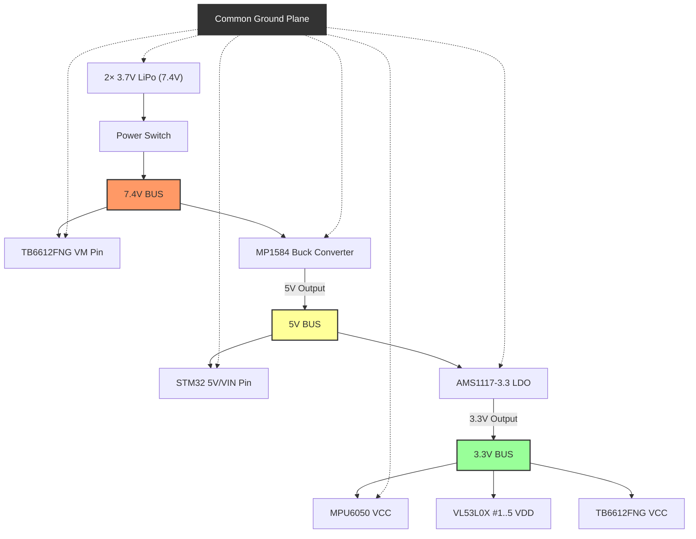
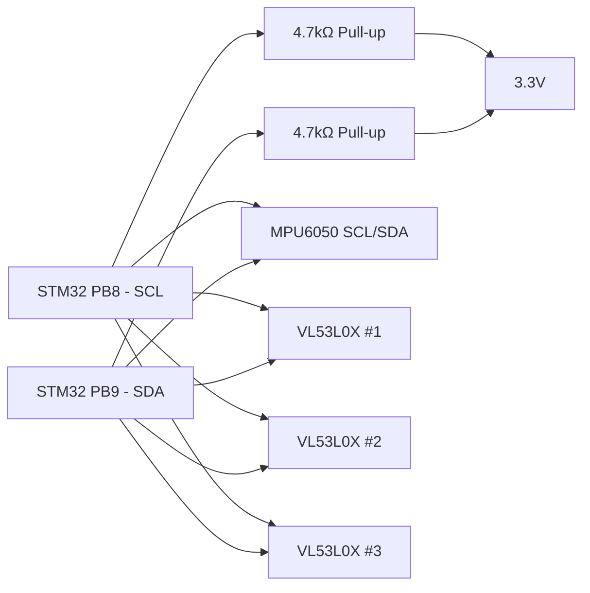

# 03 — Pin Diagram & Wiring Guide
## STM32F411CEU6 (BlackPill) — Complete Connection Map

---

## Pin Assignment Table (STM32F411CEU6)

| STM32 Pin | Function | Connected To | Notes |
|-----------|----------|--------------|-------|
| **PA0** | ENC_LA | Left Motor Encoder A | EXTI0 — hardware interrupt |
| **PA1** | ENC_LB | Left Motor Encoder B | EXTI1 — hardware interrupt |
| **PA2** | ENC_RA | Right Motor Encoder A | EXTI2 — hardware interrupt |
| **PA3** | ENC_RB | Right Motor Encoder B | EXTI3 — hardware interrupt |
| **PA6** | PWM_A | TB6612FNG PWMA | Timer3 CH1 — PWM output |
| **PA7** | PWM_B | TB6612FNG PWMB | Timer3 CH2 — PWM output |
| **PB0** | AIN1 | TB6612FNG AIN1 | Digital output |
| **PB1** | AIN2 | TB6612FNG AIN2 | Digital output |
| **PB4** | BIN1 | TB6612FNG BIN1 | Digital output |
| **PB5** | BIN2 | TB6612FNG BIN2 | Digital output |
| **PB6** | STBY | TB6612FNG STBY | HIGH = enabled |
| **PB8** | SCL | I2C1 Clock | MPU6050 + All VL53L0X |
| **PB9** | SDA | I2C1 Data | MPU6050 + All VL53L0X |
| **PC13** | XSHUT_1 | VL53L0X #1 XSHUT | Active LOW shutdown |
| **PC14** | XSHUT_2 | VL53L0X #2 XSHUT | Active LOW shutdown |
| **PC15** | XSHUT_3 | VL53L0X #3 XSHUT | Active LOW shutdown |
| **PB12** | XSHUT_4 | VL53L0X #4 XSHUT | Only for 5-sensor config |
| **PB13** | XSHUT_5 | VL53L0X #5 XSHUT | Only for 5-sensor config |
| **PA8** | BTN_START | Push Button 1 | INPUT_PULLUP |
| **PA9** | BTN_RESET | Push Button 2 | INPUT_PULLUP |
| **PA10** | BUZZER | Passive Buzzer | Optional |
| **PA15** | STATUS_LED | LED + 330Ω → GND | Optional |
| **PA4** | MPU_INT | MPU6050 INT pin | Optional — for DMP interrupt mode |
| **PA5** | VBAT_ADC | Battery voltage divider | ADC input — for low-voltage cutoff |
| **PA11/PA12** | USB D-/D+ | USB (if using serial debug) | |

> [!NOTE]
> **Pin utilization:** 22 pins used / ~20 pins free on STM32F411CEU6. Plenty of room for expansion (OLED, Bluetooth, extra sensors).

---

## Wiring Diagrams

### Power Wiring


> [!CAUTION]
> All grounds must be connected together: Battery GND, STM32 GND, TB6612FNG GND, Sensor GND — one shared ground plane.

---

### I2C Bus Wiring (Shared)


> Note: Only 2 pull-up resistors needed per I2C bus (one on SCL, one on SDA). Don't add per-device.

---

### VL53L0X XSHUT Wiring (3-sensor example)
```
STM32 PC13 ──→ VL53L0X #1 XSHUT   (Front Center)
STM32 PC14 ──→ VL53L0X #2 XSHUT   (Left)
STM32 PC15 ──→ VL53L0X #3 XSHUT   (Right)

Each XSHUT also has 10kΩ pull-up to 3.3V
(keeps sensor active even if STM32 pin is floating during boot)
```

---

### TB6612FNG Wiring
```
STM32                   TB6612FNG           Motors
──────                  ─────────           ──────
PA6 (PWM_A)   ───────→  PWMA
PB0 (AIN1)    ───────→  AIN1                      ┌─ AO1 ──→ Left Motor (+)
PB1 (AIN2)    ───────→  AIN2                      └─ AO2 ──→ Left Motor (-)
PA7 (PWM_B)   ───────→  PWMB
PB4 (BIN1)    ───────→  BIN1                      ┌─ BO1 ──→ Right Motor (+)
PB5 (BIN2)    ───────→  BIN2                      └─ BO2 ──→ Right Motor (-)
PB6           ───────→  STBY (HIGH = active)
3.3V          ───────→  VCC  (logic power)
7.4V          ───────→  VM   (motor power)
GND           ───────→  GND
```

---

### Encoder Wiring (per motor)
```
N20 Motor Encoder       STM32
─────────────────       ─────
VCC (3.3V or 5V) ─────→ 3.3V
GND              ─────→ GND
Channel A        ─────→ PA0 (Left A) or PA2 (Right A)
Channel B        ─────→ PA1 (Left B) or PA3 (Right B)
```

> Some N20 encoders operate on 5V — check your datasheet. If 5V output signals, add voltage divider (10kΩ + 20kΩ) before STM32 pins to protect 3.3V GPIO.

---

### MPU6050 Wiring
```
MPU6050     STM32
───────     ─────
VCC   ────→ 3.3V
GND   ────→ GND
SCL   ────→ PB8
SDA   ────→ PB9
AD0   ────→ GND  (sets I2C address to 0x68)
INT   ────→ PA4  (optional — for DMP interrupt mode)
```

---

## Sensor Placement Angles

### 3-Sensor Config (Minimum):
```
         Front wall
    ─────────────────────
    │                   │
    │   ← Robot →      │
    │                   │
         [FRONT] ← 0°
     [L-45°]  [R-45°]

L-45° sensor mounted 45° left of forward axis
R-45° sensor mounted 45° right of forward axis
```

### 5-Sensor Config (Recommended):
```
    [L-90°] [L-45°] [FRONT] [R-45°] [R-90°]
      ←─────────── robot ──────────→

L-90°: Points directly left (wall-following)
R-90°: Points directly right (wall-following)
L-45°: Detects left-front corner/opening
R-45°: Detects right-front corner/opening
FRONT: Detects wall directly ahead
```

---

> [!WARNING]
> **Wiring Checklist**

Before powering on:
- [ ] All GNDs connected to common ground
- [ ] 7.4V not connected to STM32 or sensors directly
- [ ] 5V Buck converter output verified with multimeter before connecting
- [ ] 3.3V LDO output verified before connecting sensors
- [ ] I2C pull-ups (4.7kΩ) on SCL and SDA
- [ ] STBY pin of TB6612FNG HIGH (tied to 3.3V or STM32 pin)
- [ ] Motor polarity correct (wrong polarity just reverses direction, not harmful)
- [ ] Encoder power matches encoder spec (3.3V or 5V?)
- [ ] XSHUT lines have 10kΩ pull-ups to 3.3V
- [ ] No loose connections

---

## Color Code Convention (Recommended)

| Color | Use |
|-------|-----|
| Red | 3.3V |
| Orange | 5V |
| Black | GND |
| Blue | I2C SDA |
| Yellow | I2C SCL |
| Green | PWM signals |
| White | Encoder signals |
| Purple | Motor output wires |
| Gray | XSHUT signals |

---

## Timer & Peripheral Conflict Map (STM32F411)

> [!WARNING]
> Some pin functions share hardware timers. Verify no conflicts exist in your configuration.

| Timer | Channels Used | Pins | Purpose | Conflict? |
|-------|---------------|------|---------|----------|
| **EXTI** | Lines 0, 1 | PA0, PA1 | Left encoder (software interrupt) | ❌ No |
| **EXTI** | Lines 2, 3 | PA2, PA3 | Right encoder (software interrupt) | ❌ No |
| **TIM3** | CH1, CH2 | PA6, PA7 | Motor PWM output | ❌ No |
| **I2C1** | SCL, SDA | PB8, PB9 | Sensors + IMU | ❌ No |
| **ADC1** | CH5 | PA5 | Battery voltage reading | ❌ No |
| **USB** | D-, D+ | PA11, PA12 | Serial debug | ❌ No |

**All timers are independent — no conflicts in this configuration.** ✅

### Alternate Pin Options (if you need to rearrange):

| Function | Primary | Alternate 1 | Alternate 2 |
|----------|---------|-------------|-------------|
| I2C SCL | PB8 | PB6 | PA8 |
| I2C SDA | PB9 | PB7 | PA9 |
| Motor PWM A | PA6 (TIM3) | PB4 (TIM3) | PA8 (TIM1) |
| Motor PWM B | PA7 (TIM3) | PB5 (TIM3) | PA9 (TIM1) |
| Encoder L-A | PA0 (EXTI0) | PA5 (EXTI5) | PA15 (EXTI15) |

> [!TIP]
> If you remap I2C to PB6/PB7, you free up PB8/PB9 for additional PWM or interrupts. But be aware PB6 conflicts with the STBY pin assignment in this guide.
