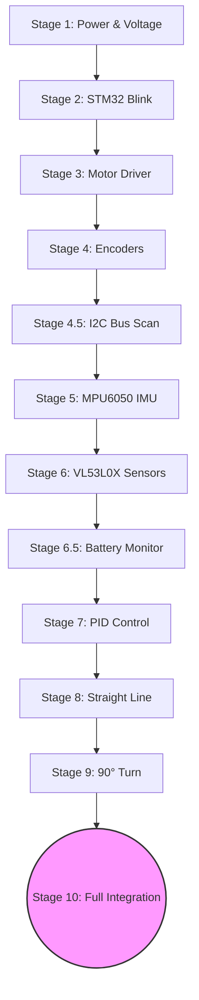

# 05 — Testing Stages with Code
## Test Each System Independently Before Integration

---

> [!WARNING]
> **Testing Order — NEVER skip steps**


---

## Stage 1 — Power & Voltage Check

**Before connecting anything:**
1. Connect battery through switch to buck converter input
2. Measure buck converter output → must be **5.0V ± 0.1V**
3. Connect 5V to LDO input, measure output → must be **3.3V ± 0.05V**
4. Only then connect STM32

No code needed — just a multimeter.

**✅ PASS:** 5V reads 4.9–5.1V, 3.3V reads 3.25–3.35V | **❌ FAIL:** Voltage out of range or fluctuating

---

## Stage 2 — STM32 Blink Test

**Purpose:** Confirm STM32 is alive and Arduino IDE can upload.

```cpp
// STAGE 2: Basic blink test
// Board: Generic STM32F4xx (STM32F411CEU6 BlackPill)
// Upload via: STLink

void setup() {
  pinMode(PC13, OUTPUT);  // Built-in LED on STM32F411CEU6
  Serial.begin(115200);
  Serial.println("STM32 Alive!");
}

void loop() {
  digitalWrite(PC13, LOW);   // LED ON (active low on STM32F411CEU6)
  delay(500);
  digitalWrite(PC13, HIGH);  // LED OFF
  delay(500);
}
```

**Expected:** LED blinks every 0.5s, serial prints "STM32 Alive!"

**✅ PASS:** LED blinks, serial output visible | **❌ FAIL:** No blink or no serial output

---

## Stage 3 — Motor Driver Test (No Encoders)

**Purpose:** Confirm TB6612FNG wiring and motor direction.

```cpp
// STAGE 3: Motor driver test
// Tests: Forward, Reverse, Brake, both motors independently

#define PWMA  PA6
#define AIN1  PB0
#define AIN2  PB1
#define PWMB  PA7
#define BIN1  PB4
#define BIN2  PB5
#define STBY  PB6

void setMotorA(int speed) {
  // speed: -255 to +255
  if (speed > 0) {
    digitalWrite(AIN1, HIGH);
    digitalWrite(AIN2, LOW);
    analogWrite(PWMA, speed);
  } else if (speed < 0) {
    digitalWrite(AIN1, LOW);
    digitalWrite(AIN2, HIGH);
    analogWrite(PWMA, -speed);
  } else {
    digitalWrite(AIN1, HIGH);
    digitalWrite(AIN2, HIGH);  // Brake
    analogWrite(PWMA, 0);
  }
}

void setMotorB(int speed) {
  if (speed > 0) {
    digitalWrite(BIN1, HIGH);
    digitalWrite(BIN2, LOW);
    analogWrite(PWMB, speed);
  } else if (speed < 0) {
    digitalWrite(BIN1, LOW);
    digitalWrite(BIN2, HIGH);
    analogWrite(PWMB, -speed);
  } else {
    digitalWrite(BIN1, HIGH);
    digitalWrite(BIN2, HIGH);
    analogWrite(PWMB, 0);
  }
}

void setup() {
  Serial.begin(115200);
  pinMode(AIN1, OUTPUT);
  pinMode(AIN2, OUTPUT);
  pinMode(BIN1, OUTPUT);
  pinMode(BIN2, OUTPUT);
  pinMode(STBY, OUTPUT);
  pinMode(PWMA, OUTPUT);
  pinMode(PWMB, OUTPUT);
  digitalWrite(STBY, HIGH);  // Enable driver
  Serial.println("Motor Test Start");
}

void loop() {
  Serial.println("Both Forward");
  setMotorA(150);
  setMotorB(150);
  delay(2000);

  Serial.println("Both Stop");
  setMotorA(0);
  setMotorB(0);
  delay(1000);

  Serial.println("Both Reverse");
  setMotorA(-150);
  setMotorB(-150);
  delay(2000);

  Serial.println("Brake");
  setMotorA(0);
  setMotorB(0);
  delay(2000);
}
```

**Expected:** Motors spin forward, stop, reverse in sequence.

**✅ PASS:** Both motors respond to commands, direction matches code | **❌ FAIL:** Motor doesn't spin, wrong direction, or stutters

**If motor runs backward when it should go forward:** Swap AO1/AO2 wires (or change `AIN1/AIN2` logic in code).

---

## Stage 4 — Encoder Test

**Purpose:** Confirm quadrature encoder reading and direction detection.

```cpp
// STAGE 4: Encoder reading test
// Uses external interrupt (EXTI) on encoder pins

volatile long encoderL = 0;
volatile long encoderR = 0;

// Left encoder pins
#define ENC_LA PA0
#define ENC_LB PA1
// Right encoder pins
#define ENC_RA PA2
#define ENC_RB PA3

void encoderL_ISR() {
  int b = digitalRead(ENC_LB);
  encoderL += (b == HIGH) ? 1 : -1;
}

void encoderR_ISR() {
  int b = digitalRead(ENC_RB);
  encoderR += (b == HIGH) ? -1 : 1;  // Right motor mirrored
}

void setup() {
  Serial.begin(115200);
  pinMode(ENC_LA, INPUT_PULLUP);
  pinMode(ENC_LB, INPUT_PULLUP);
  pinMode(ENC_RA, INPUT_PULLUP);
  pinMode(ENC_RB, INPUT_PULLUP);
  attachInterrupt(digitalPinToInterrupt(ENC_LA), encoderL_ISR, RISING);
  attachInterrupt(digitalPinToInterrupt(ENC_RA), encoderR_ISR, RISING);
  Serial.println("Encoder Test — spin wheels by hand");
}

void loop() {
  Serial.print("Left: ");
  Serial.print(encoderL);
  Serial.print("  Right: ");
  Serial.println(encoderR);
  delay(200);
}
```

**Expected:**
- Spinning left wheel forward → encoderL increases
- Spinning left wheel backward → encoderL decreases
- Same for right
- If direction is wrong: swap ENC_LB logic in ISR

**Pulses per revolution:**
- Manually spin wheel exactly once → note encoder count
- This is your **CPR (counts per revolution)**
- Record this value for odometry calculations

**✅ PASS:** Forward spin increases count, backward decreases. Consistent CPR. | **❌ FAIL:** Count stays at 0, or inconsistent

---

## Stage 4.5 — I2C Bus Scan

**Purpose:** Verify all I2C devices are detected before testing them individually.

```cpp
// STAGE 4.5: I2C bus scanner
// Detects all devices on the I2C bus

#include <Wire.h>

void setup() {
  Serial.begin(115200);
  Wire.begin(PB9, PB8);  // SDA, SCL for STM32
  Wire.setClock(400000);
  Serial.println("I2C Bus Scanner");
  Serial.println("Scanning...");
}

void loop() {
  int devices = 0;
  
  for (byte addr = 8; addr < 120; addr++) {
    Wire.beginTransmission(addr);
    byte error = Wire.endTransmission();
    
    if (error == 0) {
      Serial.print("Device found at 0x");
      if (addr < 16) Serial.print("0");
      Serial.print(addr, HEX);
      
      // Identify known devices
      if (addr == 0x68) Serial.print(" ← MPU6050");
      if (addr == 0x69) Serial.print(" ← MPU6050 (AD0=HIGH)");
      if (addr == 0x29) Serial.print(" ← VL53L0X (default)");
      if (addr >= 0x30 && addr <= 0x35) {
        Serial.print(" ← VL53L0X #");
        Serial.print(addr - 0x2F);
      }
      if (addr == 0x3C || addr == 0x3D) Serial.print(" ← SSD1306 OLED");
      
      Serial.println();
      devices++;
    }
  }
  
  Serial.print("\nTotal devices found: ");
  Serial.println(devices);
  Serial.println("---");
  delay(5000);
}
```

**Expected:**
- MPU6050 at 0x68 (with AD0=GND) or 0x69 (AD0=HIGH)
- VL53L0X at 0x29 (before address assignment) or assigned addresses

**✅ PASS:** All expected devices detected | **❌ FAIL:** Missing devices — check wiring, pull-ups, and power

---

## Stage 5 — MPU6050 Test

**Install library first:** Tools → Manage Libraries → search "MPU6050" by Electronic Cats or Jeff Rowberg

```cpp
// STAGE 5: MPU6050 gyroscope test
#include <Wire.h>
#include <MPU6050.h>

MPU6050 mpu;

float yaw = 0;
unsigned long lastTime = 0;

void setup() {
  Serial.begin(115200);
  Wire.begin(PB9, PB8);  // SDA, SCL for STM32
  Wire.setClock(400000); // 400kHz Fast I2C
  
  mpu.initialize();
  if (!mpu.testConnection()) {
    Serial.println("MPU6050 NOT FOUND! Check wiring.");
    while (1);
  }
  mpu.setFullScaleGyroRange(MPU6050_GYRO_FS_500);
  mpu.setFullScaleAccelRange(MPU6050_ACCEL_FS_4);
  
  Serial.println("MPU6050 OK. Calibrating — keep still for 3 seconds...");
  delay(3000);
  Serial.println("Done. Rotate robot and watch yaw.");
  lastTime = millis();
}

void loop() {
  int16_t ax, ay, az, gx, gy, gz;
  mpu.getMotion6(&ax, &ay, &az, &gx, &gy, &gz);
  
  float gyroZ = gz / 65.5;  // Convert to degrees/sec (65.5 LSB per deg/s at 500dps range)
  // Note: at 250dps range, divide by 131.0 instead
  
  unsigned long now = millis();
  float dt = (now - lastTime) / 1000.0;
  lastTime = now;
  
  yaw += gyroZ * dt;
  
  Serial.print("Yaw: ");
  Serial.print(yaw, 2);
  Serial.println("°");
  
  delay(20);  // 50Hz update
}
```

**Expected:**
- Robot still: yaw stays near 0 (±0.5° drift per minute acceptable)
- Robot rotated 90° right: yaw shows ~90
- Robot rotated 90° left: yaw shows ~-90

**✅ PASS:** Yaw drift < 1°/min when still, and reads ±5° of expected when rotated | **❌ FAIL:** Rapid drift or no reading

**If MPU6050 not found:** Check I2C address — AD0 pin LOW = 0x68, AD0 HIGH = 0x69. Check pull-ups.

---

## Stage 6 — VL53L0X Sensor Test

**Install library:** Library Manager → "VL53L0X" by Pololu

```cpp
// STAGE 6: VL53L0X sensor test with address assignment
#include <Wire.h>
#include <VL53L0X.h>

// For 3-sensor config
#define XSHUT_1 PC13   // Front
#define XSHUT_2 PC14   // Left  
#define XSHUT_3 PC15   // Right

#define ADDR_1 0x30
#define ADDR_2 0x31
#define ADDR_3 0x32

VL53L0X sensor1, sensor2, sensor3;

void assignSensorAddresses() {
  // Shut all down first
  pinMode(XSHUT_1, OUTPUT);
  pinMode(XSHUT_2, OUTPUT);
  pinMode(XSHUT_3, OUTPUT);
  digitalWrite(XSHUT_1, LOW);
  digitalWrite(XSHUT_2, LOW);
  digitalWrite(XSHUT_3, LOW);
  delay(10);
  
  // Enable sensor 1, assign address
  digitalWrite(XSHUT_1, HIGH);
  delay(10);
  sensor1.init();
  sensor1.setAddress(ADDR_1);
  Serial.println("Sensor 1 (Front) initialized at 0x30");
  
  // Enable sensor 2
  digitalWrite(XSHUT_2, HIGH);
  delay(10);
  sensor2.init();
  sensor2.setAddress(ADDR_2);
  Serial.println("Sensor 2 (Left) initialized at 0x31");
  
  // Enable sensor 3
  digitalWrite(XSHUT_3, HIGH);
  delay(10);
  sensor3.init();
  sensor3.setAddress(ADDR_3);
  Serial.println("Sensor 3 (Right) initialized at 0x32");
}

void setup() {
  Serial.begin(115200);
  Wire.begin(PB9, PB8);
  Wire.setClock(400000);
  
  assignSensorAddresses();
  
  // Set to high speed mode (shorter range but faster)
  sensor1.setMeasurementTimingBudget(20000);  // 20ms per reading
  sensor2.setMeasurementTimingBudget(20000);
  sensor3.setMeasurementTimingBudget(20000);
  
  sensor1.startContinuous();
  sensor2.startContinuous();
  sensor3.startContinuous();
  
  Serial.println("Sensors ready. Move objects in front of them.");
}

void loop() {
  int d1 = sensor1.readRangeContinuousMillimeters();
  int d2 = sensor2.readRangeContinuousMillimeters();
  int d3 = sensor3.readRangeContinuousMillimeters();
  
  Serial.print("Front: "); Serial.print(d1); Serial.print("mm  ");
  Serial.print("Left: ");  Serial.print(d2); Serial.print("mm  ");
  Serial.print("Right: "); Serial.print(d3); Serial.println("mm");
  
  // 65535 = out of range / timeout
  delay(50);
}
```

**Expected:**
- Open air: ~1200mm or 65535 (timeout)
- Hand 200mm away: ~200mm reading
- Each sensor responds independently

**✅ PASS:** All 3 sensors respond, readings match real distance ±10mm | **❌ FAIL:** 65535 constantly, or sensor not initializing

---

## Stage 6.5 — Battery Voltage Monitor Test

**Purpose:** Read battery voltage via ADC for low-voltage protection.

**Wiring:** Create a voltage divider: Battery+ → 20kΩ → PA5 → 10kΩ → GND
(This divides 8.4V max down to 2.8V — safe for 3.3V ADC)

```cpp
// STAGE 6.5: Battery voltage monitor

#define VBAT_PIN PA5
#define DIVIDER_RATIO 3.0    // (20k + 10k) / 10k = 3.0
#define ADC_REF 3.3
#define ADC_MAX 4095.0       // 12-bit ADC

void setup() {
  Serial.begin(115200);
  pinMode(VBAT_PIN, INPUT_ANALOG);
  Serial.println("Battery Monitor Test");
}

void loop() {
  // Average 10 readings for stability
  long sum = 0;
  for (int i = 0; i < 10; i++) {
    sum += analogRead(VBAT_PIN);
    delay(2);
  }
  float adcAvg = sum / 10.0;
  
  float voltage = (adcAvg / ADC_MAX) * ADC_REF * DIVIDER_RATIO;
  float cellVoltage = voltage / 2.0;  // 2S pack
  
  Serial.print("Battery: ");
  Serial.print(voltage, 2);
  Serial.print("V  Cell: ");
  Serial.print(cellVoltage, 2);
  Serial.print("V  ");
  
  if (cellVoltage > 3.7) Serial.println("[GOOD]");
  else if (cellVoltage > 3.5) Serial.println("[OK]");
  else if (cellVoltage > 3.2) Serial.println("[LOW - charge soon]");
  else Serial.println("[CRITICAL - STOP IMMEDIATELY!]");
  
  delay(1000);
}
```

**Expected:**
- Fully charged: ~8.2–8.4V (4.1–4.2V/cell)
- Normal use: 7.0–7.8V (3.5–3.9V/cell)

**✅ PASS:** Voltage reading matches multimeter ±0.1V | **❌ FAIL:** Reading is 0 or wildly inaccurate

---

## Stage 7 — PID Motor Speed Control

**Purpose:** Make motors run at target RPM accurately.

```cpp
// STAGE 7: PID speed control test
// Run each motor at 50% speed and check it holds steady

// Include motor + encoder setup from stages 3 & 4
// Then add:

#define TARGET_RPM 150.0       // Target RPM for both motors
#define ENCODER_CPR 210.0      // Counts per revolution (measure in stage 4!)
#define WHEEL_DIAMETER 34.0    // mm — measure your actual wheel
#define PID_INTERVAL 20        // ms (50Hz PID loop)

// PID gains — tune these (start low!)
float Kp = 2.0, Ki = 0.5, Kd = 0.1;

float errorL = 0, errorR = 0;
float integralL = 0, integralR = 0;
float prevErrorL = 0, prevErrorR = 0;
long prevEncL = 0, prevEncR = 0;
unsigned long lastPID = 0;

float pwmL = 0, pwmR = 0;

void pidLoop() {
  if (millis() - lastPID < PID_INTERVAL) return;
  lastPID = millis();
  
  float dt = PID_INTERVAL / 1000.0;
  
  // Calculate actual RPM from encoder delta
  long dL = encoderL - prevEncL;
  long dR = encoderR - prevEncR;
  prevEncL = encoderL;
  prevEncR = encoderR;
  
  float rpmL = (dL / ENCODER_CPR) * (60.0 / dt);
  float rpmR = (dR / ENCODER_CPR) * (60.0 / dt);
  
  // PID for left motor
  errorL = TARGET_RPM - rpmL;
  integralL += errorL * dt;
  integralL = constrain(integralL, -100, 100);  // Anti-windup
  float derivL = (errorL - prevErrorL) / dt;
  prevErrorL = errorL;
  pwmL = Kp*errorL + Ki*integralL + Kd*derivL;
  pwmL = constrain(pwmL, 0, 255);
  
  // PID for right motor (same structure)
  errorR = TARGET_RPM - rpmR;
  integralR += errorR * dt;
  integralR = constrain(integralR, -100, 100);
  float derivR = (errorR - prevErrorR) / dt;
  prevErrorR = errorR;
  pwmR = Kp*errorR + Ki*integralR + Kd*derivR;
  pwmR = constrain(pwmR, 0, 255);
  
  setMotorA((int)pwmL);
  setMotorB((int)pwmR);
  
  // Debug
  Serial.print("RPM L: "); Serial.print(rpmL, 1);
  Serial.print(" R: "); Serial.print(rpmR, 1);
  Serial.print(" | PWM L: "); Serial.print(pwmL);
  Serial.print(" R: "); Serial.println(pwmR);
}

void setup() {
  // ... motor + encoder setup from stages 3 & 4 ...
  Serial.begin(115200);
  // Enable motors
  digitalWrite(STBY, HIGH);
}

void loop() {
  pidLoop();
}
```

**Expected:** Both motors run at ~150 RPM. PWM values settle after a few seconds.

**✅ PASS:** RPM stabilizes within ±10 of target in <3 seconds | **❌ FAIL:** Oscillating, maxing out, or no response

---

## Stage 8 — Straight Line Test

**Purpose:** Robot drives straight without drifting.

Combine PID speed control with encoder odometry feedback. Set both motors to same target speed.

```cpp
// After Stage 7 is working:
// Add this — corrections to keep robot straight using encoder differential

float straightCorrection(long encL, long encR) {
  float diff = encL - encR;  // If positive, left went further → need to slow left
  return diff * 0.5;          // Correction gain — tune this
}

// In main loop:
float correction = straightCorrection(encoderL, encoderR);
float targetL = TARGET_RPM - correction;
float targetR = TARGET_RPM + correction;
// Feed targetL, targetR into PID instead of fixed TARGET_RPM
```

**Expected:** Robot drives 1 meter in a straight line (<5mm lateral deviation).

**✅ PASS:** <5mm deviation over 1 meter | **❌ FAIL:** Curves or oscillates

---

## Stage 9 — 90° Turn Test

```cpp
// Turn left 90 degrees using encoder counting

void turnLeft90() {
  // Calculate encoder counts for 90° turn
  // Arc length = (PI/2) * wheelbase_radius
  // wheelbase = distance between wheel centers (measure yours, e.g. 70mm)
  float wheelbase = 70.0;   // mm
  float wheelDiam = 34.0;   // mm
  float wheelCirc = PI * wheelDiam;
  float arcLength = (PI / 2.0) * (wheelbase / 2.0);
  int targetCounts = (int)(arcLength / wheelCirc * ENCODER_CPR);
  
  long startL = encoderL;
  long startR = encoderR;
  
  // Left motor backward, right motor forward
  setMotorA(-120);  // Left backward
  setMotorB(120);   // Right forward
  
  while (true) {
    long dL = abs(encoderL - startL);
    long dR = abs(encoderR - startR);
    long avg = (dL + dR) / 2;
    if (avg >= targetCounts) break;
  }
  
  setMotorA(0);
  setMotorB(0);
}
```

**Expected:** Robot turns approximately 90°. Verify with MPU6050 yaw reading.

**✅ PASS:** Turn within ±5° of 90° | **❌ FAIL:** Under/overshooting significantly

After passing this, combine gyro feedback for more accurate turns (see `06_MAIN_LOGIC_CODE.md`).

---

## Stage 10 — Full Integration Test

**Purpose:** Verify all subsystems work together in a controlled mini-maze.

### Test Environment:
- Build a 2×2 or 3×3 mini-maze with cardboard walls (18cm cells, 5cm tall walls)
- Start robot in corner cell

### Integration Test Code:
```cpp
// STAGE 10: Full integration test
// Runs a simplified exploration in a small test maze

// Include ALL code from stages 3-9 and 06_MAIN_LOGIC_CODE.md
// Set MAZE_SIZE to 4 for a small test maze:
// #define MAZE_SIZE 4

// Override goal to cell (1,1) for small maze:
// bool isGoal(int x, int y) { return x == 1 && y == 1; }

void setup() {
  Serial.begin(115200);
  Serial.println("=== FULL INTEGRATION TEST ===");
  
  initMotors();
  initSensors();
  calibrateGyro();  // From 07_TUNING_CALIBRATION
  
  // Initialize small maze
  memset(walls, 0, sizeof(walls));
  memset(visited, 0, sizeof(visited));
  
  // Set border walls for small maze
  for (int i = 0; i < MAZE_SIZE; i++) {
    walls[0][i]           |= 8;  // West
    walls[MAZE_SIZE-1][i] |= 2;  // East
    walls[i][0]           |= 4;  // South
    walls[i][MAZE_SIZE-1] |= 1;  // North
  }
  
  floodFill();
  
  pinMode(BTN_START, INPUT_PULLUP);
  Serial.println("Press START button.");
  while (digitalRead(BTN_START) == HIGH);
  delay(1000);  // 1 second delay after button press
  
  Serial.println("Running!");
}

void loop() {
  // Print state before each step
  printMazeState();  // From 08_TROUBLESHOOTING
  
  // Check battery
  float vbat = readBatteryVoltage();
  if (vbat < 6.4) {
    setMotors(0, 0);
    Serial.println("LOW BATTERY! STOPPING.");
    while(1);
  }
  
  exploreStep();
  
  if (goalReached) {
    setMotors(0, 0);
    Serial.println("=== GOAL REACHED! TEST PASSED! ===");
    // Print final maze map
    for (int y = MAZE_SIZE-1; y >= 0; y--) {
      for (int x = 0; x < MAZE_SIZE; x++) {
        Serial.print(floodValues[x][y]);
        Serial.print("\t");
      }
      Serial.println();
    }
    while(1);  // Stop
  }
}
```

### Integration Checklist:
- [ ] Robot reads sensors without crashing when motors are running
- [ ] Wall detection matches physical walls in test maze
- [ ] Robot navigates at least 3 cells correctly
- [ ] Turns are accurate (±5°)
- [ ] Robot stops at goal cell
- [ ] Battery voltage reads correctly under motor load
- [ ] No I2C lockups during 5-minute continuous run

**✅ PASS:** Robot completes mini-maze without errors | **❌ FAIL:** See `08_TROUBLESHOOTING.md`
