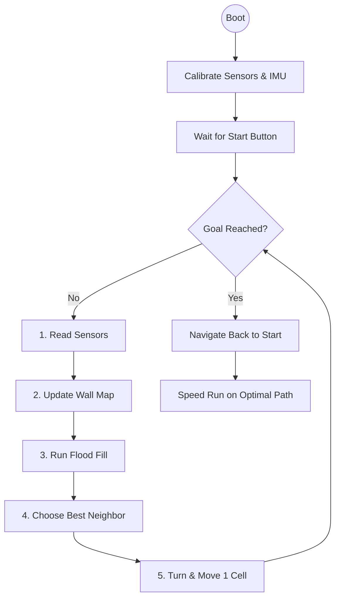
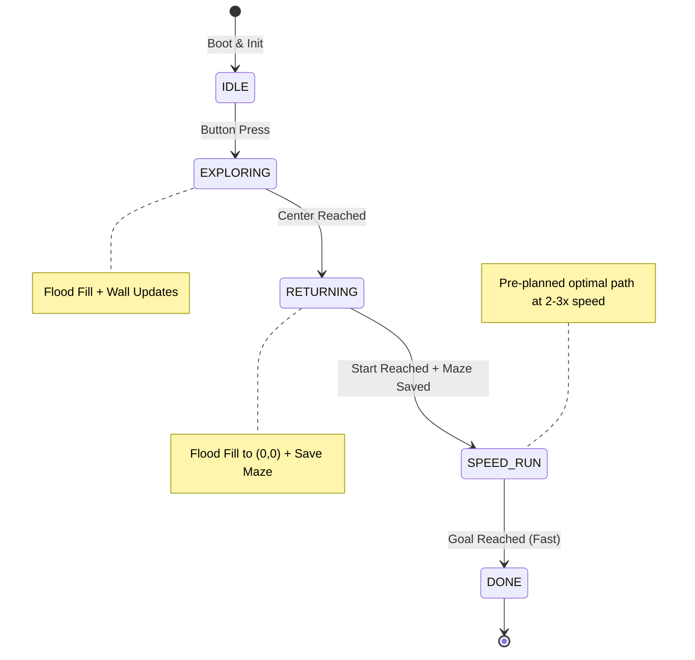

# 06 — Main Logic, Maze Solving & Full Code
## Flood Fill Algorithm + PID Control + Complete Integration

---

## Overview of Micromouse Algorithm



---

## Maze Representation

```cpp
// 16×16 maze
#define MAZE_SIZE 16

// Wall data: stored as bitmask per cell
// Bit 0 (1) = North wall
// Bit 1 (2) = East wall  
// Bit 2 (4) = South wall
// Bit 3 (8) = West wall

uint8_t walls[MAZE_SIZE][MAZE_SIZE];       // Wall map
uint8_t floodValues[MAZE_SIZE][MAZE_SIZE]; // Flood fill distances
bool visited[MAZE_SIZE][MAZE_SIZE];        // Cells explored

// Robot state
int robotX = 0;      // Current cell X (0 = left column)
int robotY = 0;      // Current cell Y (0 = bottom row)
int robotHeading = 0; // 0=North 1=East 2=South 3=West

// Start: (0,0) corner | Goal: center (7,7),(7,8),(8,7),(8,8) for 16x16
```

---

## Flood Fill Implementation

```cpp
#include <queue>
using namespace std;

// Direction vectors: N, E, S, W
const int dx[] = {0, 1, 0, -1};
const int dy[] = {1, 0, -1, 0};
const int wallBit[] = {1, 2, 4, 8};  // N, E, S, W wall bits

// Target coordinates (set based on state)
bool returnToStart = false;

bool isGoal(int x, int y) {
  if (returnToStart) {
    return x == 0 && y == 0; // Start position
  }
  // Center 4 cells for 16x16 maze
  return (x == 7 || x == 8) && (y == 7 || y == 8);
}

bool hasWall(int x, int y, int dir) {
  return (walls[x][y] & wallBit[dir]) != 0;
}

void setWall(int x, int y, int dir) {
  walls[x][y] |= wallBit[dir];
  // Also set the corresponding wall on adjacent cell
  int nx = x + dx[dir];
  int ny = y + dy[dir];
  if (nx >= 0 && nx < MAZE_SIZE && ny >= 0 && ny < MAZE_SIZE) {
    walls[nx][ny] |= wallBit[(dir + 2) % 4]; // Opposite direction
  }
}

void floodFill() {
  // Reset all flood values to max
  memset(floodValues, 255, sizeof(floodValues));
  
  queue<pair<int,int>> q;
  
  // Seed the goal cells with value 0
  for (int x = 0; x < MAZE_SIZE; x++) {
    for (int y = 0; y < MAZE_SIZE; y++) {
      if (isGoal(x, y)) {
        floodValues[x][y] = 0;
        q.push({x, y});
      }
    }
  }
  
  // BFS flood fill
  while (!q.empty()) {
    auto [cx, cy] = q.front();
    q.pop();
    
    for (int dir = 0; dir < 4; dir++) {
      if (hasWall(cx, cy, dir)) continue;  // Wall blocks this direction
      
      int nx = cx + dx[dir];
      int ny = cy + dy[dir];
      if (nx < 0 || nx >= MAZE_SIZE || ny < 0 || ny >= MAZE_SIZE) continue;
      
      if (floodValues[nx][ny] > floodValues[cx][cy] + 1) {
        floodValues[nx][ny] = floodValues[cx][cy] + 1;
        q.push({nx, ny});
      }
    }
  }
}

int chooseNextDirection() {
  // Find the open neighbor with lowest flood value
  int bestDir = -1;
  uint8_t bestVal = 255;
  
  for (int dir = 0; dir < 4; dir++) {
    if (hasWall(robotX, robotY, dir)) continue;
    
    int nx = robotX + dx[dir];
    int ny = robotY + dy[dir];
    if (nx < 0 || nx >= MAZE_SIZE || ny < 0 || ny >= MAZE_SIZE) continue;
    
    if (floodValues[nx][ny] < bestVal) {
      bestVal = floodValues[nx][ny];
      bestDir = dir;
    }
  }
  return bestDir;  // 0=N 1=E 2=S 3=W
}
```

---

## Sensor Reading & Wall Detection

```cpp
#include <Wire.h>
#include <VL53L0X.h>
#include <MPU6050.h>

VL53L0X sensorFront, sensorLeft, sensorRight;
MPU6050 mpu;

// Wall detection thresholds (mm) — tune for your maze!
#define WALL_PRESENT_THRESHOLD  180  // Distance < this = wall present
#define WALL_ABSENT_THRESHOLD   250  // Distance > this = no wall

// Median filter for noise reduction
int medianOfThree(int a, int b, int c) {
  if (a > b) { int t = a; a = b; b = t; }
  if (b > c) { int t = b; b = c; c = t; }
  if (a > b) { int t = a; a = b; b = t; }
  return b;
}

int readSensorFiltered(VL53L0X& sensor) {
  int a = sensor.readRangeContinuousMillimeters();
  int b = sensor.readRangeContinuousMillimeters();
  int c = sensor.readRangeContinuousMillimeters();
  return medianOfThree(a, b, c);
}

struct SensorData {
  int front, left, right;
  bool wallFront, wallLeft, wallRight;
};

SensorData readSensors() {
  SensorData s;
  // Use median filter for noise-free readings
  s.front = readSensorFiltered(sensorFront);
  s.left  = readSensorFiltered(sensorLeft);
  s.right = readSensorFiltered(sensorRight);
  
  // Clamp out-of-range readings
  if (s.front > 1200 || s.front == 65535) s.front = 1200;
  if (s.left  > 1200 || s.left  == 65535) s.left  = 1200;
  if (s.right > 1200 || s.right == 65535) s.right = 1200;
  
  s.wallFront = (s.front < WALL_PRESENT_THRESHOLD);
  s.wallLeft  = (s.left  < WALL_PRESENT_THRESHOLD);
  s.wallRight = (s.right < WALL_PRESENT_THRESHOLD);
  
  return s;
}

void updateWallMap(SensorData& s) {
  // Convert robot-relative directions to absolute N/E/S/W
  // robotHeading: 0=N 1=E 2=S 3=W
  
  int frontAbs = robotHeading;
  int leftAbs  = (robotHeading + 3) % 4;  // Turn left = -1
  int rightAbs = (robotHeading + 1) % 4;  // Turn right = +1
  
  if (s.wallFront) setWall(robotX, robotY, frontAbs);
  if (s.wallLeft)  setWall(robotX, robotY, leftAbs);
  if (s.wallRight) setWall(robotX, robotY, rightAbs);
  
  // NOTE: Do NOT blindly set back wall — we just drove through that opening!
  // The back wall info was already captured when we read sensors from the
  // previous cell (it was that cell's front/side wall).
  
  visited[robotX][robotY] = true;
}
```

---

## Motion Control (PID + Gyro)

```cpp
// ---- PIN DEFINITIONS ----

#define PWMA PA6
#define AIN1 PB0
#define AIN2 PB1
#define PWMB PA7
#define BIN1 PB4
#define BIN2 PB5
#define STBY PB6

#define ENC_LA PA0
#define ENC_LB PA1
#define ENC_RA PA2
#define ENC_RB PA3

// ---- ROBOT PARAMETERS (TUNE THESE!) ----

#define WHEEL_DIAMETER_MM  34.0
#define WHEELBASE_MM       70.0    // Center-to-center wheel distance
#define ENCODER_CPR        210.0   // Counts per revolution

#define MM_PER_COUNT  (PI * WHEEL_DIAMETER_MM / ENCODER_CPR)
#define CELL_SIZE_MM  180.0        // IEEE maze cell size

// ---- PID GAINS ----

float Kp_speed = 2.5, Ki_speed = 0.8, Kd_speed = 0.1;  // Motor speed PID
float Kp_straight = 3.0;   // Straight-line correction gain
float Kp_turn = 2.0;        // Turn PID gain

volatile long encoderL = 0;
volatile long encoderR = 0;

void encoderL_ISR() { encoderL += (digitalRead(ENC_LB) == HIGH) ? 1 : -1; }
void encoderR_ISR() { encoderR += (digitalRead(ENC_RB) == HIGH) ? -1 : 1; }

void setMotors(int speedL, int speedR) {
  speedL = constrain(speedL, -255, 255);
  speedR = constrain(speedR, -255, 255);
  
  // Left motor (Motor A)
  digitalWrite(AIN1, speedL >= 0 ? HIGH : LOW);
  digitalWrite(AIN2, speedL >= 0 ? LOW : HIGH);
  analogWrite(PWMA, abs(speedL));
  
  // Right motor (Motor B)  
  digitalWrite(BIN1, speedR >= 0 ? HIGH : LOW);
  digitalWrite(BIN2, speedR >= 0 ? LOW : HIGH);
  analogWrite(PWMB, abs(speedR));
}

float readGyroYaw() {
  int16_t ax, ay, az, gx, gy, gz;
  mpu.getMotion6(&ax, &ay, &az, &gx, &gy, &gz);
  // IMPORTANT: If your MPU6050 is mounted upside-down, negate gz.
  // Test: rotate robot clockwise. If yaw goes negative, add minus sign:
  // return -(gz - gyroBiasZ) / 65.5;
  return (gz - gyroBiasZ) / 65.5;  // deg/s at 500dps range, bias-corrected
}

// Corridor centering correction during forward movement
float corridorCenterCorrection(SensorData& s) {
  // Only apply when both side walls are detected
  if (s.wallLeft && s.wallRight) {
    int error = s.left - s.right;  // Positive = too close to right wall
    return error * 0.3;  // Gentle centering correction
  }
  return 0.0;
}

// Move forward exactly one cell (180mm)
void moveForward() {
  long startL = encoderL;
  long startR = encoderR;
  long targetCounts = (long)(CELL_SIZE_MM / MM_PER_COUNT);
  
  float yawRef = 0;  // Gyro reference (reset to 0 for each move)
  mpu.resetFIFO();
  
  int baseSpeed = 150;  // PWM speed during straight move
  unsigned long lastTime = millis();
  
  while (true) {
    long dL = encoderL - startL;
    long dR = encoderR - startR;
    long avgCount = (dL + dR) / 2;
    
    if (avgCount >= targetCounts) break;
    
    // Decelerate when approaching end
    float progress = (float)avgCount / targetCounts;
    int speed = (progress > 0.8) ? 80 : baseSpeed;
    
    // Gyro-based straight correction
    unsigned long now = millis();
    float dt = (now - lastTime) / 1000.0;
    lastTime = now;
    yawRef += readGyroYaw() * dt;
    
    // Also encoder-based correction
    float encDiff = dL - dR;
    
    // Corridor centering (wall-following correction)
    SensorData cs = readSensors();
    float centerCorr = corridorCenterCorrection(cs);
    
    // Combined correction: gyro + encoder + wall centering
    float correction = Kp_straight * (yawRef * 2.0 + encDiff * 0.5) + centerCorr;
    
    setMotors(speed - correction, speed + correction);
    delay(5);
  }
  
  setMotors(0, 0);  // Brake
  delay(50);
  
  // Update robot position
  robotX += dx[robotHeading];
  robotY += dy[robotHeading];
}

// Turn in place
void turnRight() {
  float targetAngle = 90.0;
  float yaw = 0;
  unsigned long lastTime = millis();
  
  while (abs(yaw) < targetAngle - 2.0) {
    unsigned long now = millis();
    float dt = (now - lastTime) / 1000.0;
    lastTime = now;
    float gyroRate = readGyroYaw();
    yaw += gyroRate * dt;
    
    // Use absolute value — handles both positive and negative gyro output
    float remaining = targetAngle - abs(yaw);
    int speed = (remaining > 20) ? 120 : 60;
    
    setMotors(speed, -speed);  // Right: left forward, right backward
    delay(5);
  }
  
  setMotors(0, 0);
  delay(50);
  
  robotHeading = (robotHeading + 1) % 4;  // Update heading
}

void turnLeft() {
  float targetAngle = 90.0;  // We track absolute rotation
  float yaw = 0;
  unsigned long lastTime = millis();
  
  while (abs(yaw) < targetAngle - 2.0) {
    unsigned long now = millis();
    float dt = (now - lastTime) / 1000.0;
    lastTime = now;
    float gyroRate = readGyroYaw();
    yaw += gyroRate * dt;
    
    float remaining = targetAngle - abs(yaw);
    int speed = (remaining > 20) ? 120 : 60;
    
    setMotors(-speed, speed);
    delay(5);
  }
  
  setMotors(0, 0);
  delay(50);
  
  robotHeading = (robotHeading + 3) % 4;
}

void turnAround() {
  turnRight();
  delay(100);
  turnRight();
}

// Turn to face absolute direction
void turnToDirection(int targetDir) {
  int turns = (targetDir - robotHeading + 4) % 4;
  if (turns == 0) return;
  if (turns == 1) turnRight();
  else if (turns == 3) turnLeft();
  else { turnRight(); delay(100); turnRight(); }
}
```

---

## Main Exploration Loop

```cpp
bool goalReached = false;

void exploreStep() {
  // 1. Read sensors
  SensorData s = readSensors();
  
  // 2. Update wall map
  updateWallMap(s);
  
  // 3. Re-run flood fill with new wall info
  floodFill();
  
  // 4. Check if at goal
  if (isGoal(robotX, robotY)) {
    goalReached = true;
    setMotors(0, 0);
    Serial.println("GOAL REACHED!");
    return;
  }
  
  // 5. Choose best direction
  int nextDir = chooseNextDirection();
  if (nextDir == -1) {
    // Stuck — shouldn't happen with correct flood fill
    Serial.println("ERROR: No valid direction!");
    return;
  }
  
  // 6. Turn to face that direction, then move
  turnToDirection(nextDir);
  moveForward();
}
```

---

## Complete setup() and loop()

```cpp
// Full includes
#include <Wire.h>
#include <VL53L0X.h>
#include <MPU6050.h>
#include <queue>
using namespace std;

// ... (all definitions and functions from above) ...

#define XSHUT_1 PC13
#define XSHUT_2 PC14
#define XSHUT_3 PC15
#define BTN_START PA8

enum RobotState { IDLE, EXPLORING, RETURNING, SPEED_RUN, DONE };
RobotState state = IDLE;

void initSensors() {
  Wire.begin(PB9, PB8);
  Wire.setClock(400000);
  
  // VL53L0X address assignment
  pinMode(XSHUT_1, OUTPUT); pinMode(XSHUT_2, OUTPUT); pinMode(XSHUT_3, OUTPUT);
  digitalWrite(XSHUT_1, LOW); digitalWrite(XSHUT_2, LOW); digitalWrite(XSHUT_3, LOW);
  delay(10);
  
  digitalWrite(XSHUT_1, HIGH); delay(10);
  sensorFront.init(); sensorFront.setAddress(0x30);
  sensorFront.setMeasurementTimingBudget(20000);
  sensorFront.startContinuous();
  
  digitalWrite(XSHUT_2, HIGH); delay(10);
  sensorLeft.init(); sensorLeft.setAddress(0x31);
  sensorLeft.setMeasurementTimingBudget(20000);
  sensorLeft.startContinuous();
  
  digitalWrite(XSHUT_3, HIGH); delay(10);
  sensorRight.init(); sensorRight.setAddress(0x32);
  sensorRight.setMeasurementTimingBudget(20000);
  sensorRight.startContinuous();
  
  // MPU6050
  mpu.initialize();
  mpu.setFullScaleGyroRange(MPU6050_GYRO_FS_500);
  mpu.setFullScaleAccelRange(MPU6050_ACCEL_FS_4);
  
  Serial.println("All sensors initialized.");
}

void initMotors() {
  pinMode(AIN1, OUTPUT); pinMode(AIN2, OUTPUT);
  pinMode(BIN1, OUTPUT); pinMode(BIN2, OUTPUT);
  pinMode(STBY, OUTPUT); pinMode(PWMA, OUTPUT); pinMode(PWMB, OUTPUT);
  digitalWrite(STBY, HIGH);
  
  pinMode(ENC_LA, INPUT_PULLUP); pinMode(ENC_LB, INPUT_PULLUP);
  pinMode(ENC_RA, INPUT_PULLUP); pinMode(ENC_RB, INPUT_PULLUP);
  attachInterrupt(digitalPinToInterrupt(ENC_LA), encoderL_ISR, RISING);
  attachInterrupt(digitalPinToInterrupt(ENC_RA), encoderR_ISR, RISING);
}

void setup() {
  Serial.begin(115200);
  Serial.println("Micromouse Booting...");
  
  initMotors();
  initSensors();
  
  // Initialize maze — all cells open (no known walls except border)
  memset(walls, 0, sizeof(walls));
  memset(visited, 0, sizeof(visited));
  
  // Set border walls
  for (int i = 0; i < MAZE_SIZE; i++) {
    walls[0][i]           |= 8;  // West border
    walls[MAZE_SIZE-1][i] |= 2;  // East border
    walls[i][0]           |= 4;  // South border
    walls[i][MAZE_SIZE-1] |= 1;  // North border
  }
  
  // Initial flood fill
  floodFill();
  
  // Wait for start button
  pinMode(BTN_START, INPUT_PULLUP);
  Serial.println("Press BTN_START to begin exploration.");
  while (digitalRead(BTN_START) == HIGH);
  delay(500);
  
  state = EXPLORING;
  Serial.println("Exploring!");
}

void loop() {
  switch (state) {
    case EXPLORING:
      exploreStep();
      if (goalReached) {
        state = RETURNING;
        returnToStart = true; // Change flood fill target to (0,0)
        goalReached = false;  // Reset flag for the return trip
        Serial.println("Returning to start...");
      }
      break;
      
    case RETURNING:
      exploreStep(); // Uses same explore logic but towards (0,0)
      if (goalReached) {
        saveMazeToFlash();  // Save discovered maze for speed run after power cycle
        state = SPEED_RUN;
        Serial.println("Back at start! Starting speed run...");
        delay(2000);  // Brief pause before speed run
      }
      break;
      
    case SPEED_RUN:
      executeSpeedRun();
      state = DONE;
      break;
      
    case DONE:
      setMotors(0, 0);
      break;
      
    default:
      break;
  }
}
```

---

## Safety Systems

### Stall Detection
```cpp
unsigned long lastStallCheck = 0;
long lastEncL_stall = 0, lastEncR_stall = 0;

void checkMotorStall() {
  if (millis() - lastStallCheck < 200) return;
  lastStallCheck = millis();
  
  // If motors are commanded but encoders aren't moving = stall
  bool motorsActive = (abs(analogRead(PWMA)) > 50 || abs(analogRead(PWMB)) > 50);
  bool encodersStopped = (abs(encoderL - lastEncL_stall) < 2 && 
                          abs(encoderR - lastEncR_stall) < 2);
  
  if (motorsActive && encodersStopped) {
    setMotors(0, 0);
    Serial.println("!!! STALL DETECTED — Motors stopped for safety !!!");
    // Buzz warning if buzzer available
    tone(PA10, 2000, 500);
    delay(1000);
  }
  
  lastEncL_stall = encoderL;
  lastEncR_stall = encoderR;
}
```

### Battery Voltage Monitor
```cpp
#define VBAT_PIN PA5
#define VBAT_LOW 6.4        // 3.2V per cell — stop immediately
#define VBAT_WARN 7.0       // 3.5V per cell — warn
#define DIVIDER_RATIO 3.0   // Voltage divider: 20kΩ + 10kΩ

float readBatteryVoltage() {
  long sum = 0;
  for (int i = 0; i < 10; i++) {
    sum += analogRead(VBAT_PIN);
    delay(1);
  }
  return (sum / 10.0 / 4095.0) * 3.3 * DIVIDER_RATIO;
}

void checkBattery() {
  float v = readBatteryVoltage();
  if (v < VBAT_LOW) {
    setMotors(0, 0);
    Serial.print("CRITICAL: Battery at ");
    Serial.print(v, 2);
    Serial.println("V — STOPPING!");
    // Rapid LED blink as warning
    while (1) {
      digitalWrite(PA15, !digitalRead(PA15));
      tone(PA10, 3000, 100);
      delay(200);
    }
  } else if (v < VBAT_WARN) {
    Serial.print("WARNING: Battery low at ");
    Serial.print(v, 2);
    Serial.println("V");
  }
}
```

### I2C Watchdog & Recovery
```cpp
#include <IWatchdog.h>  // STM32duino built-in

void setupWatchdog() {
  IWatchdog.begin(4000000);  // 4 second timeout
  // If main loop freezes (e.g. I2C lockup), STM32 auto-resets
}

void feedWatchdog() {
  IWatchdog.reload();  // Call this every loop iteration
}

// Software I2C recovery — frees stuck SDA line
void i2cRecover() {
  Wire.end();
  pinMode(PB8, OUTPUT);  // SCL
  // Toggle SCL 9 times to free stuck SDA
  for (int i = 0; i < 9; i++) {
    digitalWrite(PB8, LOW);  delayMicroseconds(5);
    digitalWrite(PB8, HIGH); delayMicroseconds(5);
  }
  Wire.begin(PB9, PB8);  // Re-init I2C
  Wire.setClock(400000);
  Serial.println("I2C bus recovered.");
}
```

### EEPROM / Flash Maze Storage
```cpp
#include <EEPROM.h>

#define MAZE_EEPROM_ADDR 0
#define MAZE_VALID_MARKER 0xA5  // Magic byte to verify saved data

void saveMazeToFlash() {
  EEPROM.write(MAZE_EEPROM_ADDR, MAZE_VALID_MARKER);
  for (int x = 0; x < MAZE_SIZE; x++) {
    for (int y = 0; y < MAZE_SIZE; y++) {
      EEPROM.write(MAZE_EEPROM_ADDR + 1 + x * MAZE_SIZE + y, walls[x][y]);
    }
  }
  Serial.println("Maze saved to flash!");
}

bool loadMazeFromFlash() {
  if (EEPROM.read(MAZE_EEPROM_ADDR) != MAZE_VALID_MARKER) {
    Serial.println("No saved maze found.");
    return false;
  }
  for (int x = 0; x < MAZE_SIZE; x++) {
    for (int y = 0; y < MAZE_SIZE; y++) {
      walls[x][y] = EEPROM.read(MAZE_EEPROM_ADDR + 1 + x * MAZE_SIZE + y);
    }
  }
  Serial.println("Maze loaded from flash!");
  return true;
}

void clearSavedMaze() {
  EEPROM.write(MAZE_EEPROM_ADDR, 0x00);
  Serial.println("Saved maze cleared.");
}
```

---

## Gyro Bias Calibration (Run at Startup)

```cpp
float gyroBiasZ = 0;

void calibrateGyro() {
  const int samples = 500;
  long sumGz = 0;
  
  Serial.println("Calibrating gyro — keep robot still for 2 seconds...");
  
  for (int i = 0; i < samples; i++) {
    int16_t ax, ay, az, gx, gy, gz;
    mpu.getMotion6(&ax, &ay, &az, &gx, &gy, &gz);
    sumGz += gz;
    delay(2);
  }
  
  gyroBiasZ = sumGz / (float)samples;
  Serial.print("Gyro Z bias: ");
  Serial.println(gyroBiasZ);
  Serial.println("Calibration done.");
}
```

---

## Maze Solving Strategy Notes

### Right-hand rule (simple, not optimal):
- Always follow the right wall
- Will solve any simply-connected maze
- Not used here — flood fill is far better

### Flood Fill (implemented above):
- Always finds shortest path
- Handles dead ends and backtracking automatically
- Re-calculates after each new wall discovery
- **This is what competition micromice use**

### Memory optimization:
- Wall data: 16×16 = 256 bytes
- Flood values: 256 bytes
- Total: ~1KB — fits easily in STM32 RAM

---

## State Machine Summary



---

## Updated Main Loop with Safety Systems

```cpp
void loop() {
  feedWatchdog();       // Prevent I2C lockup freeze
  checkBattery();       // Low-voltage cutoff
  checkMotorStall();    // Stall protection
  
  switch (state) {
    case EXPLORING:
      exploreStep();
      if (goalReached) {
        state = RETURNING;
        returnToStart = true;
        goalReached = false;
        tone(PA10, 1000, 500);  // Beep: goal reached!
        Serial.println("Returning to start...");
      }
      break;
      
    case RETURNING:
      exploreStep();
      if (goalReached) {
        saveMazeToFlash();
        state = SPEED_RUN;
        tone(PA10, 2000, 300);
        delay(300);
        tone(PA10, 2500, 300);
        Serial.println("Speed run starting...");
        delay(2000);
      }
      break;
      
    case SPEED_RUN:
      executeSpeedRun();
      state = DONE;
      tone(PA10, 3000, 1000);  // Victory beep!
      break;
      
    case DONE:
      setMotors(0, 0);
      break;
  }
}
```
