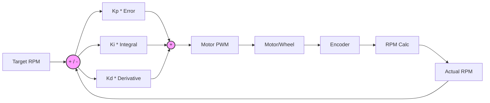

# 07 — Tuning & Calibration Guide

---

## Step 1: Measure Physical Constants

### Wheel Diameter
```
1. Mark a point on wheel with paint/marker
2. Roll robot exactly 1 meter on flat surface
3. Count rotations (mark shows how many)
4. Diameter = 1000mm / (rotations × π)

Typical N20 wheel: 34–40mm
Update WHEEL_DIAMETER_MM in code.
```

### Wheelbase
```
1. Measure distance between the contact points of both wheels
2. (Center of left wheel to center of right wheel)
Typical: 60–80mm
Update WHEELBASE_MM in code.
```

### Encoder CPR (Counts Per Revolution)
```
1. Mark wheel, run Stage 4 encoder test code
2. Slowly rotate wheel exactly one full turn by hand
3. Read encoder count from Serial Monitor
4. That is your CPR
Update ENCODER_CPR in code.

Cross-check: N20 300RPM usually has 7 PPR on motor shaft.
If gear ratio is 30:1 → CPR = 7 × 30 × 4 (if quadrature) = 840
Or with single-edge interrupt: 7 × 30 = 210
```

---

## Step 2: Calibrate Sensors

### VL53L0X Zero-Distance Calibration
```cpp
// Place a flat wall at exactly 100mm from sensor face
// Read value from sensor
// If it reads 95mm, offset = +5mm
// Add offset to all readings:
#define SENSOR_FRONT_OFFSET  5   // mm correction
#define SENSOR_LEFT_OFFSET   3
#define SENSOR_RIGHT_OFFSET  4

int correctedFront = s.front + SENSOR_FRONT_OFFSET;
```

### Wall Detection Threshold
```
1. Put robot in maze cell
2. Read sensor values with wall present: should be ~80–150mm
3. Read values without wall: should be 250–1200mm
4. Set threshold between these values, e.g. 200mm

Refine for each sensor direction (front vs side angles differ).
```

### Sensor Angle Verification
```
1. Place robot parallel to wall
2. Both side sensors should read same distance (±5mm)
3. If not: physically adjust sensor mounting angle
4. Fine-tune with software:

float leftReading = sensorLeft.read() * cos(sensorLeftAngleDeg * PI / 180.0);
```

---

## Step 3: PID Tuning (Ziegler-Nichols Method)

### Speed PID (for each motor independently):



```
Start with: Kp=1, Ki=0, Kd=0

Step 1 — Tune Kp:
  Increase Kp until motor just starts oscillating (hunting)
  That is Ku (ultimate gain), period of oscillation is Tu

Step 2 — Set gains (Ziegler-Nichols):
  Kp = 0.6 × Ku
  Ki = 2 × Kp / Tu
  Kd = Kp × Tu / 8

Step 3 — Fine tune:
  If overshoot: reduce Kp or Kd
  If slow response: increase Kp
  If steady-state error: increase Ki
  If oscillation: reduce Ki
```

### Typical starting values for N20 300RPM with PID at 50Hz:
```
Kp_speed = 2.0–3.0
Ki_speed = 0.5–1.0
Kd_speed = 0.05–0.15
```

### Straight-line correction gain:
```
Kp_straight = start at 0.5, increase until robot barely oscillates
Typical: 1.0–3.0
```

---

## Step 4: Gyro Calibration

### Gyro Zero-Rate Offset (Bias Calibration)
```cpp
// Run this at startup while robot is still
void calibrateGyro() {
  const int samples = 500;
  long sumGz = 0;
  
  for (int i = 0; i < samples; i++) {
    int16_t ax, ay, az, gx, gy, gz;
    mpu.getMotion6(&ax, &ay, &az, &gx, &gy, &gz);
    sumGz += gz;
    delay(2);
  }
  
  gyroBiasZ = sumGz / (float)samples;
  Serial.print("Gyro Z bias: ");
  Serial.println(gyroBiasZ);
}

// Then in readGyroYaw():
float gyroZ = (gz - gyroBiasZ) / 65.5;  // Subtract bias
```

### Temperature effect:
- Gyro bias drifts with temperature
- Always calibrate after 2–3 minutes warm-up
- Recalibrate if environment temperature changes significantly

---

## Step 5: Turn Calibration

### 90° Turn Accuracy Test:
```
1. Place robot at known position
2. Command 10 consecutive 90° right turns (full 360° × 2.5)
3. Robot should end facing original direction
4. Measure actual heading vs expected

If robot ends 10° off after 10 turns:
  Error per turn = 10°/10 = 1°
  Scale correction factor: 91/90 = 1.011
  
  Apply in code:
  #define TURN_90_CORRECTION  1.011  // Scale target angle
  float targetAngle = 90.0 * TURN_90_CORRECTION;
```

### Turn Speed vs Accuracy Tradeoff:
- Faster turns = less accurate (gyro latency, wheel slip)
- Slower turns = more accurate but slower maze run
- Recommended: exploration at 80–100 PWM, speed run at 150+ PWM turns

---

## Step 6: Cell Navigation Calibration

### One-cell forward distance:
```
1. Mark start position
2. Command moveForward() once
3. Measure actual distance traveled
4. If 175mm instead of 180mm:
   CELL_SIZE_MM = 175.0  (use your measured value)
   
OR scale encoder target:
   targetCounts = targetCounts * (180.0/175.0)
```

### Centering in corridor using side sensors:
```cpp
void centerInCorridor() {
  int leftDist  = sensorLeft.read();
  int rightDist = sensorRight.read();
  
  // If both walls present, we can center
  if (leftDist < WALL_PRESENT_THRESHOLD && rightDist < WALL_PRESENT_THRESHOLD) {
    int error = leftDist - rightDist;  // Positive = too close to right
    float correction = error * 0.3;   // Gentle correction
    // Apply to motor speeds during forward movement
  }
}
```

---

## Recommended Calibration Order

1. Physical measurements (wheel diameter, wheelbase, CPR)
2. Gyro bias calibration
3. Sensor distance offsets
4. Motor speed PID (test on bench with wheels lifted)
5. Straight-line correction (test on floor)
6. Turn calibration (single turns)
7. Full cell navigation (one cell forward and back)
8. Corner detection (enter turn at right point)
9. Full maze run test

---

## Quick Diagnostic Checks

| Symptom | Likely Cause | Fix |
|---------|-------------|-----|
| Drifts left during straight | Right motor faster | Decrease right PID setpoint or check encoder CPR |
| Turns >90° | Gyro overcounting | Reduce TURN_90_CORRECTION or check bias |
| Turns <90° | Wheel slip on turn | Slow down turn speed, check wheel grip |
| Wall not detected | Threshold too low | Increase WALL_PRESENT_THRESHOLD |
| False wall detection | Sensor noise | Add median filter, check mounting angle |
| Robot freezes mid-maze | I2C hang (VL53L0X) | Add timeout/watchdog reset to I2C reads |
| Encoders count wrong | Wrong interrupt edge | Change RISING to CHANGE, divide count by 2 |

---

## Step 7: Automated PID Self-Tuning Routine

Instead of manually tuning, this routine measures the step response and calculates PID gains:

```cpp
// Self-tuning routine — run with wheels raised off the ground!
// Measures the motor's step response to calculate optimal PID gains

void autoTunePID() {
  Serial.println("=== PID Auto-Tune ===");
  Serial.println("LIFT WHEELS OFF THE GROUND!");
  Serial.println("Starting in 3 seconds...");
  delay(3000);
  
  // Step 1: Apply a step input and measure response
  int stepPWM = 150;  // Test PWM value
  long startEnc = encoderL;
  unsigned long startTime = millis();
  
  setMotorA(stepPWM);
  
  // Measure RPM over time to find rise time and overshoot
  float maxRPM = 0;
  float steadyRPM = 0;
  unsigned long riseTime = 0;
  bool foundPeak = false;
  float prevRPM = 0;
  long prevEnc = encoderL;
  
  for (int i = 0; i < 200; i++) {  // 4 seconds at 20ms interval
    delay(20);
    long dEnc = encoderL - prevEnc;
    prevEnc = encoderL;
    float rpm = (dEnc / ENCODER_CPR) * (60.0 / 0.02);
    
    if (rpm > maxRPM) maxRPM = rpm;
    if (i > 150) steadyRPM += rpm;  // Average last 1 second
    
    if (!foundPeak && rpm > 0.95 * maxRPM && i > 5) {
      riseTime = i * 20;  // ms
      foundPeak = true;
    }
    
    Serial.print(i * 20); Serial.print("ms: ");
    Serial.print(rpm, 1); Serial.println(" RPM");
  }
  
  setMotorA(0);
  steadyRPM /= 50.0;
  
  // Step 2: Calculate suggested PID gains
  float Ku = stepPWM / (steadyRPM * 0.1);  // Approximate ultimate gain
  float Tu = riseTime * 4.0 / 1000.0;       // Approximate ultimate period
  
  float suggestedKp = 0.6 * Ku;
  float suggestedKi = 2.0 * suggestedKp / Tu;
  float suggestedKd = suggestedKp * Tu / 8.0;
  
  Serial.println("\n=== AUTO-TUNE RESULTS ===");
  Serial.print("Steady-state RPM: "); Serial.println(steadyRPM, 1);
  Serial.print("Rise time: "); Serial.print(riseTime); Serial.println(" ms");
  Serial.print("Max RPM: "); Serial.println(maxRPM, 1);
  Serial.println("\nSuggested PID gains:");
  Serial.print("  Kp = "); Serial.println(suggestedKp, 3);
  Serial.print("  Ki = "); Serial.println(suggestedKi, 3);
  Serial.print("  Kd = "); Serial.println(suggestedKd, 4);
  Serial.println("\nUse these as starting point, then fine-tune.");
}
```

---

## Step 8: Sensor Noise Characterization

Before trusting your sensors, measure their noise floor:

```cpp
// Measure VL53L0X noise — place sensor 100mm from a flat wall
// and record 100 readings to compute standard deviation

void characterizeSensorNoise(VL53L0X& sensor, const char* name) {
  const int N = 100;
  float readings[N];
  float sum = 0;
  
  Serial.print("Characterizing "); Serial.print(name);
  Serial.println(" — place 100mm from flat wall...");
  delay(2000);
  
  for (int i = 0; i < N; i++) {
    readings[i] = sensor.readRangeContinuousMillimeters();
    sum += readings[i];
    delay(20);
  }
  
  float mean = sum / N;
  float variance = 0;
  float minVal = readings[0], maxVal = readings[0];
  
  for (int i = 0; i < N; i++) {
    variance += (readings[i] - mean) * (readings[i] - mean);
    if (readings[i] < minVal) minVal = readings[i];
    if (readings[i] > maxVal) maxVal = readings[i];
  }
  
  float stddev = sqrt(variance / N);
  
  Serial.print(name); Serial.println(" Noise Analysis:");
  Serial.print("  Mean: "); Serial.print(mean, 1); Serial.println(" mm");
  Serial.print("  Std Dev: "); Serial.print(stddev, 2); Serial.println(" mm");
  Serial.print("  Min: "); Serial.print(minVal); Serial.println(" mm");
  Serial.print("  Max: "); Serial.print(maxVal); Serial.println(" mm");
  Serial.print("  Range: "); Serial.print(maxVal - minVal); Serial.println(" mm");
  
  if (stddev < 3.0) Serial.println("  Quality: EXCELLENT");
  else if (stddev < 8.0) Serial.println("  Quality: GOOD");
  else if (stddev < 15.0) Serial.println("  Quality: FAIR — consider median filter");
  else Serial.println("  Quality: POOR — check mounting, power, or replace sensor");
}

// Usage:
// characterizeSensorNoise(sensorFront, "Front");
// characterizeSensorNoise(sensorLeft, "Left");
// characterizeSensorNoise(sensorRight, "Right");
```

---

## Golden Reference Values

Typical known-good values for common N20 + VL53L0X micromouse setups. Use these as sanity checks:

| Parameter | Typical Value | Range | Unit |
|-----------|---------------|-------|------|
| **Wheel diameter** | 34 | 30–40 | mm |
| **Wheelbase** | 70 | 60–80 | mm |
| **Encoder CPR** | 210 | 140–840 | counts/rev |
| **Kp_speed** | 2.5 | 1.5–4.0 | - |
| **Ki_speed** | 0.8 | 0.3–1.5 | - |
| **Kd_speed** | 0.1 | 0.05–0.2 | - |
| **Kp_straight** | 2.0 | 1.0–3.0 | - |
| **Exploration speed** | 120–150 | 80–180 | PWM (0–255) |
| **Turn speed** | 80–120 | 60–150 | PWM |
| **Speed run speed** | 180–220 | 150–255 | PWM |
| **Wall threshold** | 180 | 150–220 | mm |
| **VL53L0X noise (std dev)** | 2–5 | 1–10 | mm |
| **Gyro drift** | 0.3–0.8 | 0.1–1.5 | °/min |
| **Gyro bias (raw)** | ±10 | ±50 | LSB |
| **PID loop rate** | 50 | 50–200 | Hz |
| **I2C clock** | 400000 | 100000–400000 | Hz |
| **Motor stall current** | 0.5–1.0 | - | A |
| **Total robot weight** | 100 | 60–150 | g |

> [!TIP]
> If your values are wildly outside these ranges, something is probably misconfigured or miswired. Double-check before spending hours tuning.
