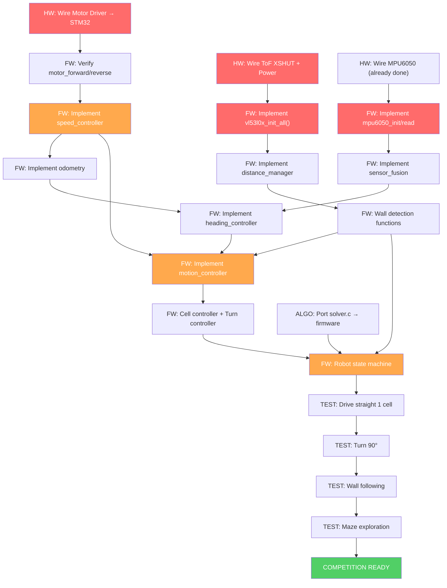
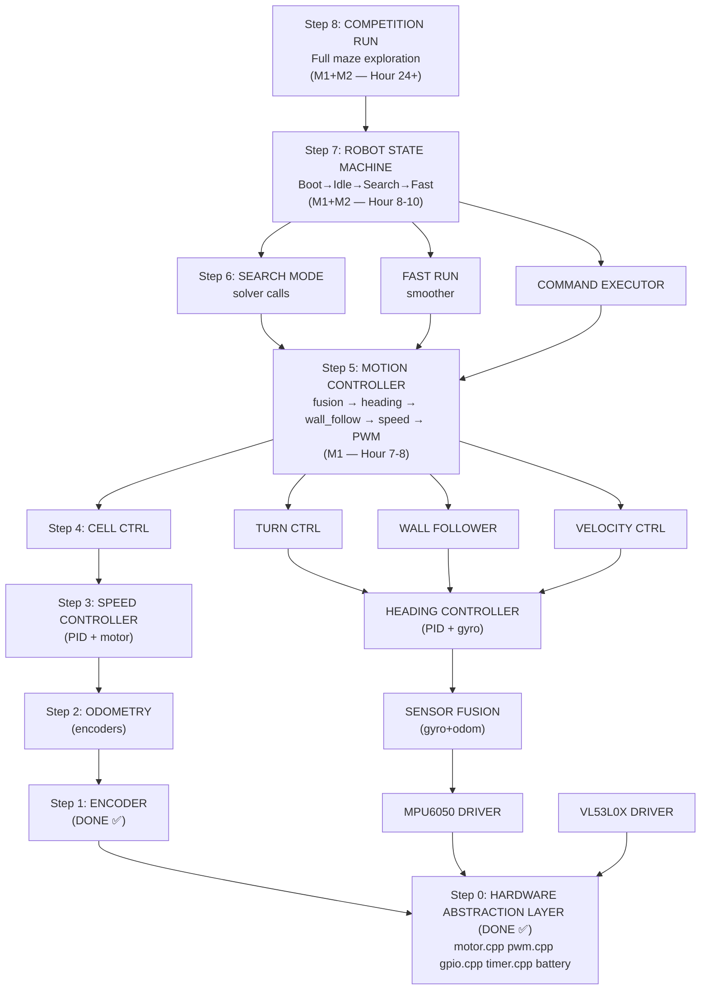
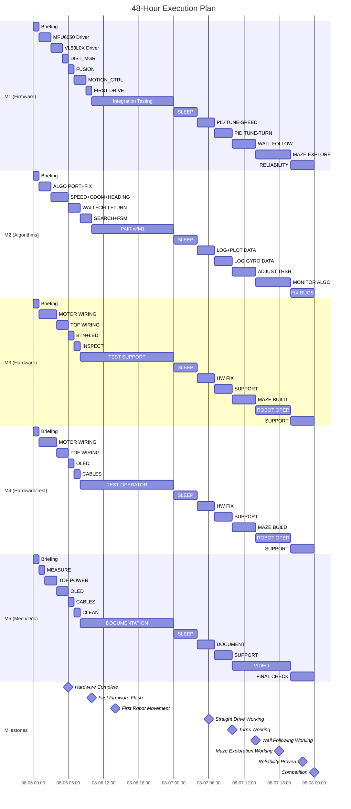

# MICROMOUSE PROJECT — 48-HOUR EXECUTION REPORT

**Project:** SLIIT RoboFest 2026 — Autonomous Micromouse  
**Platform:** STM32F401CCU6 (Black Pill) | Arduino Core for STM32  
**Date Issued:** 2026-08-06 03:30 IST  
**Deadline:** 2026-08-08 (Competition)  
**Classification:** CRITICAL PRIORITY — Time-Boxed Sprint  

---

## TABLE OF CONTENTS

1. [Current Project Status & SWOT](#1-current-project-status--swot-analysis)
2. [Team Skill Analysis](#2-team-skill-analysis)
3. [Critical Path Analysis](#3-critical-path-analysis)
4. [Team Organization](#4-recommended-team-organization)
5. [Detailed Task Breakdown](#5-detailed-task-breakdown)
6. [Parallel Execution Strategy](#6-parallel-execution-strategy)
7. [Firmware Integration Roadmap](#7-firmware-integration-roadmap)
8. [Hardware Completion Checklist](#8-hardware-completion-checklist)
9. [Software Integration Checklist](#9-software-integration-checklist)
10. [Daily Schedule](#10-daily-schedule)
11. [Risk Management](#11-risk-management)
12. [Final Integration Strategy](#12-final-integration-strategy)
13. [Testing Strategy](#13-testing-strategy)
14. [48-Hour Execution Plan](#14-48-hour-execution-plan)
15. [Communication Plan](#15-team-communication-plan)
16. [Technical Recommendations](#16-technical-recommendations)
17. [Success Criteria](#17-success-criteria)

---

## 1. CURRENT PROJECT STATUS & SWOT ANALYSIS

### Codebase Audit Summary

After examining every source file in the project, here is the actual implementation status:

| Module | Files | Status | Implementation |
|--------|-------|--------|----------------|
| **Hardware — Motor** | [motor.cpp](Full%20%20Code/Micromouse/src/hardware/motor.cpp), [encoder.cpp](Full%20%20Code/Micromouse/src/hardware/encoder.cpp), [pwm.cpp](Full%20%20Code/Micromouse/src/hardware/pwm.cpp) | ✅ IMPLEMENTED | Tested in Phase 1 & 2 test modes |
| **Hardware — GPIO/LED/Button** | [gpio.cpp](Full%20%20Code/Micromouse/src/hardware/gpio.cpp), [led.cpp](Full%20%20Code/Micromouse/src/hardware/led.cpp), [button.cpp](Full%20%20Code/Micromouse/src/hardware/button.cpp) | ✅ IMPLEMENTED | Tested in Phase 1 test mode |
| **Hardware — Battery** | [battery.cpp](Full%20%20Code/Micromouse/src/hardware/battery.cpp) | ✅ IMPLEMENTED | ADC voltage reading working |
| **Hardware — Timer** | [timer.cpp](Full%20%20Code/Micromouse/src/hardware/timer.cpp) | ✅ IMPLEMENTED | 1kHz interrupt callback working |
| **Sensor — MPU6050** | [mpu6050.cpp](Full%20%20Code/Micromouse/src/sensors/mpu6050.cpp) | ⚠️ SKELETON | All functions have `TODO` — raw I2C code not written |
| **Sensor — VL53L0X** | [vl53l0x.cpp](Full%20%20Code/Micromouse/src/sensors/vl53l0x.cpp) | ⚠️ SKELETON | XSHUT init sequence and read are `TODO` |
| **Sensor — Distance Mgr** | [distance_manager.cpp](Full%20%20Code/Micromouse/src/sensors/distance_manager.cpp) | ⚠️ SKELETON | Wall detection, centering error all `TODO` |
| **Sensor — Fusion** | [sensor_fusion.cpp](Full%20%20Code/Micromouse/src/sensors/sensor_fusion.cpp) | ⚠️ SKELETON | Complementary filter not written |
| **Sensor — Calibration** | [calibration.cpp](Full%20%20Code/Micromouse/src/sensors/calibration.cpp) | ⚠️ SKELETON | Empty |
| **Control — PID** | [pid.cpp](Full%20%20Code/Micromouse/src/control/pid.cpp) | ✅ IMPLEMENTED | Full PID with anti-windup + derivative-on-measurement |
| **Control — Speed Ctrl** | [speed_controller.cpp](Full%20%20Code/Micromouse/src/control/speed_controller.cpp) | ⚠️ SKELETON | PID integration `TODO` |
| **Control — Heading Ctrl** | [heading_controller.cpp](Full%20%20Code/Micromouse/src/control/heading_controller.cpp) | ⚠️ SKELETON | PID integration `TODO` |
| **Control — Wall Follower** | [wall_follower.cpp](Full%20%20Code/Micromouse/src/control/wall_follower.cpp) | ⚠️ SKELETON | PID integration `TODO` |
| **Control — Cell Ctrl** | [cell_controller.cpp](Full%20%20Code/Micromouse/src/control/cell_controller.cpp) | ⚠️ SKELETON | Distance tracking `TODO` |
| **Control — Turn Ctrl** | [turn_controller.cpp](Full%20%20Code/Micromouse/src/control/turn_controller.cpp) | ⚠️ SKELETON | Turn execution `TODO` |
| **Control — Motion Ctrl** | [motion_controller.cpp](Full%20%20Code/Micromouse/src/control/motion_controller.cpp) | ⚠️ SKELETON | Orchestrator `TODO` |
| **Localization — Odometry** | [odometry.cpp](Full%20%20Code/Micromouse/src/localization/odometry.cpp) | ⚠️ SKELETON | Math documented but commented out |
| **Robot — FSM** | [robot_state_machine.cpp](Full%20%20Code/Micromouse/src/robot/robot_state_machine.cpp) | ⚠️ SKELETON | Empty switch cases |
| **Robot — Search/Fast Run** | [search_mode.cpp](Full%20%20Code/Micromouse/src/robot/search_mode.cpp), [fast_run_mode.cpp](Full%20%20Code/Micromouse/src/robot/fast_run_mode.cpp) | ⚠️ SKELETON | Not connected to solver |
| **Display — OLED** | [oled_driver.cpp](Full%20%20Code/Micromouse/src/display/oled_driver.cpp) | ⚠️ SKELETON | I2C driver not written |
| **Algorithm — Flood Fill** | [flood_fill.c](src/flood_fill.c) | ✅ COMPLETE | BFS with straight-preference working |
| **Algorithm — Dijkstra** | [dijkstra_weighted.c](src/dijkstra_weighted.c) | ✅ COMPLETE | Turn-penalized shortest path working |
| **Algorithm — Solver** | [solver.c](src/solver.c) | ✅ COMPLETE | Full search + fast-run orchestrator |
| **Algorithm — Path Smoother** | [path_smoother.c](src/path_smoother.c) | ✅ COMPLETE | Motion command generation working |
| **Algorithm — Motion Profile** | [motion_profile.c](src/motion_profile.c) | ✅ COMPLETE | S-curve and arc profiles working |

> [!CAUTION]
> **CRITICAL FINDING:** Out of ~35 implementation files in the firmware, only **~8 are actually implemented**. The remaining **~27 files are skeletons with `TODO` comments**. The algorithms work in desktop simulation (`src/`) but are **not integrated** into the STM32 firmware (`Full Code/`). This is a massive gap with only 48 hours remaining.

### SWOT Analysis

```
┌─────────────────────────────────────┬──────────────────────────────────────┐
│         STRENGTHS                   │          WEAKNESSES                  │
│                                     │                                      │
│ • Motor + encoder drivers WORKING   │ • 27/35 firmware files are EMPTY     │
│ • PID class fully implemented       │ • ToF driver not implemented         │
│ • Phase 1 & 2 test modes proven     │ • MPU6050 firmware driver empty      │
│ • Algorithm suite COMPLETE & tested │ • Motion controller = empty shell    │
│   on desktop (flood, Dijkstra,      │ • Sensor fusion not written          │
│   smoother, profiles)               │ • No code tested on actual HW yet   │
│ • Pin config fully documented       │ • Only 1 person knows firmware       │
│ • Architecture is clean & modular   │ • Algorithm code is C, firmware C++  │
│ • Hardware partially assembled      │                                      │
│ • Config constants pre-configured   │                                      │
├─────────────────────────────────────┼──────────────────────────────────────┤
│         OPPORTUNITIES               │          THREATS                     │
│                                     │                                      │
│ • Skeleton files have clear TODO    │ • 48 hours is EXTREMELY tight        │
│   docs → faster implementation     │ • I2C bus contention (6 devices)     │
│ • PID already done → just wire up  │ • Untested ToF multi-sensor init     │
│ • Adafruit VL53L0X lib can be used  │ • Hardware wiring errors likely      │
│   instead of raw driver             │ • PID tuning is time-consuming       │
│ • Testing codes prove HW works      │ • Knowledge bottleneck on Member 1   │
│ • Simplified first run possible     │ • Power noise → sensor instability  │
│   (skip OLED, skip fast-run)        │ • If 1 ToF fails, wall detect fails │
└─────────────────────────────────────┴──────────────────────────────────────┘
```

### Bottleneck Analysis

```
                    ┌──────────────────────┐
                    │   CRITICAL BOTTLENECK│
                    │                      │
                    │   MEMBER 1 (You)     │
                    │                      │
                    │  • Only person who   │
                    │    can write STM32   │
                    │    firmware          │
                    │  • Only person who   │
                    │    understands I2C   │
                    │    sensor init       │
                    │  • Only person who   │
                    │    can debug HW+FW   │
                    │    integration       │
                    │  • Must implement    │
                    │    ~20 skeleton      │
                    │    files             │
                    └──────────┬───────────┘
                               │
              ┌────────────────┼────────────────┐
              │                │                │
    ┌─────────▼──────┐ ┌──────▼───────┐ ┌──────▼────────┐
    │ HW Completion  │ │ FW Writing   │ │ FW Debugging  │
    │ (Can delegate) │ │ (ONLY YOU)   │ │ (ONLY YOU)    │
    └────────────────┘ └──────────────┘ └───────────────┘
```

> [!IMPORTANT]
> **The single biggest risk to this project is YOU becoming overwhelmed.** Every firmware implementation task funnels through you. The mitigation strategy below is designed to maximize your productivity by offloading everything that doesn't require your unique skills.

---

## 2. TEAM SKILL ANALYSIS

### Skill Matrix (1-5 Scale)

| Skill Domain | M1 (You/ENTC) | M2 (CSE) | M3 (ENTC) | M4 (ENTC) | M5 (ENTC/Mech) |
|:---|:---:|:---:|:---:|:---:|:---:|
| STM32 Firmware | ⬛⬛⬛⬛⬛ 5 | ⬜⬜⬜⬜⬜ 1 | ⬛⬜⬜⬜⬜ 1 | ⬛⬜⬜⬜⬜ 1 | ⬜⬜⬜⬜⬜ 0 |
| C/C++ Programming | ⬛⬛⬛⬛⬜ 4 | ⬛⬛⬛⬛⬛ 5 | ⬛⬛⬜⬜⬜ 2 | ⬛⬛⬜⬜⬜ 2 | ⬛⬜⬜⬜⬜ 1 |
| Algorithm Design | ⬛⬛⬛⬜⬜ 3 | ⬛⬛⬛⬛⬛ 5 | ⬛⬜⬜⬜⬜ 1 | ⬛⬜⬜⬜⬜ 1 | ⬜⬜⬜⬜⬜ 0 |
| Electronics/Wiring | ⬛⬛⬛⬛⬛ 5 | ⬛⬜⬜⬜⬜ 1 | ⬛⬛⬛⬜⬜ 3 | ⬛⬛⬛⬜⬜ 3 | ⬛⬛⬜⬜⬜ 2 |
| Soldering | ⬛⬛⬛⬛⬜ 4 | ⬜⬜⬜⬜⬜ 0 | ⬛⬛⬛⬛⬜ 4 | ⬛⬛⬛⬜⬜ 3 | ⬛⬛⬜⬜⬜ 2 |
| I2C/SPI Protocols | ⬛⬛⬛⬛⬛ 5 | ⬛⬛⬜⬜⬜ 2 | ⬛⬜⬜⬜⬜ 1 | ⬛⬜⬜⬜⬜ 1 | ⬜⬜⬜⬜⬜ 0 |
| PID/Controls | ⬛⬛⬛⬛⬜ 4 | ⬛⬛⬛⬜⬜ 3 | ⬛⬜⬜⬜⬜ 1 | ⬛⬜⬜⬜⬜ 1 | ⬜⬜⬜⬜⬜ 0 |
| Mechanical Assembly | ⬛⬛⬛⬜⬜ 3 | ⬜⬜⬜⬜⬜ 0 | ⬛⬛⬛⬜⬜ 3 | ⬛⬛⬜⬜⬜ 2 | ⬛⬛⬛⬛⬛ 5 |
| Debugging/Testing | ⬛⬛⬛⬛⬛ 5 | ⬛⬛⬛⬜⬜ 3 | ⬛⬛⬜⬜⬜ 2 | ⬛⬛⬜⬜⬜ 2 | ⬛⬜⬜⬜⬜ 1 |
| Git/Version Control | ⬛⬛⬛⬛⬜ 4 | ⬛⬛⬛⬛⬜ 4 | ⬛⬜⬜⬜⬜ 1 | ⬛⬜⬜⬜⬜ 1 | ⬜⬜⬜⬜⬜ 0 |

### Optimal Role Assignment (with reasoning)

| Member | Assigned Role | Justification |
|--------|--------------|---------------|
| **M1 (You)** | **Firmware Lead + Integration Architect** | Only person who can write STM32-level code, debug I2C, and integrate sensors. Must be protected from non-firmware tasks. Every minute you spend on wiring is a minute not writing firmware. |
| **M2 (CSE)** | **Algorithm Integration Engineer + PID Tuning Partner** | Wrote the algorithms. Must port `src/*.c` into `Full Code/` firmware. Can also write the skeleton implementations for speed_controller, heading_controller, wall_follower using the existing PID class — these are pure C++ logic, not hardware-dependent. |
| **M3 (ENTC)** | **Hardware Integration Lead (wiring)** | Best soldering skills after you. Takes over ALL remaining hardware: motor driver→STM32, ToF power/XSHUT, OLED, LEDs, buttons. You supervise pin assignments, M3 executes. |
| **M4 (ENTC)** | **Hardware Assistant + Test Operator** | Assists M3 with wiring, cable management. After hardware done, becomes the "test pilot" — physically operates the robot during testing while you watch Serial output and tune. |
| **M5 (Mech)** | **Mechanical Finisher + Hardware Support** | Finishes any chassis modifications, cable routing, sensor mounting. After that, supports M3/M4 on wiring. Also documents physical measurements (wheel base, sensor offsets) that firmware needs. |

### Knowledge Transfer Requirements

> [!WARNING]
> **Before splitting into teams, you MUST spend 30 minutes briefing M3 and M5 on:**
> - The [pin_config.h](Full%20%20Code/Micromouse/src/config/pin_config.h) mapping (which wire goes where)
> - Power rail layout (what gets 3.3V vs 5V)
> - I2C bus topology (MPU6050, OLED, 5× VL53L0X all on PB8/PB9)
> - XSHUT pin assignments for each ToF sensor
> - TB6612FNG motor driver connections
>
> **And brief M2 on:**
> - How the firmware architecture connects to their algorithms
> - The existing PID class API in [pid.cpp](Full%20%20Code/Micromouse/src/control/pid.cpp)
> - What `motion_controller_update()` needs to do (the pipeline in the TODO comment)
> - How `solver.c` will be called from [robot_state_machine.cpp](Full%20%20Code/Micromouse/src/robot/robot_state_machine.cpp)

---

## 3. CRITICAL PATH ANALYSIS

### Dependency Graph



### Critical Path (longest sequential chain)

```
Wire ToF → ToF Driver → Distance Manager → Wall Detection
                                                    ↓
Wire Motor → Motor Verify → Speed Controller → Heading Controller → Motion Controller
                                                    ↑                       ↓
                            MPU Driver → Sensor Fusion               Cell/Turn Controller
                                                                            ↓
                                                        Solver Port → State Machine → TESTING
```

**Critical path estimated time: ~20 hours of focused work**

### Parallel Tracks Identified

| Track | Tasks | Can Start Immediately | Blocking Dependencies |
|-------|-------|-----------------------|-----------------------|
| **Track A: Hardware** | Motor→STM32, ToF→Power/STM32, OLED, LEDs, Buttons | ✅ YES | None — hardware first |
| **Track B: Sensor Drivers** | MPU6050 driver, VL53L0X driver | ✅ YES (MPU already connected) | ToF needs hardware Track A |
| **Track C: Algorithm Port** | Copy solver.c/flood_fill.c/etc into firmware | ✅ YES | None — pure code |
| **Track D: Control Logic** | speed_controller, heading_controller, wall_follower | ✅ YES | These are pure logic using existing PID class |
| **Track E: Integration** | motion_controller, FSM, sensor_manager | ❌ BLOCKED | Needs Tracks B, C, D complete |

---

## 4. RECOMMENDED TEAM ORGANIZATION

### Your Initial Idea vs My Recommendation

Your idea: 2 on hardware, 3 on software.

> [!IMPORTANT]
> **I agree with the split but with a critical modification.** You (M1) should NOT be on the hardware team. Your firmware skills are irreplaceable and your time writing firmware is 10× more valuable than your time holding a soldering iron. M3, M4, and M5 can handle hardware. You and M2 must be writing firmware from minute one.

### Recommended Structure

```
┌─────────────────────────────────────────────────────────────────────┐
│                    TEAM ORGANIZATION                                │
├─────────────────────────────────────────────────────────────────────┤
│                                                                     │
│  ┌─────────────────────────┐  ┌──────────────────────────────────┐ │
│  │  HARDWARE CELL (3 ppl)  │  │  FIRMWARE CELL (2 ppl)           │ │
│  │  Duration: ~4-6 hours   │  │  Duration: Full 48 hours         │ │
│  │                         │  │                                  │ │
│  │  Lead: M3 (ENTC)        │  │  Lead: M1 (You)                 │ │
│  │  Assist: M4 (ENTC)      │  │  Partner: M2 (CSE)              │ │
│  │  Assist: M5 (Mech)      │  │                                  │ │
│  │                         │  │  M1: Sensor drivers, motion ctrl │ │
│  │  Tasks:                 │  │  M2: Algorithm port, controllers │ │
│  │  • Motor driver → STM32 │  │      PID wiring, FSM logic      │ │
│  │  • ToF → power + STM32  │  │                                  │ │
│  │  • OLED wiring           │  │                                  │ │
│  │  • LEDs + Buttons        │  │                                  │ │
│  │  • Cable management      │  │                                  │ │
│  │  • Physical measurements │  │                                  │ │
│  │                         │  │                                  │ │
│  │  After HW done → join   │  │                                  │ │
│  │  testing team            │  │                                  │ │
│  └─────────────────────────┘  └──────────────────────────────────┘ │
│                                                                     │
│  After hardware completion (Hour 6+):                               │
│  ┌──────────────────────────────────────────────────────────────┐   │
│  │  INTEGRATION & TESTING TEAM (All 5)                          │   │
│  │                                                              │   │
│  │  M1: Flash firmware, debug, tune PID                         │   │
│  │  M2: Monitor Serial output, log data, adjust algorithm params│   │
│  │  M3: Physical robot handling, re-solder if needed            │   │
│  │  M4: Test operator — place robot in maze, press buttons      │   │
│  │  M5: Record videos, document results, track issues           │   │
│  └──────────────────────────────────────────────────────────────┘   │
└─────────────────────────────────────────────────────────────────────┘
```

### RACI Matrix

| Task | M1 (You) | M2 (CSE) | M3 (ENTC) | M4 (ENTC) | M5 (Mech) |
|------|:--------:|:--------:|:---------:|:---------:|:---------:|
| Hardware Briefing | **R** | I | **A** | I | I |
| Motor→STM32 Wiring | C | — | **R/A** | **R** | — |
| ToF Sensor Wiring | C | — | **R/A** | **R** | **R** |
| OLED/LED/Button Wiring | — | — | **R/A** | **R** | **R** |
| Physical Measurements | C | — | — | — | **R/A** |
| MPU6050 Driver | **R/A** | — | — | — | — |
| VL53L0X Driver | **R/A** | C | — | — | — |
| Distance Manager | **R/A** | C | — | — | — |
| Sensor Fusion | **R/A** | C | — | — | — |
| Algorithm Port to FW | C | **R/A** | — | — | — |
| Speed Controller | C | **R/A** | — | — | — |
| Heading Controller | C | **R/A** | — | — | — |
| Wall Follower | C | **R/A** | — | — | — |
| Motion Controller | **R/A** | C | — | — | — |
| Odometry | **R/A** | C | — | — | — |
| Cell/Turn Controller | **R/A** | C | — | — | — |
| Robot State Machine | **R** | **A** | — | — | — |
| PID Tuning | **R/A** | **R** | — | I | — |
| System Integration Test | **R/A** | **R** | C | **R** | I |
| Maze Running Test | **R/A** | **R** | C | **R** | I |

*R = Responsible, A = Accountable, C = Consulted, I = Informed*

---

## 5. DETAILED TASK BREAKDOWN

### Phase 0: Preparation (Hours 0-1)

| # | Task | Owner | Duration | Priority | Dependencies | Risk | Verification |
|---|------|-------|----------|----------|-------------|------|--------------|
| 0.1 | Brief M3/M4/M5 on pin_config.h and wiring diagram | M1 | 30 min | P0 | None | LOW | Team can recite which pin goes where |
| 0.2 | Brief M2 on firmware architecture and PID API | M1 | 20 min | P0 | None | LOW | M2 can explain motion controller pipeline |
| 0.3 | M5 measures wheel_base, sensor_front_offset | M5 | 15 min | P0 | None | LOW | Values recorded, update robot_config.h |
| 0.4 | Git: Create `sprint` branch, everyone pulls | M1 | 10 min | P0 | None | LOW | All members have branch checked out |
| 0.5 | Verify pin assignments in pin_config.h match actual hardware | M1 + M3 | 15 min | P0 | None | MED | Confirmed XSHUT pins, motor pins match physical |

### Phase 1: Hardware Completion (Hours 1-6)

| # | Task | Owner | Duration | Priority | Dependencies | Risk | Verification |
|---|------|-------|----------|----------|-------------|------|--------------|
| 1.1 | Wire TB6612FNG → STM32 (AIN1=PB12, AIN2=PB13, BIN1=PB15, BIN2=PA10, PWMA=PA8, PWMB=PA9, STBY=PB14) | M3+M4 | 1.5 hr | P0 | 0.1 | MED | Motor spin test via Phase 2 mode |
| 1.2 | Wire 5× VL53L0X XSHUT pins (PB0-PB4) | M3 | 1 hr | P0 | 0.1 | HIGH | Continuity test with multimeter |
| 1.3 | Wire 5× VL53L0X to 3.3V power + GND | M4+M5 | 1 hr | P0 | 0.1 | MED | 3.3V measured at each sensor VIN |
| 1.4 | Wire VL53L0X SDA/SCL to PB9/PB8 I2C bus | M3 | 30 min | P0 | 1.2, 1.3 | HIGH | I2C scan detects devices |
| 1.5 | Wire OLED SSD1306 to I2C (PB8/PB9) + power | M5 | 30 min | P1 | None | LOW | I2C scan shows 0x3C |
| 1.6 | Wire Start button to PB5, Mode button to PB6 | M4 | 20 min | P1 | None | LOW | Digital read HIGH/LOW on press |
| 1.7 | Wire onboard LED (PC13), Status LED to PA5 | M4 | 15 min | P2 | None | LOW | LED toggle test |
| 1.8 | Cable management + strain relief | M5 | 30 min | P1 | 1.1-1.7 | LOW | No loose wires, clean routing |
| 1.9 | Full electrical inspection | M3 | 20 min | P0 | 1.1-1.8 | LOW | Checklist complete (see §8) |

### Phase 2: Sensor Driver Implementation (Hours 1-8, parallel with HW)

| # | Task | Owner | Duration | Priority | Dependencies | Risk | Verification |
|---|------|-------|----------|----------|-------------|------|--------------|
| 2.1 | Implement `mpu6050_init()` — wake, config gyro/accel/DLPF, WHO_AM_I check | M1 | 1 hr | P0 | None (MPU already wired) | MED | WHO_AM_I returns 0x68, Serial prints raw accel/gyro |
| 2.2 | Implement `mpu6050_read_raw()` and `mpu6050_read_scaled()` | M1 | 45 min | P0 | 2.1 | LOW | Serial print shows stable ~0 gyro when still |
| 2.3 | Implement `mpu6050_calibrate_gyro()` | M1 | 30 min | P0 | 2.2 | LOW | Gyro offsets computed, printed |
| 2.4 | Implement `vl53l0x_init_all()` using Pololu VL53L0X library | M1 | 2 hr | P0 | 1.2-1.4 (HW) | HIGH | I2C scan shows 5 distinct addresses (0x30-0x34) |
| 2.5 | Implement `vl53l0x_read_distance_mm()` | M1 | 30 min | P0 | 2.4 | MED | Serial prints 5 distances, hand in front changes value |
| 2.6 | Implement `distance_manager_init()` and `distance_manager_update()` | M1 | 30 min | P0 | 2.5 | LOW | All 5 sensors read continuously |
| 2.7 | Implement `distance_has_wall_*()` and `distance_get_centering_error()` | M1 | 45 min | P0 | 2.6 | MED | Place robot in corridor, Serial shows L/R/F walls correctly |
| 2.8 | Implement `sensor_fusion.cpp` — complementary filter for heading | M1 | 1 hr | P1 | 2.3 | MED | Rotate robot 360°, heading returns to ~0 |

### Phase 3: Control System Implementation (Hours 1-10, parallel)

| # | Task | Owner | Duration | Priority | Dependencies | Risk | Verification |
|---|------|-------|----------|----------|-------------|------|--------------|
| 3.1 | Implement `speed_controller.cpp` — wire PID to motor, add feedforward | M2 | 1.5 hr | P0 | PID class exists | MED | Robot drives at target speed ±10% |
| 3.2 | Implement `odometry.cpp` — uncomment and verify math | M2 | 30 min | P0 | None (logic is documented) | LOW | Serial shows (x,y,θ) updating as robot moves |
| 3.3 | Implement `heading_controller.cpp` — PID for angular control | M2 | 1 hr | P0 | PID class | MED | Robot holds heading within ±2° |
| 3.4 | Implement `wall_follower.cpp` — PID on centering error | M2 | 1 hr | P0 | PID class | MED | Robot centers in corridor |
| 3.5 | Implement `cell_controller.cpp` — distance-based cell traversal | M2 | 1 hr | P0 | 3.1 | MED | Robot moves exactly 180mm (1 cell) |
| 3.6 | Implement `turn_controller.cpp` — gyro-based 90°/180° turns | M2 | 1 hr | P0 | 3.3, 2.8 | HIGH | Robot turns 90° within ±3° |
| 3.7 | Implement `motion_controller.cpp` — orchestrate pipeline | M1 | 1.5 hr | P0 | 3.1-3.6, 2.7 | HIGH | Full pipeline: fusion→heading→speed→PWM |
| 3.8 | Implement `velocity_controller.cpp` — differential drive mixer | M2 | 30 min | P0 | None (pure math) | LOW | (v, ω) → (left_speed, right_speed) correct |

### Phase 4: Algorithm Integration (Hours 2-8, parallel)

| # | Task | Owner | Duration | Priority | Dependencies | Risk | Verification |
|---|------|-------|----------|----------|-------------|------|--------------|
| 4.1 | Copy `solver.c`, `flood_fill.c`, `dijkstra_weighted.c`, `path_smoother.c`, `motion_profile.c` into `Full Code/Micromouse/src/maze/` | M2 | 30 min | P0 | None | LOW | Files compile in Arduino IDE |
| 4.2 | Copy `solver.h`, `flood_fill.h`, `dijkstra_weighted.h`, `path_smoother.h`, `motion_profile.h`, `maze.h`, `config.h` into firmware | M2 | 20 min | P0 | 4.1 | LOW | No compile errors |
| 4.3 | Resolve C vs C++ linkage — wrap headers with `extern "C" {}` | M2 | 30 min | P0 | 4.2 | MED | Clean compile |
| 4.4 | Implement `search_mode.cpp` — calls solver_record_walls + solver_search_step | M2 | 1.5 hr | P0 | 4.3 | MED | Compiles, logic matches solver API |
| 4.5 | Implement `fast_run_mode.cpp` — calls solver_get_next_command + motion_execute_command | M2 | 1 hr | P1 | 4.4 | MED | Compiles, logic matches API |
| 4.6 | Implement `robot_state_machine.cpp` — full FSM transitions | M1+M2 | 1.5 hr | P0 | 4.4, 3.7 | HIGH | State transitions work via button press |
| 4.7 | Update `Micromouse.ino` `setup()` and `loop()` to remove test modes and enable full code | M1 | 30 min | P0 | 4.6 | LOW | Clean boot into STATE_IDLE |

### Phase 5: Integration & Tuning (Hours 10-48)

| # | Task | Owner | Duration | Priority | Dependencies | Risk | Verification |
|---|------|-------|----------|----------|-------------|------|--------------|
| 5.1 | PID tuning — speed controller (Kp, Ki, Kd) | M1 | 2 hr | P0 | 3.1, 1.1 | HIGH | Straight drive within ±5% speed |
| 5.2 | PID tuning — heading controller | M1 | 1.5 hr | P0 | 3.3, 2.8 | HIGH | Maintains heading ±2° |
| 5.3 | PID tuning — wall follower | M1 | 1.5 hr | P1 | 3.4, 2.7 | MED | Centers within ±5mm |
| 5.4 | Calibrate cell distance (180mm traversal) | M1 | 1 hr | P0 | 3.5 | MED | Stops within ±5mm of cell boundary |
| 5.5 | Calibrate 90° turn (gyro integration) | M1 | 1.5 hr | P0 | 3.6 | HIGH | Turns within ±3° |
| 5.6 | End-to-end test: drive 3 cells straight | M1+M4 | 30 min | P0 | 5.1, 5.4 | MED | Drives 540mm, stops |
| 5.7 | End-to-end test: drive + turn + drive | M1+M4 | 1 hr | P0 | 5.5, 5.6 | HIGH | L-shape navigation |
| 5.8 | End-to-end test: wall following in corridor | M1+M4 | 1 hr | P0 | 5.3, 5.7 | HIGH | Drives straight between walls |
| 5.9 | End-to-end test: simple 2×2 maze exploration | M1+M2+M4 | 2 hr | P0 | 5.8, 4.6 | HIGH | Explores and returns to start |
| 5.10 | Full 16×16 maze test (if time allows) | ALL | 2+ hr | P1 | 5.9 | HIGH | Explores full maze |

---

## 6. PARALLEL EXECUTION STRATEGY

### Hour-by-Hour Activity Map

```
HOUR   M1 (You)           M2 (CSE)              M3 (ENTC)           M4 (ENTC)          M5 (Mech)
─────┼───────────────────┼─────────────────────┼───────────────────┼──────────────────┼──────────────────
 0   │ Brief ALL teams   │ Listen + ask Qs     │ Listen + ask Qs   │ Listen + ask Qs  │ Listen + ask Qs
     │ Pin config review │ Understand PID API  │ Study wiring map  │ Study wiring map │ Measure wheelbase
─────┼───────────────────┼─────────────────────┼───────────────────┼──────────────────┼──────────────────
 1   │ MPU6050 init()    │ Copy algo files     │ Wire Motor→STM32  │ Wire Motor→STM32 │ Measure sensor
     │ mpu6050_read_raw  │ to firmware dir     │ (TB6612 pins)     │ (assist M3)      │ offsets, update
     │                   │ Fix C/C++ linkage   │                   │                  │ robot_config.h
─────┼───────────────────┼─────────────────────┼───────────────────┼──────────────────┼──────────────────
 2   │ MPU6050 scaled    │ Implement           │ Wire Motor→STM32  │ Wire ToF power   │ Wire ToF power
     │ + calibrate_gyro  │ speed_controller    │ (finish + test)   │ (3.3V + GND)     │ (assist M4)
     │                   │ using PID class     │                   │                  │
─────┼───────────────────┼─────────────────────┼───────────────────┼──────────────────┼──────────────────
 3   │ Start VL53L0X     │ Implement           │ Wire XSHUT pins   │ Wire XSHUT pins  │ Wire OLED
     │ driver (Pololu    │ odometry.cpp        │ (PB0-PB4)         │ (assist M3)      │ to I2C bus
     │ library wrap)     │ heading_controller  │                   │                  │
─────┼───────────────────┼─────────────────────┼───────────────────┼──────────────────┼──────────────────
 4   │ VL53L0X driver    │ Implement           │ Wire ToF SDA/SCL  │ Wire buttons     │ Wire LEDs
     │ (XSHUT sequence)  │ wall_follower       │ (PB8/PB9 bus)     │ (PB5, PB6)       │ (PA5)
     │                   │ velocity_controller │                   │                  │
─────┼───────────────────┼─────────────────────┼───────────────────┼──────────────────┼──────────────────
 5   │ VL53L0X testing   │ Implement           │ Electrical        │ Full continuity  │ Cable management
     │ (verify 5 addrs)  │ cell_controller     │ inspection        │ test             │ Strain relief
     │                   │ turn_controller     │                   │                  │
─────┼───────────────────┼─────────────────────┼───────────────────┼──────────────────┼──────────────────
 6   │ distance_manager  │ Implement           │ ◆ HW COMPLETE ◆  │ ◆ HW COMPLETE ◆ │ ◆ HW COMPLETE ◆
     │ implementation    │ search_mode.cpp     │ → Join testing   │ → Test operator  │ → Document +
     │ wall detection    │                     │                   │                  │   support
─────┼───────────────────┼─────────────────────┼───────────────────┼──────────────────┼──────────────────
 7   │ sensor_fusion     │ Implement FSM       │ Help M1 test      │ Flash FW +       │ Record test
     │ implementation    │ robot_state_machine │ I2C bus scan      │ run Phase2 test  │ results
─────┼───────────────────┼─────────────────────┼───────────────────┼──────────────────┼──────────────────
 8   │ motion_controller │ Update              │ Assist debugging   │ Hold robot for   │ Track issues
     │ orchestrator      │ Micromouse.ino      │                   │ sensor test      │ in spreadsheet
─────┼───────────────────┼─────────────────────┼───────────────────┼──────────────────┼──────────────────
 9+  │ ◆ INTEGRATION TESTING — ALL HANDS ◆                                                             │
     │ PID tuning, calibration, maze testing                                                             │
```

---

## 7. FIRMWARE INTEGRATION ROADMAP

### Implementation Order (Bottom-Up)



### Key Decision: Use Pololu VL53L0X Library

> [!TIP]
> **Do NOT write raw I2C register access for VL53L0X.** The VL53L0X initialization sequence is extremely complex (400+ registers). Use the [Pololu VL53L0X Arduino library](https://github.com/pololu/vl53l0x-arduino). Wrap it inside your `vl53l0x.cpp`. This saves 4+ hours.

### Minimum Viable Robot (MVR) — What to Cut

If time runs out, here's what to **skip** to still have a working robot:

| Feature | Priority | Can Skip? | Impact if Skipped |
|---------|----------|-----------|-------------------|
| Search run (flood fill) | P0 — MUST HAVE | ❌ | No maze solving at all |
| Fast run (Dijkstra) | P1 | ✅ | Robot solves but slower |
| S-curve motion profiles | P2 | ✅ | Robot works but jerky |
| OLED display | P2 | ✅ | Use Serial instead |
| Wall follower centering | P1 | Partial | Robot drifts but may still navigate |
| Rolling smooth turns | P2 | ✅ | Use in-place turns instead |
| Path smoother | P2 | ✅ | Use raw flood fill path |
| Battery monitoring | P2 | ✅ | Just charge before runs |
| Debug LED | P3 | ✅ | No visual feedback |
| Menu system | P3 | ✅ | Hardcode mode selection |

---

## 8. HARDWARE COMPLETION CHECKLIST

### Pre-Wiring Safety

- [ ] Battery disconnected during all wiring
- [ ] Multimeter available and working
- [ ] Soldering iron temperature set correctly (350°C for lead, 380°C for lead-free)
- [ ] [pin_config.h](Full%20%20Code/Micromouse/src/config/pin_config.h) printed out and on the workbench

### Motor Driver (TB6612FNG → STM32)

- [ ] AIN1 wire from PB12 to TB6612 AIN1
- [ ] AIN2 wire from PB13 to TB6612 AIN2
- [ ] BIN1 wire from PB15 to TB6612 BIN1
- [ ] BIN2 wire from PA10 to TB6612 BIN2
- [ ] PWMA wire from PA8 to TB6612 PWMA
- [ ] PWMB wire from PA9 to TB6612 PWMB
- [ ] STBY wire from PB14 to TB6612 STBY
- [ ] **Motor driver VCC = motor battery voltage (NOT 3.3V)**
- [ ] **Logic VCC = 3.3V**
- [ ] GND connected to common ground
- [ ] **VERIFY**: `motor_forward(500)` spins both wheels forward
- [ ] **VERIFY**: `motor_turn_left(500)` spins wheels in opposite directions

### VL53L0X Sensors (×5)

- [ ] All 5 sensors receiving 3.3V on VIN pin — **measured with multimeter**
- [ ] All 5 sensors GND connected to common ground
- [ ] XSHUT_FRONT → PB0 — continuity confirmed
- [ ] XSHUT_FRONT_LEFT → PB1 — continuity confirmed
- [ ] XSHUT_FRONT_RIGHT → PB2 — continuity confirmed
- [ ] XSHUT_LEFT → PB3 — continuity confirmed
- [ ] XSHUT_RIGHT → PB4 — continuity confirmed
- [ ] SDA lines from all 5 sensors → PB9 (I2C1_SDA)
- [ ] SCL lines from all 5 sensors → PB8 (I2C1_SCL)
- [ ] 4.7kΩ pull-up resistors on SDA and SCL to 3.3V (if not already on MPU breakout)
- [ ] **VERIFY**: I2C scan detects device at 0x29 (with only one sensor XSHUT HIGH)

### MPU6050 (Already Connected)

- [ ] SDA → PB9 confirmed
- [ ] SCL → PB8 confirmed
- [ ] VCC → 3.3V confirmed
- [ ] GND → common ground confirmed
- [ ] AD0 → GND (address = 0x68)
- [ ] **VERIFY**: I2C scan detects 0x68

### OLED SSD1306

- [ ] SDA → PB9
- [ ] SCL → PB8
- [ ] VCC → 3.3V
- [ ] GND → common ground
- [ ] **VERIFY**: I2C scan detects 0x3C

### User Interface

- [ ] Start button → PB5 with pull-up/pull-down resistor
- [ ] Mode button → PB6 with pull-up/pull-down resistor
- [ ] Status LED + current-limiting resistor → PA5
- [ ] Onboard LED = PC13 (already connected)
- [ ] **VERIFY**: `button_just_pressed(BUTTON_START)` returns true on press

### Power System

- [ ] 3.3V rail: Measured voltage = _________ mV (expect 3200-3400)
- [ ] 5V rail: Measured voltage = _________ mV (expect 4800-5200)
- [ ] GND continuity between battery GND and STM32 GND: ✅ / ❌
- [ ] Motor battery voltage: _________ mV (expect 7200-8400 for 2S LiPo)
- [ ] No short circuits: resistance between 3.3V and GND > 100Ω: ✅ / ❌
- [ ] No short circuits: resistance between 5V and GND > 100Ω: ✅ / ❌
- [ ] Battery connector secure, no exposed terminals

### I2C Bus Verification

- [ ] Total devices on I2C bus: 7 (5× ToF + 1× MPU + 1× OLED)
- [ ] Pull-up resistors present (one pair is sufficient for the whole bus)
- [ ] Wire length < 15cm for reliable 400kHz operation
- [ ] I2C scan sketch shows exactly 7 addresses (after XSHUT initialization)

### Final Inspection

- [ ] No loose wires
- [ ] No solder bridges
- [ ] All wires have strain relief (hot glue or cable ties)
- [ ] Robot wheels spin freely without wire interference
- [ ] Sensors have clear line of sight (no obstruction from wires)
- [ ] Robot can be placed in maze without catching on walls

---

## 9. SOFTWARE INTEGRATION CHECKLIST

### Layer 0: Build System

- [ ] Arduino IDE configured for STM32F401CCU6 (Black Pill)
- [ ] Board: "Generic STM32F4 series"
- [ ] Board part number: "BlackPill F401CC"
- [ ] Upload method: STLink or Serial
- [ ] Required libraries installed: Pololu VL53L0X, Wire (built-in)
- [ ] Project compiles with zero errors
- [ ] Project compiles with zero warnings (or only benign ones)

### Layer 1: Hardware Drivers

- [ ] `motor_forward(500)` drives both motors forward
- [ ] `motor_reverse(500)` drives both motors backward
- [ ] `motor_turn_left(500)` turns correctly
- [ ] `motor_turn_right(500)` turns correctly
- [ ] `motor_stop()` stops immediately
- [ ] `encoder_get_count(ENCODER_LEFT)` increments when left wheel spins forward
- [ ] `encoder_get_count(ENCODER_RIGHT)` increments when right wheel spins forward
- [ ] Encoder counts are consistent (same number of counts per revolution ±5%)
- [ ] `battery_get_voltage_mv()` returns reasonable value (7000-8400)

### Layer 2: Sensor Drivers

- [ ] `mpu6050_init()` returns `true`
- [ ] `mpu6050_read_raw()` returns changing values when robot is moved
- [ ] `mpu6050_read_scaled()` gyro_z reads near 0 when stationary (after calibration)
- [ ] `mpu6050_calibrate_gyro()` completes without error
- [ ] `vl53l0x_init_all()` returns 5 (all sensors initialized)
- [ ] Each ToF sensor reads realistic distances (20-1200mm)
- [ ] `distance_has_wall_front()` returns `true` when wall is <120mm away
- [ ] `distance_has_wall_left()` returns `true` when wall is <120mm away
- [ ] `distance_has_wall_right()` returns `true` when wall is <120mm away
- [ ] `distance_get_centering_error()` returns ~0 when robot is centered

### Layer 3: Control System

- [ ] Speed controller: robot drives at 200mm/s ±20% when commanded
- [ ] Speed controller: both wheels match speed within 10%
- [ ] Heading controller: robot maintains heading ±3° on straight run
- [ ] Heading controller: robot can turn exactly 90° ±5°
- [ ] Heading controller: robot can turn exactly 180° ±5°
- [ ] Cell controller: robot moves exactly 180mm ±10mm
- [ ] Wall follower: robot centers between two walls
- [ ] Motion controller pipeline runs at 1kHz without overrun

### Layer 4: Navigation

- [ ] Odometry tracks position correctly over 5-cell straight run
- [ ] Sensor fusion heading matches actual heading ±5° over 4 turns
- [ ] Solver records walls correctly from sensor readings
- [ ] Flood fill computes correct distances
- [ ] Robot makes correct turn decisions at junctions

### Layer 5: Competition Readiness

- [ ] Boot to IDLE in <3 seconds
- [ ] Button press starts search run
- [ ] Robot explores simple maze (4 cells minimum) without crashing
- [ ] Robot returns to start after reaching goal
- [ ] Robot survives 5 consecutive runs without reset
- [ ] Battery lasts for at least 3 complete maze runs

---

## 10. DAILY SCHEDULE

### DAY 1 — Wednesday Aug 6 (Today)

| Time | Activity | Who | Deliverable |
|------|----------|-----|-------------|
| **09:00 – 09:30** | ☕ Team briefing. Print pin_config.h. Assign tasks. | ALL | Everyone knows their role |
| **09:30 – 10:00** | M5 measures robot dimensions. M1 briefs M3 on wiring. M2 reads firmware architecture. | ALL | robot_config.h updated, M3 has wiring map |
| **10:00 – 12:00** | **PARALLEL SPRINT 1** | | |
| | M1: MPU6050 driver (init + read + calibrate) | M1 | WHO_AM_I verified, gyro reads stable |
| | M2: Copy algorithms to firmware, fix C/C++ linkage | M2 | Clean compile |
| | M3+M4: Wire motor driver → STM32 | M3+M4 | Motor wires connected |
| | M5: Wire ToF power (3.3V + GND for all 5) | M5 | Voltage confirmed at each sensor |
| **12:00 – 12:30** | 🍴 Lunch break + sync. M1 verifies motor wiring. | ALL | Motor test pass/fail |
| **12:30 – 14:30** | **PARALLEL SPRINT 2** | | |
| | M1: VL53L0X driver (Pololu library integration) | M1 | Library installed, compile test |
| | M2: speed_controller + odometry + heading_controller | M2 | Three files implemented |
| | M3: Wire XSHUT pins (PB0-PB4) | M3 | 5 XSHUT wires connected |
| | M4: Wire I2C SDA/SCL for ToF sensors | M4 | I2C bus wired |
| | M5: Wire OLED | M5 | OLED connected |
| **14:30 – 15:00** | ☕ Break + **CHECKPOINT 1**: Motor test + I2C scan | ALL | Motors spin. I2C devices detected. |
| **15:00 – 17:00** | **PARALLEL SPRINT 3** | | |
| | M1: VL53L0X XSHUT init sequence + multi-sensor test | M1 | 5 sensors read different addresses |
| | M2: wall_follower + cell_controller + turn_controller | M2 | Three files implemented |
| | M3+M4: Wire buttons + LEDs + final inspection | M3+M4 | All UI wired |
| | M5: Cable management + strain relief | M5 | Clean build |
| **17:00 – 17:30** | 🍴 Snack + **CHECKPOINT 2**: Full hardware done? | ALL | ⭐ HARDWARE SIGN-OFF ⭐ |
| **17:30 – 19:30** | **INTEGRATION SPRINT 1** | | |
| | M1: distance_manager + sensor_fusion | M1 | Wall detection works |
| | M2: velocity_controller + search_mode.cpp | M2 | Search mode implemented |
| | M3: Assist M1 — hold robot, confirm sensor readings | M3 | Test data logged |
| | M4: Flash firmware, run Phase 1 test on complete HW | M4 | All LEDs/buttons work |
| | M5: Run I2C diagnostic, log all device addresses | M5 | Address map confirmed |
| **19:30 – 20:00** | 🍴 Dinner break | ALL | |
| **20:00 – 22:00** | **INTEGRATION SPRINT 2** | | |
| | M1: motion_controller + robot_state_machine (with M2) | M1+M2 | Full pipeline compiles |
| | M2: FSM transitions + Micromouse.ino update | M1+M2 | Boot→Idle→Search works |
| | M3: Prepare test maze (simple 3×3 cardboard) | M3+M4 | Physical maze ready |
| | M5: Document all wiring changes, update README | M5 | Documentation current |
| **22:00 – 22:30** | **CHECKPOINT 3**: Can we compile and flash the full firmware? | ALL | ✅ Full build, clean flash |
| **22:30 – 00:00** | **FIRST DRIVE TEST** | | |
| | M1: Flash full firmware, test drive straight | M1 | Robot moves forward |
| | M2: Monitor Serial output, log PID behavior | M2 | Data captured |
| | M4: Place robot, retrieve robot | M4 | Robot physically handled |
| **00:00** | 🛌 **MANDATORY SLEEP** (at least 5 hours) | ALL | |

### DAY 2 — Thursday Aug 7

| Time | Activity | Who | Deliverable |
|------|----------|-----|-------------|
| **08:00 – 08:30** | ☕ Morning sync. Review Day 1 issues. | ALL | Issue list prioritized |
| **08:30 – 10:30** | **PID TUNING SPRINT** | | |
| | M1: Tune speed controller PID | M1 | Straight drive accurate |
| | M2: Log encoder data, plot speed curves | M2 | Tuning data |
| | M4: Operate robot for tests | M4 | Test runs |
| | M3+M5: Fix any hardware issues from Day 1 | M3+M5 | All HW stable |
| **10:30 – 12:30** | **TURN TUNING SPRINT** | | |
| | M1: Tune heading controller, calibrate 90° turns | M1 | 90° turns ±5° |
| | M2: Log gyro data, verify turn angles | M2 | Turn accuracy data |
| | M4: Mark floor with tape for reference angles | M4 | Reference marks |
| **12:30 – 13:00** | 🍴 Lunch + **CHECKPOINT 4**: Straight + Turn working? | ALL | GO / NO-GO decision |
| **13:00 – 15:00** | **WALL FOLLOWING SPRINT** | | |
| | M1: Tune wall follower, test in corridor | M1 | Robot centers in corridor |
| | M2: Adjust wall detection thresholds in distance_manager | M2 | Thresholds calibrated |
| | M3+M4: Set up longer test corridors | M3+M4 | Test environment ready |
| **15:00 – 15:30** | ☕ Break + **CHECKPOINT 5**: Wall following works? | ALL | GO / NO-GO |
| **15:30 – 18:00** | **MAZE EXPLORATION SPRINT** | | |
| | M1+M2: Test search mode in simple maze | M1+M2 | Robot explores 2×2 area |
| | M3: Adjust maze walls as needed | M3 | Maze configuration |
| | M4: Robot operator | M4 | Test runs |
| | M5: Record video of test runs | M5 | Documentation |
| **18:00 – 18:30** | 🍴 Dinner + **CHECKPOINT 6**: Maze exploration working? | ALL | ⭐ MAJOR MILESTONE ⭐ |
| **18:30 – 21:00** | **RELIABILITY SPRINT** | | |
| | Run 10 consecutive maze exploration tests | ALL | 7/10 successful = pass |
| | Fix any bugs discovered | M1+M2 | Bug fixes |
| | Fine-tune parameters | M1 | Optimized constants |
| **21:00 – 23:00** | **OPTIMIZATION (if time allows)** | | |
| | Fast run mode | M1+M2 | Speed run works |
| | OLED display (nice-to-have) | M1 | Status displayed |
| **23:00 – 23:30** | **FINAL CHECKPOINT**: Competition readiness assessment | ALL | Decision on remaining work |
| **23:30** | 🛌 **MANDATORY SLEEP** | ALL | |

### DAY 3 — Friday Aug 8 (Competition Day)

| Time | Activity | Who | Deliverable |
|------|----------|-----|-------------|
| **07:00 – 08:00** | Wake up, charge batteries, final firmware flash | M1 | Fresh batteries, latest code |
| **08:00 – 09:00** | **FINAL SYSTEMS CHECK** | ALL | All checkpoints green |
| | Quick 3-run test in practice maze | M1+M4 | 3/3 successful |
| | Battery voltage check | M3 | Voltage > 7.4V |
| | All screws tight, wheels aligned | M5 | Mechanical sound |
| **09:00+** | 🏁 **COMPETITION** | ALL | |

---

## 11. RISK MANAGEMENT

### Risk Register

| ID | Risk | Probability | Impact | Risk Score | Mitigation | Contingency |
|:---|:-----|:---:|:---:|:---:|:---|:---|
| R01 | **ToF XSHUT init fails** — sensors don't respond after address change | HIGH | CRITICAL | 🔴 | Use Pololu library (proven). Test one sensor first. | If multi-sensor fails, use only FRONT sensor + simple left-wall-follow |
| R02 | **I2C bus lockup** — 7 devices cause contention | MED | CRITICAL | 🔴 | Use 400kHz. Add timeout in reads. Keep wires short (<15cm). | Software I2C reset (toggle SCL 9 times). Reduce to 100kHz. |
| R03 | **PID tuning takes too long** — robot oscillates or won't drive straight | HIGH | HIGH | 🔴 | Start with known conservative gains (Kp=1.0, Ki=0.01, Kd=0.1). Tune on flat surface first. | Use open-loop PWM for straight, PID only for turns. |
| R04 | **Motor direction wired wrong** — robot spins instead of driving straight | MED | LOW | 🟡 | Swap IN1/IN2 in pin_config.h (software fix, 2 min). | Physically swap wires at TB6612. |
| R05 | **MPU6050 gyro drift** — heading accumulates error over time | MED | HIGH | 🟠 | Calibrate gyro at startup (500+ samples). Use complementary filter with encoders. | Reset heading at cell boundaries using wall alignment. |
| R06 | **Power noise on ADC/I2C** — sensors read garbage near motors | MED | HIGH | 🟠 | Decouple each sensor with 100nF capacitor. Separate motor power from logic. | Add 10ms delay between motor command and sensor read. |
| R07 | **One ToF sensor dead** — loose connection or broken sensor | MED | MED | 🟡 | Check continuity before firmware test. Have spare sensors. | Disable failed sensor in firmware, use remaining sensors. |
| R08 | **Firmware doesn't fit in Flash** — STM32F401 has 256KB Flash | LOW | CRITICAL | 🟡 | Algorithm code is compact (~30KB). Monitor build size. | Remove unused features (OLED, menu, debug screens). |
| R09 | **STM32 timer conflict** — TIM1 (PWM) vs TIM2/TIM3 (encoders) vs control loop timer | MED | HIGH | 🟠 | TIM1=PWM, TIM2=Left Encoder, TIM3=Right Encoder, TIM4=control loop. No overlap. | Verify timer assignments before flashing. |
| R10 | **Algorithm integration fails** — C code won't compile in C++ context | LOW | MED | 🟢 | All headers already have `extern "C" {}` guards. | Fix linkage issues one by one; well-documented process. |
| R11 | **Battery dies during competition** | LOW | CRITICAL | 🟡 | Charge fully night before. Bring spare battery. | Quick battery swap (under 2 min). |
| R12 | **Loose wire during competition** — vibration disconnects something | MED | CRITICAL | 🔴 | Hot glue all connections. Cable tie strain relief. Test with gentle shaking. | M3 ready with soldering iron at venue. |
| R13 | **M1 (You) burns out** — too much on one person | HIGH | CRITICAL | 🔴 | Delegate ALL non-firmware tasks. Take scheduled breaks. M2 handles pure-logic code. | If exhausted, focus only on MVR: straight + turn + simple search. |

### Risk Heat Map

```
           LOW Impact    MED Impact    HIGH Impact    CRITICAL Impact
         ┌─────────────┬─────────────┬─────────────┬──────────────────┐
  HIGH   │             │             │ R03 PID     │ R01 ToF Init     │
  PROB   │             │             │             │ R13 Burnout      │
         ├─────────────┼─────────────┼─────────────┼──────────────────┤
  MED    │ R04 Motor   │ R07 ToF     │ R05 Drift   │ R02 I2C Lockup   │
  PROB   │ Direction   │ Dead        │ R06 Noise   │ R12 Loose Wire   │
         │             │             │ R09 Timer   │                  │
         ├─────────────┼─────────────┼─────────────┼──────────────────┤
  LOW    │             │ R10 C/C++   │             │ R08 Flash Size   │
  PROB   │             │             │             │ R11 Battery      │
         └─────────────┴─────────────┴─────────────┴──────────────────┘
```

---

## 12. FINAL INTEGRATION STRATEGY

### Git Workflow (Simplified for Speed)

```
main ──────────────────────────────────────────────────────▶
  │
  └── sprint ─────┬──────┬──────┬──────┬──────┬──────────▶
                   │      │      │      │      │
              M1-sensors  │  M2-algo   │  M1-motion
                     M2-control   M2-fsm
```

**Rules:**
1. Everyone works on the `sprint` branch
2. M1 and M2 work on **different directories** — no merge conflicts:
   - M1: `src/sensors/`, `src/hardware/`, `src/localization/`
   - M2: `src/control/`, `src/robot/`, `src/maze/` (new directory for algo files)
3. **Commit every hour** with descriptive messages
4. **Pull before push** — `git pull --rebase` before `git push`
5. M1 is the merge authority for `Micromouse.ino` and `motion_controller.cpp`
6. No code review required during sprint (too slow) — review post-competition

### Integration Merge Points

| Time | Merge Event | Who Merges | What Gets Merged | Test After |
|------|-------------|------------|------------------|------------|
| Hour 4 | Algo files in firmware | M2 | `src/maze/*.c` + headers | Clean compile |
| Hour 6 | Sensor drivers | M1 | `mpu6050.cpp`, `vl53l0x.cpp`, `distance_manager.cpp` | I2C scan + sensor readings |
| Hour 8 | Control system | M2 → M1 reviews | `speed_controller.cpp`, `heading_controller.cpp`, etc | Compile + basic logic review |
| Hour 9 | Motion controller | M1 | `motion_controller.cpp` — glues everything | Full pipeline compile |
| Hour 10 | State machine | M1+M2 pair | `robot_state_machine.cpp` + `Micromouse.ino` | Full build + flash |
| Hour 10+ | Testing iterations | M1 | Bug fixes only | Each fix tested immediately |

### Conflict Prevention

Since M1 and M2 touch different files, conflicts should be near-zero. The only shared touchpoints are:

1. **`Micromouse.ino`** — M1 owns this file exclusively. M2 does NOT edit it.
2. **`motion_controller.cpp`** — M1 owns this file. M2 writes sub-controllers that M1 calls.
3. **Config headers** — M1 owns pin_config.h and robot_config.h. M2 can modify `config.h` (algorithm tuning).

---

## 13. TESTING STRATEGY

### Testing Pyramid

```
                          ╱╲
                         ╱  ╲
                        ╱ L7 ╲        Competition Run
                       ╱      ╲       Full 16×16 maze
                      ╱────────╲      Exit: Solves maze, returns to start
                     ╱    L6    ╲     Maze Exploration
                    ╱            ╲    Test in 4×4 cardboard maze
                   ╱──────────────╲   Exit: Explores all reachable cells
                  ╱      L5       ╲   Wall Following
                 ╱                 ╲  Drive corridor without hitting walls
                ╱───────────────────╲ Exit: 3m corridor, <5mm wall contact
               ╱        L4          ╲ Cell Navigation
              ╱                      ╲ Drive N cells, turn, drive M cells
             ╱────────────────────────╲ Exit: ±10mm position accuracy
            ╱          L3              ╲ Turn Accuracy
           ╱                            ╲ 90° and 180° turns
          ╱──────────────────────────────╲ Exit: ±5° angular accuracy
         ╱            L2                  ╲ Straight Drive
        ╱                                  ╲ Drive forward at target speed
       ╱────────────────────────────────────╲ Exit: ±10% speed, ±3° heading
      ╱              L1                      ╲ Sensor Verification
     ╱                                        ╲ All sensors read correctly
    ╱──────────────────────────────────────────╲ Exit: Values within expected range
   ╱                L0                          ╲ Hardware Boot
  ╱                                              ╲ Power on, Serial output, no smoke
 ╱────────────────────────────────────────────────╲ Exit: "Micromouse Booting..." printed
```

### Exit Criteria per Level

| Level | Test | Exit Criteria | Time Budget | If Fail... |
|-------|------|---------------|-------------|------------|
| L0 | Power on | Serial prints boot message, no magic smoke, all voltages correct | 5 min | Check power, re-solder |
| L1 | Sensors | MPU returns 0x68, 5 ToF addresses present, distances 20-1200mm, gyro ~0 when still | 30 min | Debug I2C, check XSHUT wiring |
| L2 | Straight | Robot drives 3 cells (540mm) straight, ±30mm drift, stops within ±15mm | 1 hr | Tune speed PID, check encoder counts |
| L3 | Turns | 90° turn error < 5°, 180° turn error < 8° | 1 hr | Tune heading PID, recalibrate gyro |
| L4 | Cell Nav | Drive 3 cells, turn 90°, drive 2 cells. Final position ±20mm | 30 min | Fix odometry, adjust cell_size |
| L5 | Wall Follow | Drive 2m corridor without touching walls | 1 hr | Tune wall follower PID, check ToF alignment |
| L6 | Explore | Explore 4×4 section, visit all reachable cells, return to start | 2 hr | Debug solver integration, check wall recording |
| L7 | Full Maze | Complete 16×16 maze in <5 minutes | 2 hr | This is optimization territory |

---

## 14. 48-HOUR EXECUTION PLAN

### Gantt-Style Timeline (ASCII)



### Go/No-Go Decision Points

| Hour | Decision | GO Criteria | NO-GO Action |
|------|----------|-------------|--------------|
| **6** | Hardware complete? | All wires connected, power measured, I2C scan clean | Fix hardware, delay firmware integration |
| **14** | Robot moves? | Wheels spin forward on command | Debug motor wiring + driver |
| **30** | Straight drive works? | 3 cells straight, <30mm drift | Simplify: open-loop PWM, skip PID |
| **34** | Turns work? | 90° within ±8° | Use simpler turn: open-loop timed turn |
| **42** | Maze exploration works? | Explores 4×4 maze, returns to start | Run with simplified left-wall-follow algorithm |

### Fallback: Minimum Viable Robot (MVR)

If by Hour 34 we cannot get closed-loop PID turns working:

```
MVR PLAN:
1. Open-loop straight drive (fixed PWM, ~60% duty cycle)
2. In-place turn: fixed PWM for calibrated duration (e.g., 400ms = 90°)
3. Simple left-wall-follow algorithm (no flood fill)
4. No speed optimization
5. This WILL solve simple mazes, just slowly and inaccurately
```

---

## 15. TEAM COMMUNICATION PLAN

### Communication Channels

| Channel | Purpose | When |
|---------|---------|------|
| **In-person voice** | Primary. Everyone in same room. | All day |
| **WhatsApp Group** | Photos of wiring, pin measurements | When someone steps out |
| **Shared Google Sheet** | Issue tracker, test results log | Ongoing |
| **Git commit messages** | Code progress tracking | Every commit |

### Meeting Schedule

| Meeting | Time | Duration | Format | Attendees |
|---------|------|----------|--------|-----------|
| Morning Standup | 09:00 / 08:00 | 10 min | Each person: What I did, What I'll do, Blockers | ALL |
| Checkpoint 1 | ~14:30 Day 1 | 15 min | Demo: motors + I2C scan | ALL |
| Checkpoint 2 | ~17:00 Day 1 | 15 min | HW sign-off | ALL |
| Checkpoint 3 | ~22:00 Day 1 | 15 min | First firmware flash | ALL |
| Checkpoint 4 | ~12:30 Day 2 | 15 min | Straight + Turn GO/NO-GO | ALL |
| Checkpoint 5 | ~15:00 Day 2 | 15 min | Wall following GO/NO-GO | ALL |
| Checkpoint 6 | ~18:00 Day 2 | 20 min | Maze exploration — MAJOR | ALL |
| Final Check | ~23:00 Day 2 | 15 min | Competition readiness | ALL |

### Decision Authority

| Decision Type | Authority | Escalation |
|--------------|-----------|------------|
| Firmware architecture changes | M1 (You) | N/A — you decide |
| Algorithm parameter changes | M2 | Inform M1 |
| Hardware modifications | M3 | Consult M1 first |
| Feature cut (skip OLED, etc.) | M1 | Inform team |
| Schedule changes | M1 | Inform team |
| Competition strategy | ALL | Democratic vote |

### Anti-Blocking Rules

1. **If stuck for >20 minutes** → call for help immediately, don't waste time
2. **If waiting for hardware** → work on code that doesn't need hardware (algorithm port, PID logic)
3. **If waiting for firmware** → prepare test environments, build maze walls, document
4. **Never block M1** → M1's time is the most precious resource. Others handle all logistics.
5. **M4 and M5 must proactively ask** "What can I do next?" every 30 minutes

---

## 16. TECHNICAL RECOMMENDATIONS

### STM32 Best Practices for This Sprint

1. **Use `PHASE_2_TEST_MODE` as your stepping stone.** It's already in [Micromouse.ino](Full%20%20Code/Micromouse/Micromouse.ino). Add a `PHASE_3_TEST_MODE` for sensor testing before attempting full integration.

2. **I2C Bus Management — Critical for 7 devices:**
   ```cpp
   // Add a bus recovery function
   void i2c_bus_recover() {
       Wire.end();
       pinMode(PB8, OUTPUT); // SCL
       for (int i = 0; i < 9; i++) {
           digitalWrite(PB8, HIGH); delayMicroseconds(5);
           digitalWrite(PB8, LOW);  delayMicroseconds(5);
       }
       Wire.begin();
       Wire.setClock(400000);
   }
   ```

3. **VL53L0X Initialization Strategy:**
   ```
   1. Set ALL XSHUT pins LOW (all sensors in reset)
   2. Wait 10ms
   3. For each sensor i (0 to 4):
       a. Set XSHUT[i] HIGH
       b. Wait 10ms
       c. Initialize sensor at default addr (0x29)
       d. Change addr to 0x30 + i
       e. Start continuous ranging
   4. Now all sensors have unique addresses
   ```

4. **Use Pololu VL53L0X library** — `#include <VL53L0X.h>`. Create an array of 5 `VL53L0X` objects.

5. **Control Loop Timing — Use volatile flag pattern:**
   ```cpp
   volatile bool control_tick = false;
   
   void timer_callback() {
       control_tick = true;
   }
   
   void loop() {
       if (control_tick) {
           control_tick = false;
           motion_controller_update(); // 1kHz
       }
       // Slow stuff (I2C reads, display) here
   }
   ```

### Firmware Debugging Strategy

1. **Serial.print() is your best friend.** Add debug output to EVERY new function during development. Remove later.
2. **Use `LOG_INFO` macro** already in your [logger.h](Full%20%20Code/Micromouse/src/utils/logger.h).
3. **Create a PHASE_3_TEST_MODE** for sensor-only testing before full integration.
4. **Print encoder counts and gyro at 10Hz** during speed/heading tuning.
5. **Plot Serial data** using Serial Plotter in Arduino IDE for PID tuning visualization.

### PID Tuning Strategy (Quick and Dirty)

```
SPEED CONTROLLER (start here):
  1. Set Ki=0, Kd=0
  2. Increase Kp until robot oscillates
  3. Set Kp = 0.6 × oscillation Kp
  4. Add Ki = 0.01, increase until steady-state error gone
  5. Add Kd = 0.01 if needed for damping

HEADING CONTROLLER (after speed works):
  1. Same Ziegler-Nichols approach
  2. Start with Kp=2.0, Ki=0, Kd=0
  3. Typical final: Kp=3.0, Ki=0.01, Kd=0.5

WALL FOLLOWER:
  1. Very gentle: Kp=0.5, Ki=0, Kd=0.2
  2. Should produce small corrections, not aggressive swings
```

### Calibration Strategy

1. **Measure physical constants first** (M5's job):
   - `WHEEL_BASE_MM`: Place wheels on paper, rotate 360°, measure circle diameter
   - `SENSOR_FRONT_OFFSET_MM`: Measure from wheel axle to front sensor face
   - `WHEEL_DIAMETER_MM`: Already set to 34mm — verify with calipers

2. **ToF sensor calibration**: Place robot at known distances (50mm, 100mm, 150mm). Record readings. Apply linear correction if needed.

3. **Gyro calibration**: Already designed in `mpu6050_calibrate_gyro()`. Run 500 samples at startup. Robot must be stationary.

4. **Wall detection thresholds**: Place robot in maze cell, measure side distances. Set `WALL_THRESHOLD_SIDE_MM` = average side distance + 20mm.

---

## 17. SUCCESS CRITERIA

### Competition Readiness Checklist

| # | Criterion | Measurement | Target | Minimum |
|---|-----------|-------------|--------|---------|
| 1 | **Reliable Boot** | Boot 10 times consecutively | 10/10 success | 9/10 |
| 2 | **Sensor Readings** | All 5 ToF + MPU reading valid | 6/6 sensors | 4/6 (front + sides + gyro) |
| 3 | **Straight Drive** | Drive 5 cells, measure drift | <10mm drift | <30mm drift |
| 4 | **90° Turn** | Execute 4× 90° turns (full square) | Return within 20mm of start | Return within 50mm |
| 5 | **180° Turn** | Execute turn, measure angle | 180° ±5° | 180° ±10° |
| 6 | **Wall Detection** | Place in cell with walls on 3 sides | Correct detection 100% | Correct 90% |
| 7 | **Cell Traversal** | Drive exactly 1 cell (180mm) | ±5mm | ±15mm |
| 8 | **Simple Maze** | Explore 4×4 maze | Complete in <60s | Complete at all |
| 9 | **Return to Start** | After reaching goal, return to (0,0) | Returns successfully | — |
| 10 | **Battery Endurance** | Continuous operation | >10 minutes | >5 minutes |
| 11 | **Crash Recovery** | Robot hits wall lightly | Doesn't get stuck | — |
| 12 | **Consistency** | Run same maze 5 times | 4/5 successful | 3/5 successful |

### Definition of "DONE"

```
┌──────────────────────────────────────────────────────────────────┐
│                     COMPETITION READY = TRUE                     │
│                                                                  │
│  IF AND ONLY IF:                                                 │
│                                                                  │
│  ✅ Robot boots to IDLE in <3 seconds                            │
│  ✅ Button press starts search mode                              │
│  ✅ Robot detects walls on all 3 sides correctly                 │
│  ✅ Robot drives straight without hitting walls                  │
│  ✅ Robot turns 90° accurately enough to stay in maze            │
│  ✅ Robot explores at least 4 cells and returns                  │
│  ✅ Robot survives 3 consecutive runs without hardware failure   │
│  ✅ Battery is fully charged                                     │
│  ✅ Spare battery is available                                   │
│  ✅ Soldering iron is packed for venue repairs                   │
│                                                                  │
│  BONUS (nice to have, NOT required):                             │
│  ⬜ Fast run after exploration                                   │
│  ⬜ OLED showing status                                          │
│  ⬜ Full 16×16 maze completion                                   │
│  ⬜ Optimized speed run                                          │
└──────────────────────────────────────────────────────────────────┘
```

---

## APPENDIX A: Quick Reference — File Ownership Map

```
Full Code/Micromouse/
├── Micromouse.ino                    ← M1 ONLY
├── src/
│   ├── config/
│   │   ├── pin_config.h             ← M1 ONLY (hardware truth)
│   │   └── robot_config.h           ← M1 (M5 provides measurements)
│   ├── hardware/                    ← M1 ONLY (already done mostly)
│   ├── sensors/
│   │   ├── mpu6050.cpp              ← M1
│   │   ├── vl53l0x.cpp              ← M1
│   │   ├── distance_manager.cpp     ← M1
│   │   ├── sensor_fusion.cpp        ← M1
│   │   ├── sensor_manager.cpp       ← M1
│   │   └── calibration.cpp          ← M1
│   ├── control/
│   │   ├── pid.cpp                  ← DONE ✅
│   │   ├── speed_controller.cpp     ← M2
│   │   ├── heading_controller.cpp   ← M2
│   │   ├── wall_follower.cpp        ← M2
│   │   ├── cell_controller.cpp      ← M2
│   │   ├── turn_controller.cpp      ← M2
│   │   ├── velocity_controller.cpp  ← M2
│   │   ├── trajectory_controller.cpp← M2
│   │   └── motion_controller.cpp    ← M1 (orchestrator)
│   ├── localization/
│   │   ├── odometry.cpp             ← M2
│   │   └── others                   ← M2
│   ├── robot/
│   │   ├── robot_state_machine.cpp  ← M1+M2 (pair program)
│   │   ├── search_mode.cpp          ← M2
│   │   ├── fast_run_mode.cpp        ← M2
│   │   └── command_executor.cpp     ← M2
│   ├── maze/                        ← NEW DIRECTORY
│   │   ├── flood_fill.c             ← M2 (copy from src/)
│   │   ├── dijkstra_weighted.c      ← M2 (copy from src/)
│   │   ├── solver.c                 ← M2 (copy from src/)
│   │   ├── path_smoother.c          ← M2 (copy from src/)
│   │   └── *.h headers              ← M2
│   ├── display/                     ← LOW PRIORITY (skip if needed)
│   └── utils/                       ← M1 (minor changes only)
```

---

## APPENDIX B: Emergency Contacts & Resources

| Resource | Link / Info |
|----------|------------|
| Pololu VL53L0X Library | https://github.com/pololu/vl53l0x-arduino |
| STM32F401 Datasheet | Search "STM32F401CCU6 datasheet" |
| Arduino STM32 Core | https://github.com/stm32duino/Arduino_Core_STM32 |
| I2C Scanner Sketch | Arduino IDE → Examples → Wire → i2c_scanner |
| PID Tuning Guide | Ziegler-Nichols method (Google it) |
| Your Testing Codes | [Testing Codes/](Testing%20Codes) — reference implementations |

---

> [!IMPORTANT]
> **FINAL MESSAGE TO THE TEAM:**
> 
> We have 48 hours. The architecture is solid. The algorithms work in simulation. The hardware is 70% done. The gap is firmware implementation — filling in the `TODO` skeletons.
> 
> **The strategy is simple: M1 writes sensor drivers and integration code. M2 writes control logic and algorithm glue. M3+M4+M5 finish hardware fast and become the testing crew.**
> 
> We don't need perfection. We need a robot that drives straight, turns, detects walls, and follows flood fill directions. Everything else is optimization.
> 
> **Let's build this thing.** 🏁