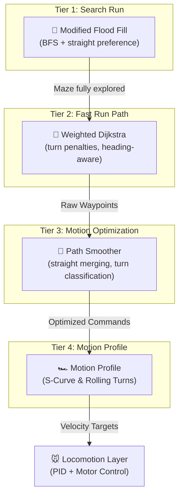

# Micromouse Algorithm Suite — Comprehensive Developer Manual

This document contains **everything** about the software powering your micromouse. It starts with a simple explanation of the four algorithms we are using, followed by a deep-dive into the mathematical and memory optimizations that make it championship-tier.

---

## 🧠 The 4 Algorithms (Simple Explanation)

Your robot uses four different algorithms working together as a team to solve the maze and drive as fast as physically possible.

### 1. Modified Flood Fill (Breadth-First Search)
*   **Where it's used:** `flood_fill.c`
*   **What it does:** Used during the **Search Run**. It acts like water flowing through the maze to find the shortest physical distance to the center. 
*   **Why it's modified:** Standard Flood Fill makes the robot zigzag. Our *modified* version uses a tie-breaker algorithm: if two paths are equal distance, it forces the robot to choose the path that goes straight, saving battery and time.

### 2. Weighted Dijkstra's Algorithm
*   **Where it's used:** `dijkstra_weighted.c`
*   **What it does:** Used to calculate the **Fast Run**. Flood Fill only counts distance, but Dijkstra can count *time*. 
*   **How it works:** We use a 3-Dimensional State Space `(x, y, heading)`. This allows Dijkstra to mathematically add a "time penalty" every time the robot has to make a 90° turn. It will deliberately choose a slightly longer path if it means avoiding slow, sharp turns.

### 3. Path Smoothing (Look-Ahead Algorithm)
*   **Where it's used:** `path_smoother.c`
*   **What it does:** Dijkstra just outputs a list of coordinates. The smoother algorithm scans the array and looks ahead to compile them into motor commands. 
*   **How it works:** If it sees `Straight → Straight → Straight`, it merges them into one command. If it sees the robot has forward momentum entering a corner, it upgrades the command to a `SMOOTH_ROLLING_TURN` so the robot carves through the corner without stopping.

### 4. S-Curve Kinematic Profiling
*   **Where it's used:** `motion_profile.c`
*   **What it does:** This is a physics/kinematics algorithm. If you just send "100% speed" to the motors, the tires will slip. 
*   **How it works:** It uses sinusoidal math to create an "S-Curve". It gently ramps up the acceleration, holds top speed, and then calculates the exact braking distance needed to slow down before the next wall. It also calculates exactly how fast the left vs. right wheel should spin to execute a smooth turn.

---

## 🏆 Architecture Flowchart



---

## 🔬 Technical Deep-Dive & Code Breakdown

The following sections explain the exact math, data structures, and C-code logic used to implement the algorithms described above on a microcontroller.

### 1. Memory Model & Core Data Structures (`maze.h`, `config.h`)

In embedded systems with limited RAM (STM32F401 has 64KB), using dynamic memory (`malloc()`) is dangerous. It leads to heap fragmentation and hard-fault crashes. **This entire algorithmic suite uses 0 bytes of dynamic memory.** Every structure is fixed-size and statically allocated.

#### The Maze Map (`MazeMap`)
The core data structure is the maze representation. A standard competition maze is 16x16 cells.
```c
typedef struct {
    uint8_t walls;       /* Bitmask of known walls */
    uint16_t flood_value;/* Distance to goal (used by Flood Fill) */
} Cell;

typedef struct {
    Cell cells[MAZE_SIZE][MAZE_SIZE];
} MazeMap;
```
*   **Size Analysis:** A `Cell` is 4 bytes. 4 bytes × 256 cells = **1,024 bytes (1 KB)**. This is incredibly small.
*   **Wall Bitmasking:** Instead of using 4 boolean variables for walls, we use a single `uint8_t` where each bit represents a direction (`DIR_NORTH = 1`, `DIR_EAST = 2`, etc.). This makes checking walls extremely fast using bitwise AND operations.

### 2. Tier 1: Search Run Explorer (`flood_fill.c`)

#### How Standard Flood Fill Works
The algorithm uses a Queue:
1. Initialize all cells to `FLOOD_INFINITY` (unreachable).
2. Set the goal cells to distance `0` and push them to the Queue.
3. Pop a cell `(x, y)`. Look at its neighbors (North, East, South, West).
4. If there is **no wall** blocking the neighbor, update its distance to `current_distance + 1` and push it to the queue.

#### The "Modified" Tie-Breaker (Crucial Optimization)
What happens if the cell in front of the robot and the cell to the left BOTH have a distance of `14`? 
*   **Our Modified Flood Fill** takes the robot's `current_heading` as an argument. If multiple cells have the same lowest distance, it applies a tie-breaker rule: **Always prefer the cell that is straight ahead.**
*   *Code Implementation:* In `flood_fill_choose_direction()`, we check `if (dir == current_heading && dist == best_dist)`. This simple line prevents hundreds of unnecessary turns during the search run.

### 3. Tier 2: Fast Run Pathfinding (`dijkstra_weighted.c`)

#### The 3D State Space
If our state is just `(x, y)`, the algorithm cannot know how much a turn costs, because it doesn't know which way the robot is facing.
*   **Solution:** We expand the state space to 3 dimensions: `(x, y, heading)`. 
*   Total states = 16 × 16 × 4 headings = **1,024 states**.

#### The Cost Calculation
When evaluating a move, we calculate the cost mathematically:
```c
uint16_t transition_cost = COST_STRAIGHT;
uint8_t turns = turn_cost_steps(current_heading, next_heading);

if (turns == 1) transition_cost += COST_TURN_90;
else if (turns == 2) transition_cost += COST_TURN_180;
```
If `COST_STRAIGHT = 10` and `COST_TURN_90 = 12` (configured in `config.h`), the algorithm mathematically understands that making a 90° turn takes more time than driving straight, and avoids it.

#### The Binary Min-Heap (Speed Optimization)
Dijkstra requires us to repeatedly find the state with the lowest cost. 
*   **Solution:** We built a custom Binary Min-Heap (`heap_push`, `heap_pop`). A Min-Heap is a tree structure where the lowest cost is always at the root. This makes the pathfinding execute in under 2 milliseconds on the STM32.

### 4. Tier 3: Path Smoother (`path_smoother.c`)

#### Step 1: Straight Merging
The smoother scans the raw Dijkstra waypoints. It counts consecutive waypoints that have the exact same heading. It condenses them into a single command: `CMD_STRAIGHT(5 cells)`.

#### Step 2: Smooth Turn Classification (Look-Ahead)
The code analyzes the waypoints to see if a turn can be taken at speed:
```c
bool entry = has_straight_entry(waypoints, i); // Did we drive straight before this?
bool exit  = has_straight_exit(waypoints, i);  // Will we drive straight after this?

if (entry && exit) return CMD_SMOOTH_RIGHT_90; // Don't stop! (Rolling turn)
else return CMD_TURN_RIGHT_90;                 // Stop and rotate (In-place)
```

### 5. Tier 4: Motion Profile Generator (`motion_profile.c`)

#### The S-Curve Profile (Linear Math)
Standard robots use Trapezoidal profiles: constant acceleration, cruise, constant deceleration. Instantly applying maximum acceleration causes a jerk that makes the tires slip.
*   **S-Curve Logic:** We use a sinusoidal ramp. 
    `velocity = v_start + (v_peak - v_start) * sin²(progress)`
    This makes the acceleration start gently, ramp up aggressively in the middle, and taper off gently at top speed.

#### The Rolling Turn Profile (Arc Geometry)
When executing `CMD_SMOOTH_RIGHT_90`, the robot traces a 90° circular arc through the cell junction.
*   **Linear Speed ($V$):** Maintained constant (e.g., 300 mm/s).
*   **Angular Velocity ($\omega$):** $\omega = V / R$. At 300mm/s and 45mm radius, the robot rotates at 6.67 radians/second (~382 degrees/second).

**Wheel Speed Conversion:**
To achieve this arc, the Differential Drive equations calculate the exact speed each wheel must spin:
*   `v_left = V - (\omega * wheelbase / 2)` (Inner wheel slows down)
*   `v_right = V + (\omega * wheelbase / 2)` (Outer wheel speeds up)

### 6. Integration Guide (`solver.h`)

You don't need to touch the complex math. You just use the high-level API in your STM32 state machine:

1. **`solver_init(&solver)`**: Setup.
2. **`solver_record_walls(&solver, front, left, right)`**: Pass in your physical IR sensor readings.
3. **`solver_search_step(&solver)`**: Triggers Flood Fill and returns the direction to drive.
4. **`solver_compute_fast_path(&solver)`**: Triggers Dijkstra to find the fast path.
5. **`solver_get_next_command(&solver)`**: Gets the next smoothed command to feed into your PID/Motion Profiler.
